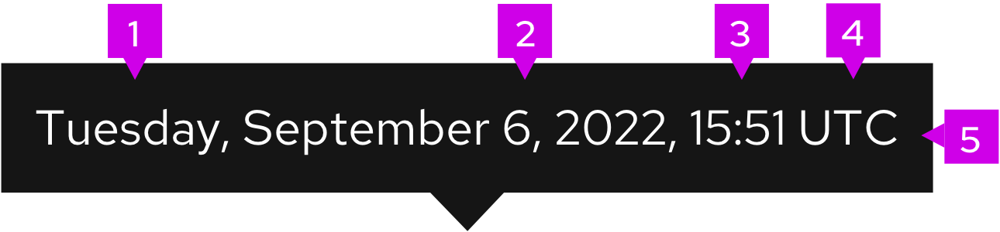

## Elements

1. **Day:** Spelled out or abbreviated format. [See Numerics guidelines for more information](https://www.patternfly.org/v4/ux-writing/numerics)
2. **Date:** Can be spelled out, abbreviated form, or digit format. [See Numerics guidelines for more information](https://www.patternfly.org/v4/ux-writing/numerics)
3. **Time:** Should be displayed in 12-hour or 24-hour ((HH:MM:SS). [See Numerics guidelines for more information](https://www.patternfly.org/v4/ux-writing/numerics)
4. **UTC/Timezone:** Should always be displayed last, in shorthand form and be in 24-hour format.
5. **Tooltip:** Dotted line displayed if there is tooltip available.

## Usage
### Use timestamp when:
You want to represent the exact date and time that an event occurred When users can go back and make use of past content.

### Best practices
#### For timestamp:
- Depending on the context, show either date or time, or both date and time.
- Locale should be appropriately set so that users see dates and times in a familiar format.
- Timestamp at minimum should include date, time, and timezone (shorthand format).
- Every element does not need to be used when implementing a timestamp.
#### For tooltip:
- Not required but recommended to provide more precise time for relative times. Tooltips should show timestamps in UTC time.
- Recommend displaying time in 24-hour format
- Displays time in UTC (Coordinated Universal Time).
- Should be formatted the same as the timestamp. 

See UX [numerics guidelines](https://www.patternfly.org/v4/ux-writing/numerics) for more information about relative time best practices.

## Variations
### 12-hour format
In the 12-hour format use AM to refer to a time of day before noon, and PM to speak of a time between noon and midnight.
 

### 24-hour format
In the 24-hour clock format, each day runs from midnight to midnight and is divided into 24 hours, starting at 1 a.m. 
 

### Abbreviated date
Abbreviated date usage is recommended when you have space restrictions. When abbreviating dates follow the date and time format. 
 

