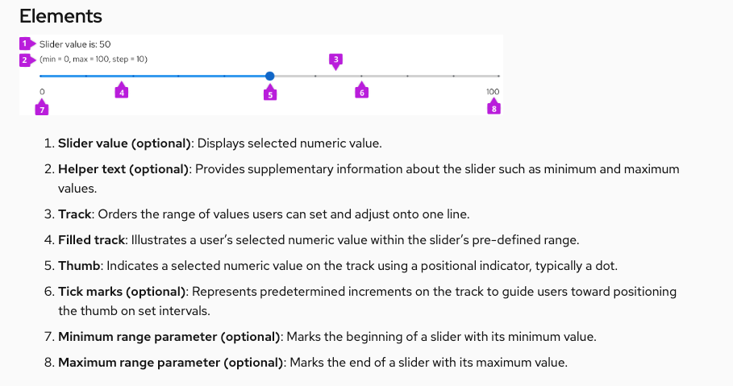

Design guidelines walk through building design patterns with PatternFly. This page focuses on how to write clear and consistent design documentation. To learn how to contribute design guidelines, see our [contribution guide](https://github.com/patternfly/patternfly-org/wiki/Contributing-to-patternfly-org-for-designers).

## Design guidelines template
When creating guidelines, information must be presented in the following order. Sections may be omitted, but if present must be under one of the following headings.

### Elements (H2)
Introduce the component and list the primary parts that make up its structure. This includes specific icons, headers, fields, symbols, or anything else included in the component.
Example:

### Usage (H2)
Explain how the component is used, when to use it, and why it should be used. Include explanations of problems it could help solve and address its advantages over similar components. Include images for visual examples.

Additional sub-sections to include: 
#### When to use
#### When not to use
#### When to use X vs. Y
#### Examples of incorrect usage

### Behavior (H2)
Explain how the component functions and break down how its elements interact with each other to achieve its purpose.

### Variations (H2)
Showcase different forms of your component and include explanations indicating when to use each one. 

Additional sub-sections to include:
#### When to use X variation vs. when to use Y variation

### Spacing (H2)
Introduce spacing requirements for components and their content. For more information regarding proper spacing, refer to our [spacing guidelines.](https://www.patternfly.org/v4/guidelines/spacers/)

### Content considerations (H2)
Showcase the different content that could be included within your component. Here is where you can also give additional tips and tricks the user may want to know. Content guidance includes:

- Editorial guidelines for labeling and message text.
- Length restrictions and what to do when text overflows.
- Localization considerations.

### Accessibility (H2)
Each component that has an assessibility tab should include the following sentence:

For information regarding accessibility, visit the [component name] accessibility tab.

Then, link the component's accessibilty tab to the words "accessibility tab".

## Formatting 

### Capitalization

Our [capitalization style guidelines](/ux-writing/capitalization/) outline best practices for capitalization across PatternFly. 

Always write headings in sentence case. Write component names in lowercase.

Example: 

"Usage guidelines for card views"

### Bolds and italics

**Bold** component names when you first introduce them.

Example: A **card** is a square or rectangle container of related information.

*Italicize* words for emphasis, but do so sparingly.

### Lists

Lists help organize lengthy, complex content into shorter, scannable sections. Use lists to introduce use cases, exceptions, and procedures.

When building lists, follow these best practices:

- Use bullets by default. Only use numbers if the order of items is important, like in a callout list.
- Introduce your list with a clause or phrase that describes the information it shares. 
- Start each item with a capital letter.
- End list items with a period if they're sentences, or if they form a full sentence when combined with the clause/phrase that introduces the list.
- Maintain parallel structure. Start every list item with the same part of speech. (Each item of this list starts with a verb.)

## Images

Design documentation includes images to contextualize elements in a UI and demonstrate them in action. All images should include alt text for accessibility.

### Annotations

Callouts demonstrate your design in action by highlighting specific areas in an image.

Use numbered callouts to call out multiple areas in your image, then use a corresponding numbered list to explain each one.

Example:

**1. Items in view:** Allows the user to select the item count (number of listed items) per page, as seen in full pagination

**2. Compact pager:** Supplies the user with page-back and page-next controls only

Avoid using a callout to highlight a single item, unless you're pointing out a small part of a large view, or the item isn't clearly shown in your image. Use a blank, unnumbered callout to mark the area, then bold it in your explanation.

Example:

Always write your **login button** as two words: "Log in."

## Style, voice, and tone

PatternFly's documentation is friendly and instructional. Learn more about voice in our [brand voice and tone section](/ux-writing/brand-voice-and-tone/).

When writing design guidelines, use:

- Present tense.
- Second-person point of view ("you").
- Active voice, unless you're using passive voice for emphasis.
- Direct language and sentence structure.
- Full words to introduce examples, instead of their abbreviations ("for example" instead of "e.g."), as seen on our [terms list](/ux-writing/terminology/).
- Descriptive language instead of directional language (up, down, left, right) to refer to elements in your document.
- Descriptive hyperlinks (not "click here").

If you're linking to other PatternFly pages, use relative URLs instead of full URLs.

**Relative URL:** /components/tooltip/design-guidelines

**Full URL:** https://www.patternfly.org/v4/components/tooltip/design-guidelines

