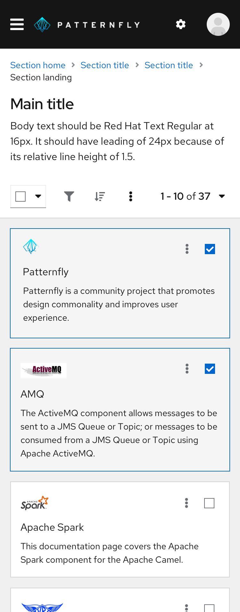

A **card view** is a grid of cards in a gallery to facilitate browsing. Card views are typically used to present data set summaries, allowing users to drill down into any card to see more detailed content.

Use a card view to:
- Display items in a data set that are best identified by a graphic or other visual representation.
- Make information easier to visualize and compare.
- Summarize a large number of objects at once within the same page.

**Never** use a card view to make a large amount of text-based content easier to scan. Use a [table](/components/table) or [list](/components/data-list) view instead.

### Background colors for card views
Card views can be placed on a white or a gray background, depending on your use case.

**Use a white background** if your content view can change, such as when:
- A card that opens an expandable panel on the right.
- A card view that toggles into a table or list view.

**Use a gray background** if the sole purpose of your content view is to display cards.

**Note:** Use the default border treatment (cards with drop shadows) for cards when placed on a gray background only. Flat cards should be used when placing cards on a white background.

### Card views on mobile
Cards will size down appropriately based on the built-in CSS responsiveness behaviors. Most of the time, they’ll follow the grid layout, expanding and compressing at certain breakpoints. At the smallest mobile size, they take up almost the entire width of the screen.

### Card view actions
You can customize card actions in a few ways. Depending on your use case, consider customizing inline actions, multiple inline actions, global actions, or action cards within your card view.

#### Inline actions
If an action can be performed on one card only, place the action in the card’s body or footer.

- If you have a few cards with single actions, use the [secondary button style](/components/button#variations).

- If you have many cards with single actions, use a [link button](/components/button#variations).

  

#### Multiple inline actions
If multiple actions can be performed on a single card, place those actions in a kebab. Position the kebab in the top-right corner of the card header.

#### Global actions
If an action can be performed globally on multiple cards, or if it leads to multiple pieces of content at the same time, place the action in a toolbar above the card view. In the top-right corner of your card, add a checkbox so that users can select one or more items.

#### Action card
You may use an extra-small empty state inside a card to present users with another way to add more cards to the existing card view. We recommend using this feature **in addition to** a primary button in the toolbar, to ensure that the user is still able to perform the action from any page of the card view. Place the action card where a new card will be added, most likely as the very first or last card in the card view.

### Bottom pagination
If your card view has multiple pages, add a footer with [pagination](/components/pagination).

