A dashboard provides overviews of key metrics or performance indicators relevant to an application, process, or business. The overall experience of dashboards can vary greatly depending on their use cases, so it can be difficult to define a one-size-fits-all approach. These guidelines take a systematic approach to dashboard design that can be applied in a variety of situations.

## Elements
While dashboards can vary greatly depending on what requirements and use cases they’re meant to fulfill, they can typically be distilled into two main parts:

- **Cards:** Information is communicated via cards. Each card should be designed to convey a single metric or a group of closely related metrics.

- **Layout:** The arrangement of cards, typically in a grid structure.

We’ll focus on these two aspects as we move through the dashboard design process. Here is an example of a dashboard containing four cards arranged in a grid.

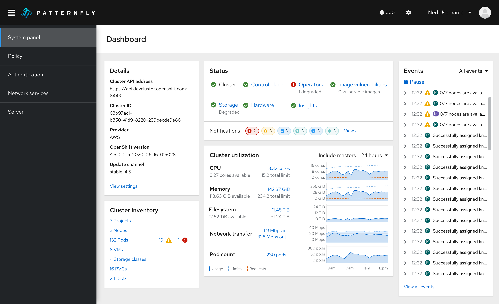

## Standard cards
PatternFly supports several common card layouts to help convey information in a consistent way. This is not an exhaustive list, but before designing your cards, you should see if the information you are trying to communicate fits into any of these common patterns. Note that card layouts are flexible and can be customized. So if you don't see exactly what you are looking for here, we recommend that you use these standard layouts as a basis upon which to build your custom designs. For more information about cards and card usage see the [Card component](/components/card) documentation.

### Aggregate status card
Aggregate status cards show a total number of objects and an aggregated status for them. For example, they can be used to provide users with a quick count of the number of nodes making up a large distributed network and identify the numbers that are down, that need maintenance, etc. There would also typically be a link to examine more details.

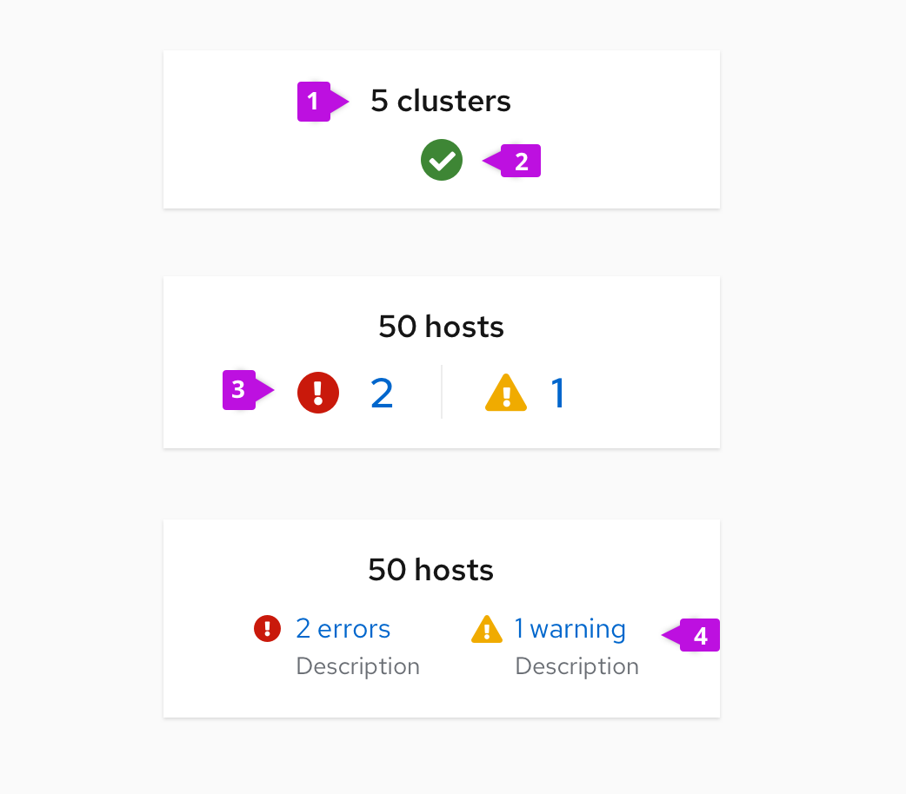

1. **Card title:** Reports the total count of objects being monitored.

2. **Normal status:** Reflects that all is running normally, with no problems.

3. **Exception status (count only):** Counts the number of items that are reporting exceptions (errors, warnings, or other conditions). Only include non-zero items. You may optionally link the count to more details.

4. **Counts with annotation (optional):** Include a label and description if more information may be required to clarify the reported status.

### Trend card
Trend cards are used to display the change in some metric over time. It should be possible to see the current value and prior values over some given time period.

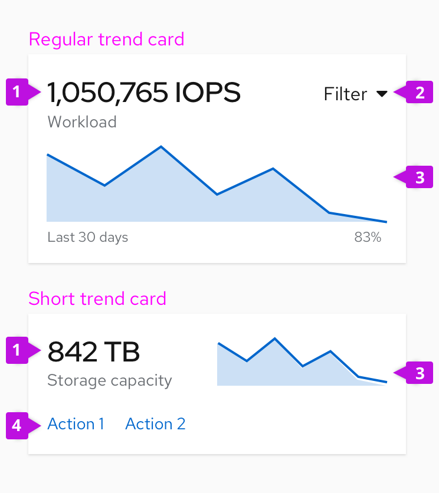

1. **Current value:** Use the title of the card to reflect the current value.

2. **Filter (optional):** Place a filter in the upper right corner of the card when you want to filter data in the chart. Most often this will be used to change the time range of the chart, e.g. “Last 24 hours,” “Last 7 days,” “Last 30 days,” etc.

3. **Trend chart:** [Sparkline charts](/charts/sparkline-chart) are most often used to display trend data.

4. **Actions (optional):** If your card is to include actions include them as [link-style buttons](/components/button#variations) in the footer of your card.

Regular trend cards arrange the current value and trend chart in a stacked layout. You can use the short trend card layout to save vertical space by placing the current value and the trend chart side-by-side. You may also want to monitor trends for several metrics on the same card.

If you’re displaying multiple trend metrics on a card, stack trend charts with clear naming to indicate what each chart measures and add a title at the top to communicate what’s being displayed on this card.

### Utilization card
A utilization card reports the current value of a single metric or multiple metrics. Bar or donut charts are most often used to report utilization because values are proportional (i.e. percentage of a whole).

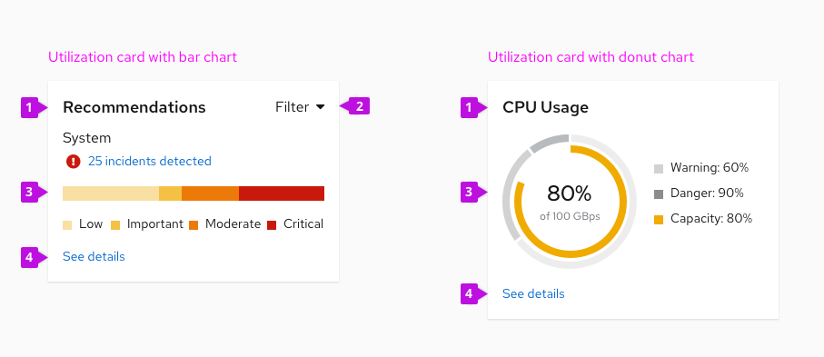

1. **Card title:** Clearly communicate what this card measures.

2. **Filter (optional):** Place a filter in the upper right corner of the card when you want to filter data in the chart.

3. **Utilization chart:** [Bar charts](/charts/bar-chart) or [donut charts](/charts/donut-utilization-chart) are commonly used to report utilization.

4. **Actions (optional):** If your card includes actions or links to another page, add them as [link-style buttons](/components/button#variations) in the footer.

### Details card
A details card is used to display detailed data related to an object or process. Details are typically expressed as attribute-value pairs or in tabular format.

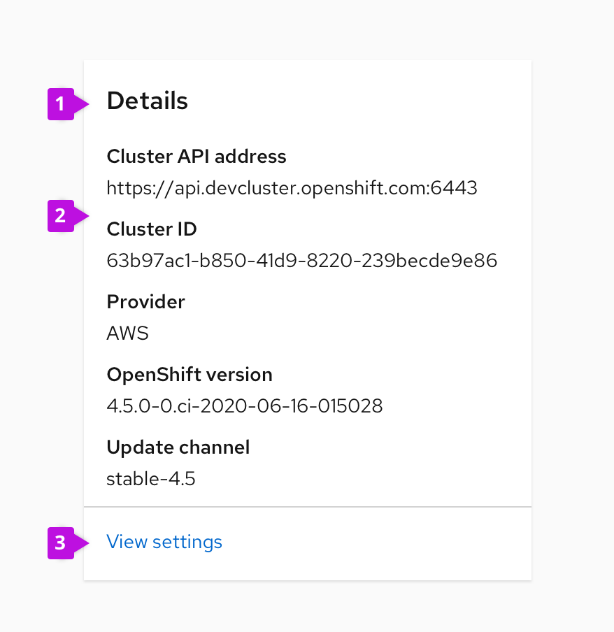

1. **Card title:** Clearly communicate what this card contains.

2. **Details:** Display details of the object in question. A [description list](/components/description-list) is often useful for this purpose.

3. **Actions (optional):** If your card includes actions, add them as [link-style buttons](/components/button#variations) in the footer.

### Events card
An event card lists items that occur in time. These could be alerts, tasks, or other system messages.

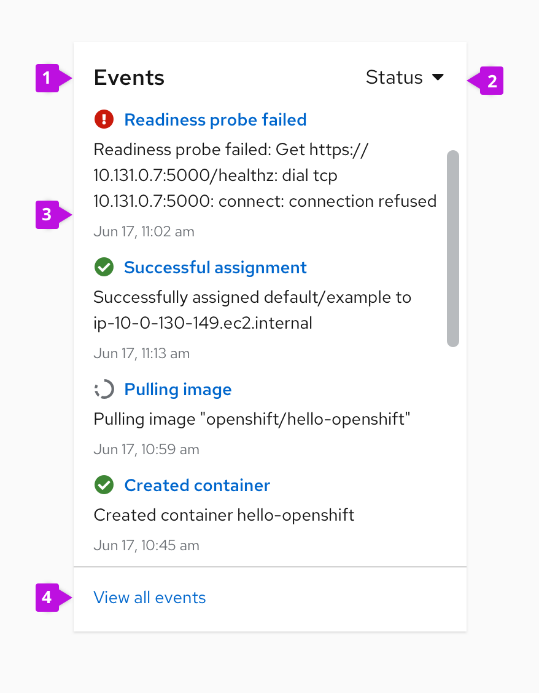

1. **Card title:** Clearly communicate what this card contains.

2. **Filter (optional):** Place a filter in the upper right corner of the card when you want to filter data in the chart.

3. **Events list:** A list of events. A [data list](/components/data-list) or a [notification drawer](/components/notification-drawer) component can be used to list events.

4. **Actions (optional):** If your card includes actions, add them as [link-style buttons](/components/button#variations) in the footer.

## Dashbar
A dashbar is a smaller dashboard placed inside of each application or dashboard to provide essential information so that you can take immediate action if it’s needed. It’s always placed at the top and takes up the upper half of the screen.

Use dashbar when: 
- Showing critical information about the current state of systems or other parts of an application. 
- Presenting historical data. It can be presented by charts.
- Filtering important data from a table.
- Introducing a new feature. 
- Showing the state of groups that can potentially have an impact on systems or any other parts of application.

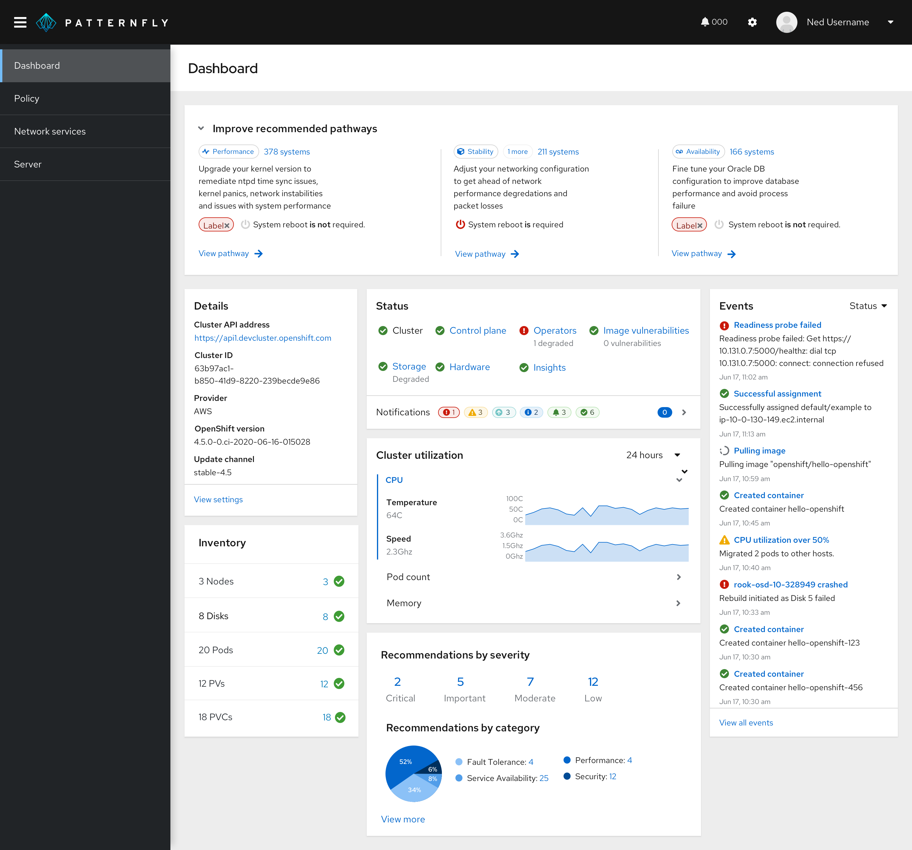

## Designing dashboards step-by-step
To design an effective dashboard, you first must have a solid understanding of the requirements and use cases your dashboard is intended to fulfill. If you don’t have that yet, go back and ask more questions, do more research, and gain an overall better understanding of what your dashboard needs to do.

### Step 1: List the cards
The first step is to create a simple list of the cards your dashboard needs to have. Think of this list as your kit of parts. These are your building blocks, your (very easy) puzzle pieces.

Each card in a dashboard should be designed to display a single metric, a set of metrics, or a summary of important information. The scope of a card can be as narrow as the resource consumption of a single node, or as broad as a list of all system events listed in real time.

Questions to answer:

- What use cases does this dashboard need to fulfill?
- What data or information is associated with those use cases?

Example list of cards:

**Cluster details**
* Name, provider, OCS version, etc…

**Performance**
- Current usage + usage history over time
- IOPS, Latency, Throughput, Recovery Rate, Recovery IOPS

**Health**
- Is the cluster healthy?
- If not, why?

**Top consumers**
- Which projects, pods, or clusters are using the most resources?
- Ability to filter view by project, nodes, classes, workloads
- Show only top 5

**Events**
- List of system events
- Ability to filter based on event type

**Inventory**
- List of how many current nodes, disks, pods, PVs, PVCs
- How if any are down/error and how many.

**Capacity**
- Physical capacity (percentage used)
- Requested capacity (percentage used)

### Step 2: Prioritizing your cards

Prioritize your list by determining which cards contain information most useful to the broadest range of use cases.

Don’t spend too much time on this step; it doesn’t have to be perfect. You might have a clear hierarchy of importance amongst your list, or you may have a list of cards which are of equal importance. If you find yourself struggling, just move on to the next step.

Ideally, all of the information you are displaying is important. The purpose of this step is to help us determine which cards we want front and center, and which we can receive less emphasis. This distinction is primarily important with responsive design. When your four-column layout becomes a one-column layout on a mobile viewport, ordering the cards appropriately will make sure that the most important information comes to the top.

#### Example of a prioritized card list

**Unprioritized:**
- Top consumers
- Events
- Capacity
- Inventory
- Performance
- Details
- Health

**Prioritized:**
- Details
- Performance
- Inventory
- Health
- Capacity
- Top Consumers
- Events

Note: The cards at the bottom of our list are not necessarily “unimportant,” they just simply wouldn’t make sense being above the cards at the top of the list.

### Step 3: Sizing your cards
Next, you must size your cards by asking yourself one question: How big do I think this card will need to be?

Here are a few questions to ask yourself, along with some real-life examples to give you a better sense of how to approach this question.

1. Start by using the three standard sizes: small, medium, large. This sizing will help prepare us for our next step, determining column structure. These sizes refer to the overall surface area of your cards, not specifically the length or the width. You can have a tall medium card and a wide medium card that both take up the same surface area. We are guesstimating. Don’t spend considerable amounts of time determining whether a card is medium or large. This step simply builds a foundation for iteration. We want to start thinking about the layout of each card on a conceptual level, which will help us when we begin to iterate on our layout.

2. Ask questions about each card:
- What format would this information most clearly be displayed as?
- How much data will this card contain?
- Is the amount of information in this card static or dynamic? The size and shape of static cards will not change over time, for example it will always be a card with one chart. A dynamic card could contain a list of items that will grow or shrink, like an events list.

Here are some examples of how to apply these questions to different types of cards to determine their appropriate sizing in your dashboard:

**Details card**

“What format would most clearly display this information?”
- This card needs to list the various details of the cluster. Each detail will have a label and a value, for example: name // cluster-name
- This looks like it calls for a two-column list of the data. One column for the label, and one for the value.

“How much data will this card contain?”
- In this particular instance of the storage dashboard, the list only contains four items. Not a very large list.

“Is the amount of information in the card static or dynamic?”
- The items in the card may be added or removed depending on user or stakeholder feedback, but they aren’t changed unless we decide to change them. Therefore, this information is static and we can expect this card to always contain the same amount of information.

Conclusion:
- This card will always contain a two-column list of four items.
- This card can be small.

**Performance card**

“What format would most clearly display this information?”
- This card will display the current performance metrics for five different values. It must show the historical data of the values over time.
- Show the current value in text and a line graph displaying the value over time. This means each of the five metrics will have a text label, a text value, and a line graph.

“How much data will this card contain?”
- Mostly answered above. It will contain five metrics, each of which reflecting a current data value and a graph showing the value over time.

“Is the amount of information in the card static or dynamic?”
- This card will contain metrics that always show the same thing: A label for the metric, a current value, and the value over time. This information itself will change constantly but the amount of or density of information will not. Therefore, it is static.

Conclusion:
- Include five line charts. This card will probably be large.

**Events card**

“What format would most clearly display this information?”
- This card will display a list of events as they occur.
- Each event list item will show a few lines of information: time occurred, event source, event description.
- This information will be best displayed in a list view format.

“How much data will this card contain?”
- Events happen fast, and in large numbers. This card could contain thousands of events. The user will need to be able to filter this view to tailor it to their specific needs.

“Is the amount of information in the card static or dynamic?”
- As this is a list that could contain 0 events or could contain thousands, it is indeed dynamic.

Conclusion:
- This card could contain a massive amount of events. We’ll need to give the card a max height based on the amount of items we think would be reasonable to see at once. Four items at once should be reasonable to set for our max height. The card will then scroll if the user wants to see more events.
- Since we have a max height of four items and this list view only needs one column, we can estimate that a medium sizing should do.

**When done, your list should look something like this:**

- Details: Small
- Performance: Large
- Inventory: Medium
- Health: Medium
- Capacity: Medium
- Top consumers: Large
- Events: Medium

### Step 4: Iterate on column structure and card arrangement

Now that you have a prioritized and sized list of cards, use it to create the card layout. To get started, draw your columns in a full size desktop view.

- All columns must be the same width.
- All columns must have the same sized gutter (space between columns).
- For a standard desktop size (1200-1400px), try to have the column layout fill the full width of the page.
- Draw your columns within the context of your project. For our example, we know we have a top masthead, a top header information area, a left hand navigation, and a canvas for the dashboard.

You can use any common amount of columns for this step, but three and four column layouts are the most common. If you use Sketch, you can find templates for these layouts in the [PatternFly template](https://www.sketch.com/s/729c2eee-e8b6-4fcd-8a79-f6faa8c30f89). For the purpose of this tutorial, we will work with a standard four column layout.

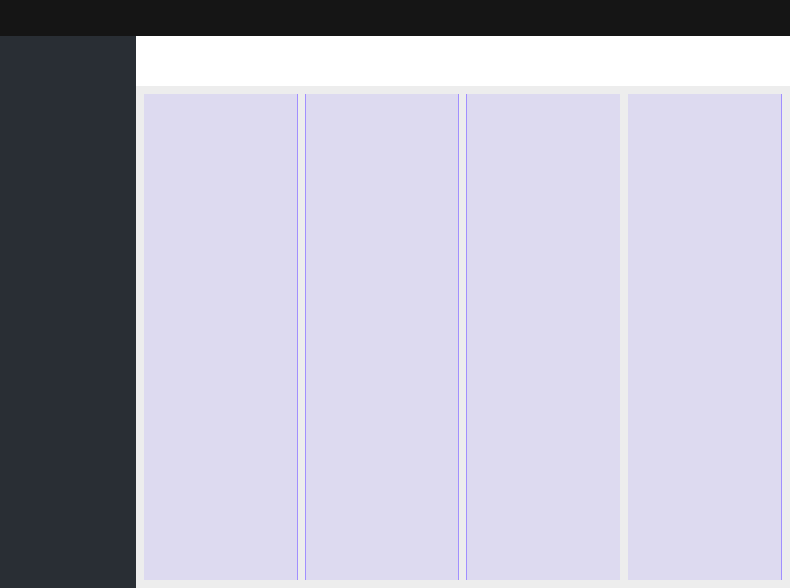

Four column layout with 16 px gutters. There are also 16px margins around the dashboard.

Next, add your cards in their appropriate sizes without any content. Don’t worry about the arrangement yet, just draw all the cards at your estimated sizes.

- There should be no real content in your cards yet, only each card’s name. At this point, the only thing we’re concerned about is getting a general size for each card.

- Again, these are guesstimates. We’re not worried about the exact height of each card. Rather, we’re using our column structure as a guide.

After placing our prioritized and sized card list on the four-column grid, the result should look like this example:

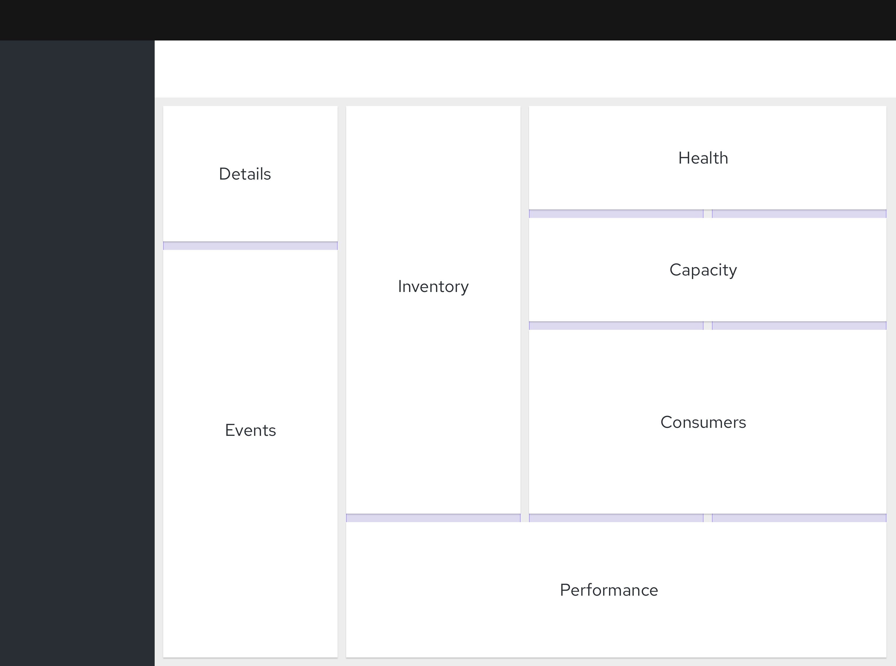

Note how loosely we stuck to those sizes. The details card is pretty small, but the events and history cards ended up being more like a large card. That’s fine.

When choosing whether or not your card should be wide or tall, it helps to consider the format of the information within the card. For example, the inventory and events cards both contain a list of data. Lists tend to lend themselves well to taller cards. The consumers card (bottom right) will contain a line graph. A line graph showing data over time lends itself well to a wider card.

You can now iterate on the arrangement of your cards. Approach this arrangement like a puzzle. If you have a strong prioritization of cards, that should be your primary driver. You want the most important cards at the top, with less important cards at the bottom. It’s OK to change the size of your cards a bit to make them fit better. In our example, the events and inventory cards probably don’t need to be that tall. Maybe we can find a better use of that space for another card that needs more room.

The only boundaries you’ll encounter in this step are the general sizes you defined earlier. Don’t limit yourself by assuming that the inventory card always has to be that tall. We don’t know exactly how tall it really has to be yet, we just have a general idea that it probably should be medium-ish. If you find yourself struggling with a certain column layout, try a different one to see if it solves any problems.

You can rearrange cards multiple times until you find the layout that works:

We knew details and performance were our top priority items, so we kept those up top and mainly iterated around the rest of the cards. Note how we changed the height of some of the cards to better fit the layout.

Dynamic cards deserve special considerations. You want to avoid situations such as having a one column dynamic card expand and push down a two column card below it, creating a gap of unused space. We’ll explore how this might play out with the events card in our next example.

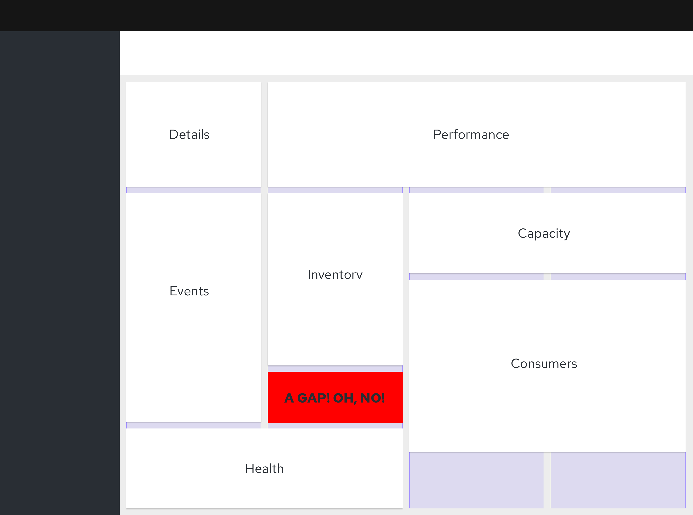

We could solve this gap by setting the inventory card height to always match the events card. Another potential solution is to always have your events card at a defined height, introducing scroll for any information that does not fit. Flexible and accommodating layouts usually provide the most effective long term solution.

### Step 5: Add your content and refine your layout

Once you’ve found a couple layouts you’re comfortable with, add your actual content designs to each card and see how it affects their sizing. Start with the [standard card templates](#standard-cards) described at the start of this document. You can modify these or create custom card layouts to meet your needs. Let’s see how we can populate each of the cards in our preliminary layout.

#### Details card
Recall that in Step 1, we defined the Details card as needing to display the cluster name, the provider, and the OS version. This can easily be accomplished by using a standard details card.

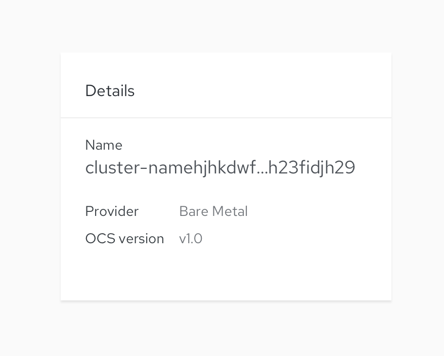

#### Performance card
The performance card needs to display current usage and usage history over time for five different measures: IOPS, Latency, Throughput, Recovery rate, and Recovery IOPS. For this use case, we can group five standard trend cards and arrange them in a horizontal grid. Then, we can add a filter in the header to change the scope of the data that we wish to measure.

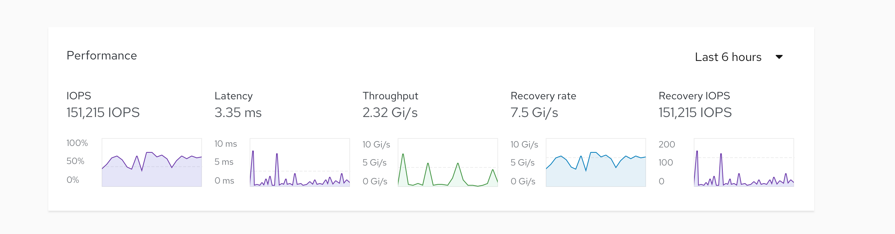

#### Health card
The health card will be a custom card to show the state of the cluster and the cluster data. While we are not using a standard card here, we can still borrow elements of the aggregate status card for displaying overall health.

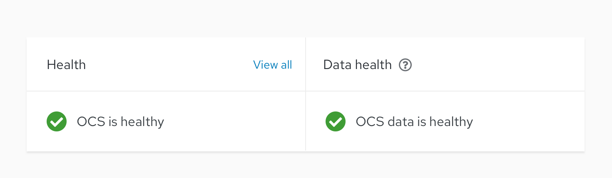

#### Capacity card
The capacity card must reflect:
- Physical capacity (percentage used).
- Requested capacity (percentage used).

Similar to the way we grouped multiple cards within a larger card for performance, we can display these two metrics side-by-side using two donut utilization charts.

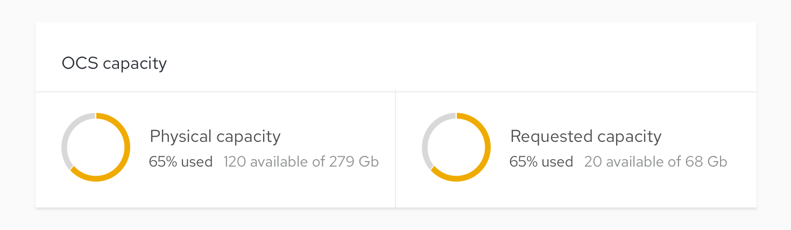

#### Top consumers card
This card gives users a glimpse of which  projects, pods, or clusters consume the most resources. We want to allow users to view this information by project, nodes, classes, and workloads for the top five consumers for any of these attributes. To accomplish this goal, we can create a custom card that uses a line chart to show consumption over time. The user can compare all five results or filter down to a specific time. We can also include an additional filter for users to change the displayed time range.

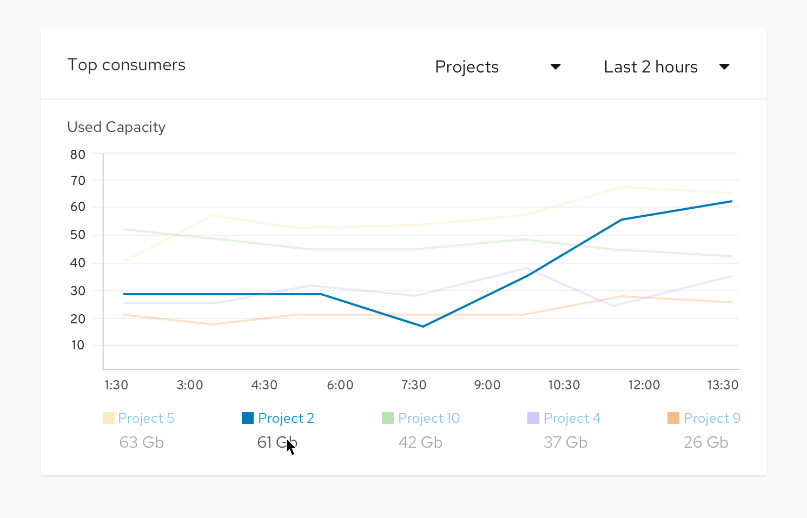

#### Events card
The events card must display a list of system events and provide the ability to filter based on event type. For this use case, we can use a standard events card.

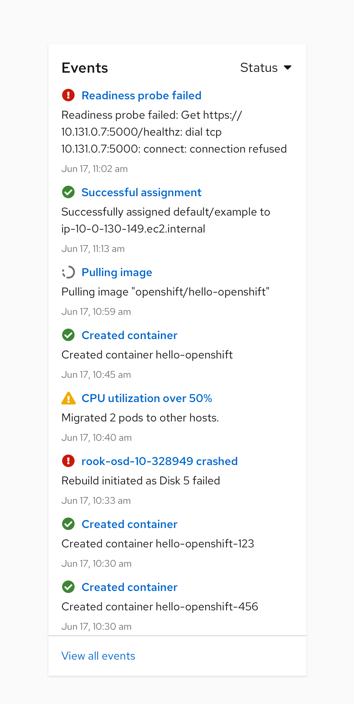

#### Inventory card
The inventory card is intended to list a count of current nodes, disks, pods, PVs, PVCs, and show if any are down or in error. For this use case, we can create a custom card. But since it has similar properties to the [aggregate status card](#aggregate-status-card) for displaying object status, we can pull from some of the aggregate status card’s concepts.

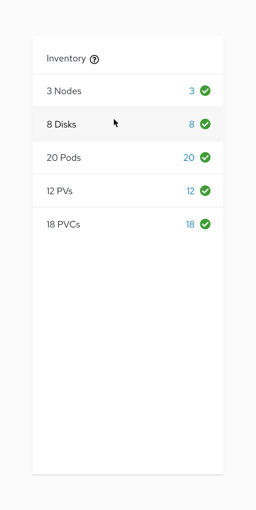

### Step 6: Iterate on your layout
Add your cards to the layout you created in Step 3 and take a look at the result. Some cards may need to be made taller or shorter, but either way you now have a few different layouts to work with. If you find a card actually needs an additional column, repeat Step 3 but with your fully designed cards. Group each card and the content it contains to quickly and easily move it around the page as you iterate.

### The final result
Here’s our final dashboard after we made a few adjustments. You’ll see that the inventory card is taller than it needs to be. But that’s OK since it matches the height of surrounding cards and creates a uniform layout. It also allows space for further extension without introducing a scroll bar.

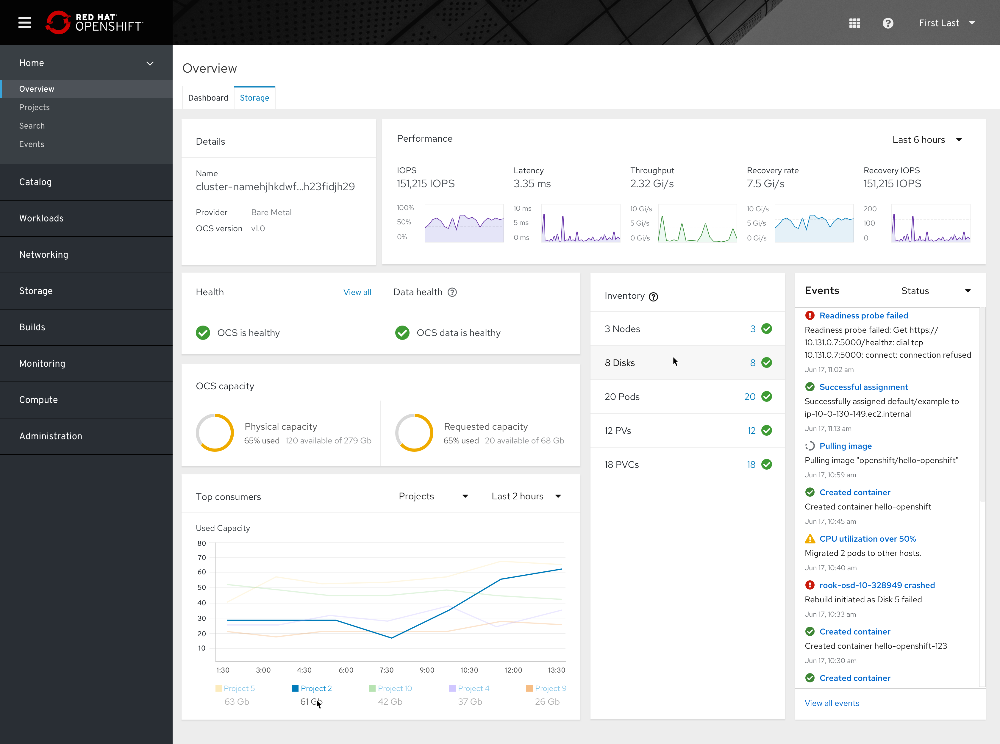