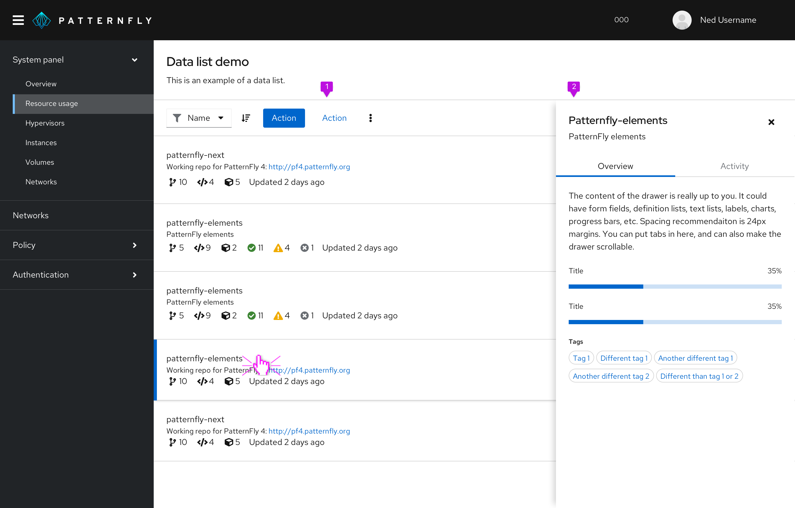
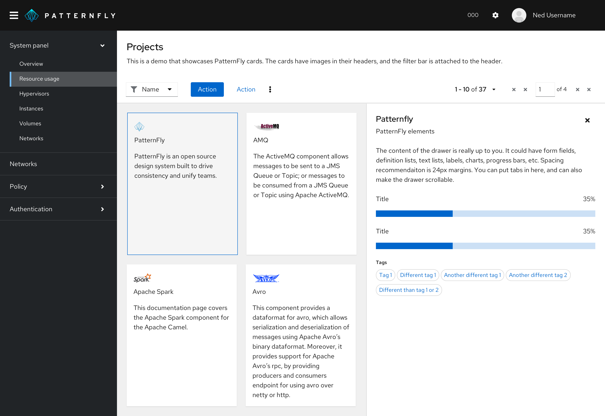
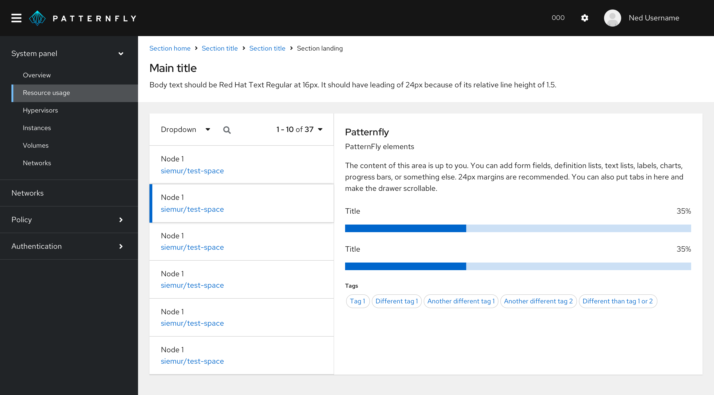
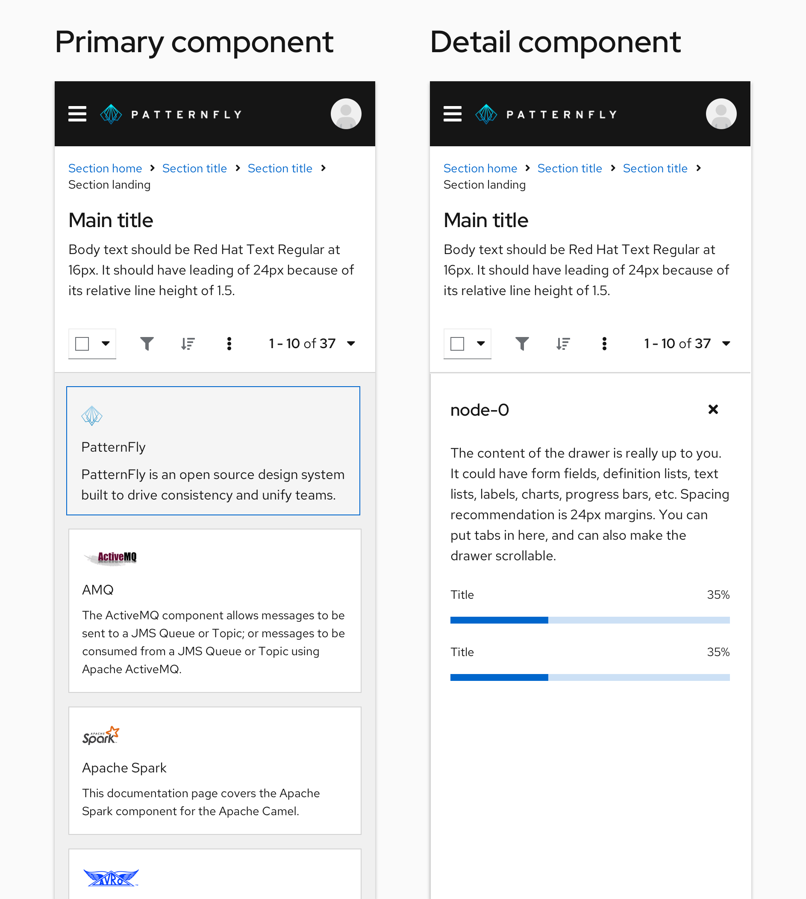
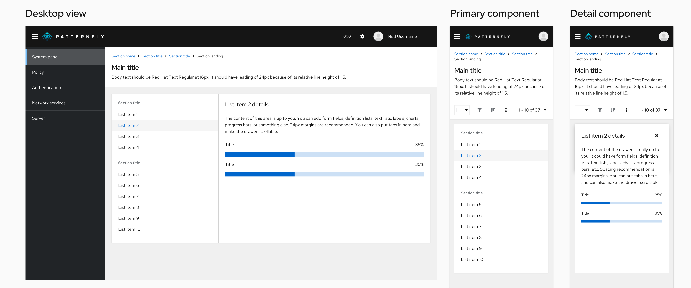
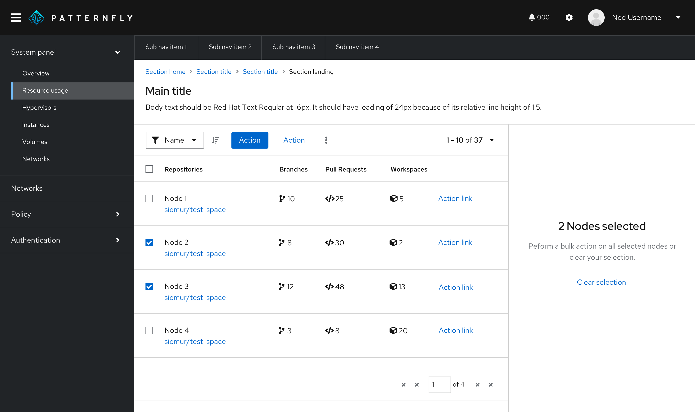
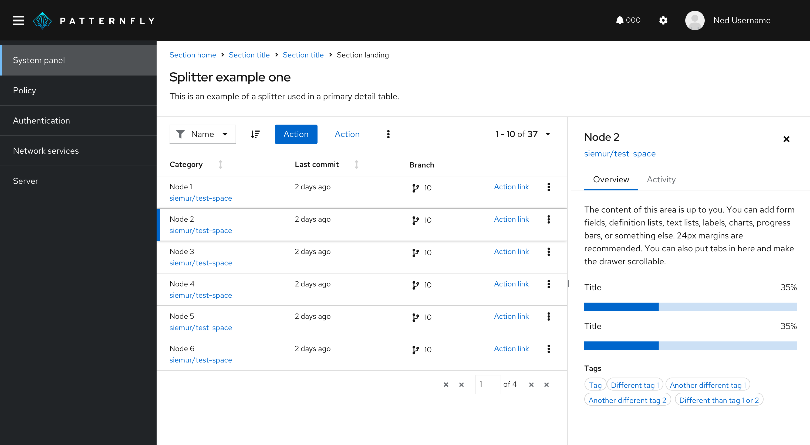

A **primary-detail layout** is an interface that shows a list of items and the corresponding details of the selected item.
 
## Elements
A primary component sits in a container on the page, and detail components typically live in a slide-out [drawer](/components/drawer).

  

1. **Primary component:** Contains the grouping of elements that can be selected to initiate each element’s details drawer.
2. **Drawer component:** Contains the details of each individual element.

When the page content has a white background, the drawer can be placed on the same level as the primary content with a divider line. Alternatively, the drawer can be elevated on top of the primary content. We recommend having a title in the drawer that relates back to the selected primary item. 
 
**Common primary components:**
- [Data list](/components/data-list)*
- [Data table](/components/table)* 
- [Card view](/components/card)*
- [Simple list](/components/simple-list)/[light nav](/components/navigation/react-demos/#legacylight-nav)
 
*Any of the above may have associated toolbars. A toolbar can be placed in the card header of a component in the primary, but it may need to be placed in a page header if there is a card view or if there is the ability to switch between views (and/or toggle open and close the details drawer). 
 
**Common detail components:**
- Markdown text form or [code editor](/components/code-editor)
- [Description list](/components/description-list)
- [Charts or graphs](/charts/about)
- [Input forms](/components/input-group)
- [Text](/components/text)
 
## Usage
Use a primary-detail layout when viewing details from an item in a large list or group on the same page. A primary-detail layout is useful for navigating back and forth through a list and making edits in the details of each list item, without losing context of the larger list. Primary-detail layouts look best on wider screens, but they can be responsive, too.

### Characteristics
PatternFly supports a side-by-side view of a primary element on the left and a detail element on the right. The component in the primary pane is used to control the information shown in the details pane. 
 
  
 
Primary-detail containers can begin below a page header. The width of the primary and detail panes can vary based on the amount and type of content they display. Typically the panes are in halves, thirds, or quarters of the view port. The height of the details pane is 100% of the primary container.
 
A primary-detail layout usually takes up the full page, but it can be placed in a card for certain use cases. We suggest placing a primary-detail layout in a card when you’re using a simple navigation or data list and the details pane is always open. A drop shadow on the details pane is not recommended in this view. 
 
 
 
## Behavior
The primary-detail component functions by the user selecting an item from the primary component on the left which opens a detail component on the right. The user can dismiss the detail component and/or select another item from the primary component to switch views of the detail component. 

### Responsive behavior
The mobile behavior of the interaction will generally mirror the desktop behavior. Mobile views will only show 1 component at a time, either the primary component or the detail component. Upon selecting an item from the primary component, the detail component will slide in from the right and will overlay the primary component, taking the whole width of the viewport. The primary component’s title will remain constant as the header with clear navigation back to the primary component. The detail component will also be dismissable and will slide out to the right upon closing, revealing just the primary component. The viewport will switch to mobile view at a defined breakpoint, usually when it drops below 2x (which is the typical mobile width). 
 
 
 
In cases where the detail component in desktop view is non-dismissible and active at all times, the detail component becomes dismissible when switching to mobile view, and behaves as described above.
 
 
 
## Variations
 
### Selectable rows
Row selection differs from bulk/checkbox selection, and both selection types operate independent of each other.
 
When checkbox select and row select are both available in a primary-detail layout, the details pane will populate an empty state and guide users to either make an action in the toolbar or clear the selected checkboxes to return to the selected row’s detail view. This empty state should show to alleviate confusion for the different select states when both are present in a table.
 
 
 
Here are some other best practices to keep in mind:
- There needs to be a **selected** state for the primary item (row or card) currently populating the details pane.
- If the details pane isn’t auto expanded, there needs to be an affordance to open an item in the primary pane (such as a hover/selectable row/card states) or in a toolbar (such as an icon to toggle open/close the details pane).
- If the details pane can be toggled close, there needs to be a close icon in the top-right of the details pane. Users may also toggle open/close in a toolbar.
 
For [empty states](/components/empty-state), if the details pane is automatically expanded on default but a primary item is not selected by default, then there should be an empty state in the details pane directing users to make a selection in the primary. In cases where there is bulk select capability in the primary component, an expanded details drawer should display an empty state informing users that multiple items have been selected. To view details of a single primary item, the user must clear their selection.

### Splitter in a primary-detail

A **splitter** allows you to create a layout with resizable panes. The orientation of a splitter can be set to **vertical** or **horizontal**.

Add a splitter to a primary-detail if you need to resize the width or height of a panel to give content more space. It helps to prioritize the content you’re focusing on. If data shown in a primary-detail has enough space, then you don’t need to use a splitter.

