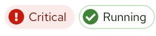
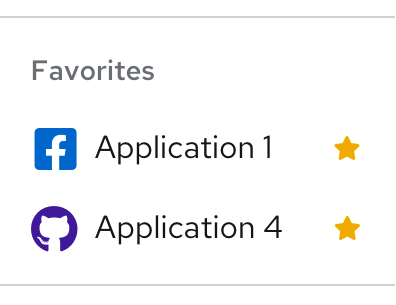
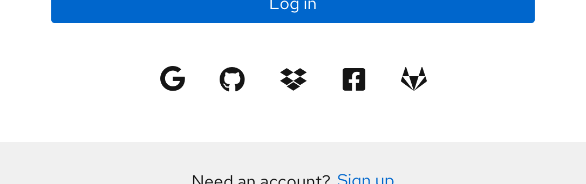
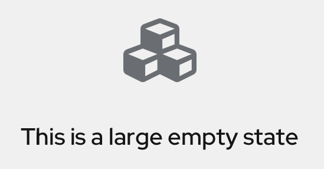
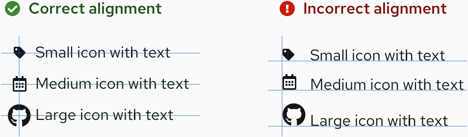

import { Card, CardBody, Divider, Flex, FlexItem, Grid, GridItem } from '@patternfly/react-core';
import CaretDownIcon from '@patternfly/react-icons/dist/esm/icons/caret-down-icon';
import CheckCircleIcon from '@patternfly/react-icons/dist/esm/icons/check-circle-icon';
import ExclamationCircleIcon from '@patternfly/react-icons/dist/esm/icons/exclamation-circle-icon';
import GithubIcon from '@patternfly/react-icons/dist/esm/icons/github-icon';
import OutlinedCalendarAltIcon from '@patternfly/react-icons/dist/esm/icons/outlined-calendar-alt-icon';
import StarIcon from '@patternfly/react-icons/dist/esm/icons/star-icon';
import TagIcon from '@patternfly/react-icons/dist/esm/icons/tag-icon';
import TimesCircleIcon from '@patternfly/react-icons/dist/esm/icons/times-circle-icon';
import { IconRecommendations } from './IconRecommendations';
import { IconsTable } from './IconsTable';
import './icons.css';

If you're a developer, check out our [getting started](/get-started/develop#using-styles) page to learn more about how to get and use our icon set.

## Icon sizes
<Grid gutter="md">
  <GridItem xl={6} lg={12} className="ws-icons-gridtext">
    

      Medium icons are used as our base size across our system as a whole and we recommend using this base size within your applications. Small, large and x-large icons are used sparingly across PatternFly components. Here is a complete list of icon sizes:
    

    <Flex className="ws-icon-sizes ws-icon-sizes-sm" alignItems={{ default: 'alignItemsFlexStart' }}>
      <FlexItem className="ws-icon-size">
        <CheckCircleIcon size="sm" />
      </FlexItem>
      <FlexItem>
        
Small (10px)

        <code className="ws-code ws-icon-code">--pf-global--icon--FontSize--sm</code>
      </FlexItem>
    </Flex>
    <Flex className="ws-icon-sizes ws-icon-sizes-md" alignItems={{ default: 'alignItemsFlexStart' }}>
      <FlexItem className="ws-icon-size">
        <CheckCircleIcon size="md" />
      </FlexItem>
      <FlexItem>
        
Medium (18px)

        <code className="ws-code ws-icon-code">--pf-global--icon--FontSize--md</code>
      </FlexItem>
    </Flex>
    <Flex className="ws-icon-sizes ws-icon-sizes-lg" alignItems={{ default: 'alignItemsFlexStart' }}>
      <FlexItem className="ws-icon-size">
        <CheckCircleIcon size="lg" />
      </FlexItem>
      <FlexItem>
        
Large (24px)

        <code className="ws-code ws-icon-code">--pf-global--icon--FontSize--lg</code>
      </FlexItem>
    </Flex>
    <Flex className="ws-icon-sizes ws-icon-sizes-xl" alignItems={{ default: 'alignItemsFlexStart' }}>
      <FlexItem className="ws-icon-size">
        <CheckCircleIcon size="xl" />
      </FlexItem>
      <FlexItem>
        
X-large (54px)

        <code className="ws-code ws-icon-code">--pf-global--icon--FontSize--xl</code>
      </FlexItem>
    </Flex>
  </GridItem>
  <GridItem xl={5} xlOffset={7} lg={12} xlRowSpan={2} >
    <Card className="ws-icon-size-examples">
      <CardBody>
        
<b>Small icons</b>

        <Flex alignItems={{ default: 'alignItemsFlexStart' }}>
          <FlexItem>
            
          </FlexItem>
          <FlexItem grow={{ default: 'grow' }}>
            
          </FlexItem>
        </Flex>
        
<b>Medium icons</b>

        
        
<b>Large icons</b>

        
        
<b>X-large icons</b>

        
      </CardBody>
    </Card>
  </GridItem>
  <GridItem xl={6} lg={12} className="ws-icons-gridtext ws-icons-alignment-section">
    No matter the size of the icon, when icons are next to text, they should be center-aligned horizontally. An example of this alignment in a component is a [link button.](/components/button/design-guidelines#button-types) If icons are stacked, they should also be center-aligned vertically.
    

  </GridItem>
</Grid>

<Divider className="ws-icons-divider" />

## Icon colors
Visit our [colors page](/guidelines/colors) to learn more about icon colors.

<Divider className="ws-icons-divider" />

## All icons
PatternFly uses custom icons and selections from <a href="https://fontawesome.com/icons?d=gallery&m=free">Font Awesome Free</a>. PatternFly icons are mostly two dimensional and flat. Navigate to Font Awesome’s website to download SVGs of any additional ‘fa’ icons within their free set. Proper attribution should be given as outlined on the Font Awesome site.

Click on any single icon in the table to download it as an SVG. Download all icon SVGs <a href="https://github.com/patternfly/patternfly-design/raw/master/resources/patternfly-icon-svgs/patternfly-icons.zip">here</a>.

If you’re a designer, these icons are the same set as the ones in the [PatternFly Sketch Design Kit.](/get-started/design) It is possible to use any FontAwesome icon as long it follows the guidelines above.

If you’re looking to copy HTML for an icon: 
Use this for 'pficon' icons: `<i class="pf-icon [insert-icon-name]"></i>` 
Use this for 'fa' solid icons: `<i class="fas [insert-icon-name]"></i>` 
Use this for 'fa' regular icons: `<i class="far [insert-icon-name]"></i>` 
<small>Note: Be sure to read [how to get started with icons](/get-started/develop#using-styles) when using 'fa' regular icons</small>

If you're looking to copy React for an icon: 
Use this for 'pficon' icons: `import { [insert-icon-name] } from '@patternfly/react-icons'`

### Font Awesome solid (FAS) vs Font Awesome regular (FAR)
The Font Awesome icons included with PatternFly core are FAS (Font Awesome solid) webfont icons. If you're using icons via `<i class="[fa, far, fas] [insert-icon-name]"></i>`, designers and developers may use any FAS icon in their designs. If a FAR icon is needed, developers must include the FAR icon(s) themselves. There are a few ways of doing so:

1. [Hosting it yourself](https://fontawesome.com/how-to-use/on-the-web/setup/hosting-font-awesome-yourself)
2. [Including via a package manager](https://fontawesome.com/how-to-use/on-the-web/setup/using-package-managers)
3. [Linking to a CDN](https://cdnjs.com/libraries/font-awesome)
4. Use the SVG code directly from [fontawesome.com](https://fontawesome.com) (though this requires attribution)

<IconsTable />

<Divider className="ws-icons-divider" />

## Updated icon recommendations
We’ve recently updated some of our PatternFly icons as well as icon usage guidelines. If you are using an outdated icon, we suggest you migrate over to the newest recommendations.

<IconRecommendations />
