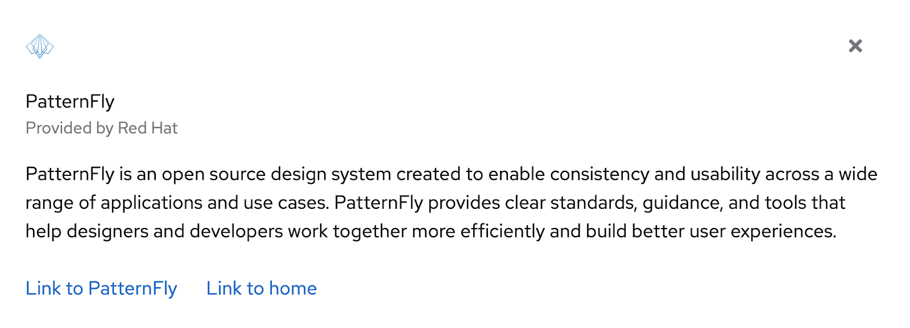
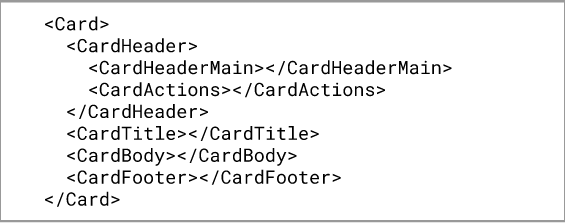

# React Fundamentals
PatternFly React is made up of components, layouts, and demos. The PatternFly React library provides a collection of React components used to build interfaces with consistent markup, styling, and behavior.

To become familiar with building UIs with PatternFly, you will build a PatternFly card. A card is a flexible element for containing any type of content. Cards are used on dashboards, in data displays, or for positioning content on a page.

## Step 1. Consider and evaluate the design.
Consider the design in Figure 1 and evaluate which components and subcomponents compose the design. Figure 1 is a design using PatternFly's card component, and PatternFly has documentation regarding the <a href="/components/card" target="_blank">card's React implementation</a> and the <a href="/components/card/html" target="_blank">card's HTML structure</a>.
In PatternFly, subcomponents compose the various regions of a card so its structure is flexible enough to accommodate a range of designs. For example, a card can contain one or more of its various subcomponents such as `CardHeader`, `CardHeaderMain`, `CardActions`, or `CardTitle`.
In this exercise, create a card to match design in figure 1 with an image, close action, header, body, and footer.


**Figure 1**


The design in Figure 1 can be broken down into the card’s various subcomponents as demonstrated in Figure 2. And the React components used to construct this card can be arranged as demonstrated in Figure 3. You are also able to view this code and modify it yourself in [this codesandbox](https://codesandbox.io/s/flamboyant-orla-gi8ho1).

**Figure 2**


**Figure 3**



## Step 2. Build out the `CardHeader`
The `CardHeader` contains `CardHeaderMain` and `CardActions`.

### Step 2.1
Add the brand to the `CardHeaderMain` component. The brand component is used to place a product logotype on a screen. All that is needed is the source image or SVG and alt text. Here the PatternFly logo is used.
Insert the brand inside of the `CardHeaderMain` component.

```noLive
<Brand
  src="https://pf4.patternfly.org/assets/images/pf-logo-small.svg"
  alt="Patternfly Logo"
/>
```

### Step 2.2
Add a close button to the `CardActions` component. Buttons communicate and trigger actions a user can take in an application or website. They come in several variations, such as primary, secondary, tertiary, danger, plain, link, and control.
Add a button using the plain variant.

```noLive 
<Button variant="plain"> </Button>
```

### Step 2.3
Add an icon inside the button. PatternFly React provides a variety of icons. They're easy to use and compile into SVG files. Use them inside buttons and other components.
Add a TimesIcon so that the card can be closed.

```noLive
<TimesIcon />
```

## Step 3. Build out the `CardTitle`

### Step 3.1
Add the text component with a variant inside of the `<CardTitle>`. The text component can wrap any static HTML content that is placed on the page to provide correct formatting when using standard HTML tags. The text component comes in several variations, such as ‘h1’, ‘p’, ‘a’, ‘small’, ‘blockquote’, and ‘pre’.
Use the ‘p’ variation, which is specified with `component={TextVariants.p}`.
Add the following code inside the `CardTitle` component:

```noLive
<Text component={TextVariants.p}>
  PatternFly
</Text>
```

### Step 3.2
Add a subhead below the text added in step 3.1. `TextContent` is used to wrap `Text` components and provides text with extra spacing and styling.
Add the following code inside of the Text component that is inside of the `CardTitle`:

```noLive
 <TextContent>
    <Text component={TextVariants.small}>
      Provided by Red Hat
    </Text>
 </TextContent>
```

## Step 4. Add content to the `CardBody` component
Any filler text can be added as a child of the `CardBody` component.

## Step 5. Add content and a layout to the `CardFooter`

### Step 5.1
Add a split layout to the `CardFooter` component.

PatternFly offers several layout options, including grid, bullseye, and split layouts.
Use a split layout to separate a pair of buttons in the footer of the card. The split layout is designed to position items horizontally. Add a `<SplitItem>` component inside `<Split>` for each item in the layout.

```noLive
<Split>
  <SplitItem>
  </SplitItem>
  <SplitItem>
  </SplitItem>
</Split>
```

### Step 5.2
Add a button to the first `SplitItem` component. Use the link variant of the button and add an `isInline` property so that the buttons are inline rather than block elements.

```noLive
<Button variant="link" isInline>Link to PatternFly</Button>
```

### Step 5.3
Add a button to the second `SplitItem` component. Use the same variant and properties as step 5.2.

```noLive
<Button variant="link" isInline>Link to home</Button>
```

### Step 5.4
Add a hasGutter property to the `Split` component to add more spacing between the buttons. The `Split` component should look like this with the hasGutter property set.

```noLive
<Split hasGutter>
```

## Compare your results
A fully constructed card can be viewed and modified in [this codesandbox solution](https://codesandbox.io/s/react-fundamentals-start-forked-0krbsb?file=/src/App.js). Compare your work with the solution.
