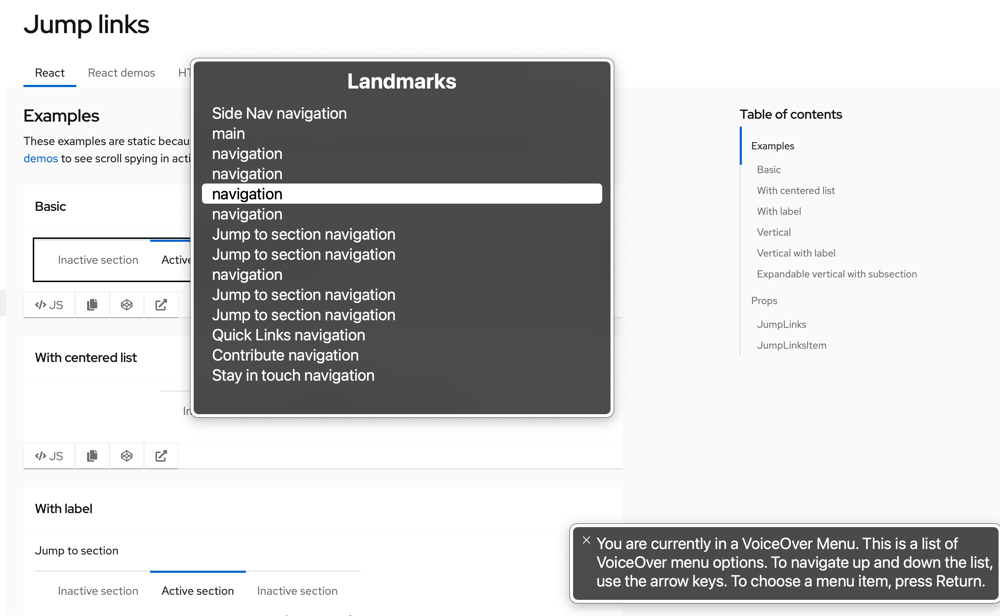

**Jump links** provide a way to navigate through section headings on a page without scrolling.

For **Keyboard users** there are a number of considerations which must be made concerning tab order and focus management.
- Keyboard users should be able to navigate to and through the jump links using **Tab** and **Shift + Tab**. 
- Keyboard users should also be able to select a jump link using **Enter**.
- The jump links should be before the associated sections in the DOM order so that the user can use the jump links to jump to the desired section. 
- When a user selects a jump link, the browser focus should move into the associated section so that the navigable elements in that associated section
can be navigated to next without having to move focus through all the rest of the jump links and page.

Additionally, it should be noted that jump links are often used on pages with so much content that the page scrolls. It should be true that
**Up** and **Down** arrow keys should be able to scroll the content.

**Screen reader users** should be made aware that the jump links are interactable when focused, and which jump link is currently active using 
`aria-current="location"` on the active jump link. 

The following props/attributes have been added for you or are customizable in PatternFly:

| React component | React prop      | Which HTML element it appears on in markup   | Explanation                                                   | 
|-----------------|-----------------|----------------------------------------------|---------------------------------------------------------------|
| JumpLinks       | aria-label      | nav.pf-c-jump-links aria-label               | Labels the nav to reflect the current nav description.        |
| JumpLinks       | toggleAriaLabel | .pf-c-jump-links__toggle > button aria-label | Accessible label for the expandable jump links toggle button. |

**Note:** Whenever multiple navigation elements are present on a page, an aria-label is highly recommended. Screen reader users
navigating a page via an elements list or rotor menu will be unable to distinguish between the various navigation elements. Using an aria-label
in these cases allows the user to differentiate between the navigation elements without navigating to and interacting with each one individually
to determine its contents. The following image demonstrates the lack of information when aria-labels are not present:

