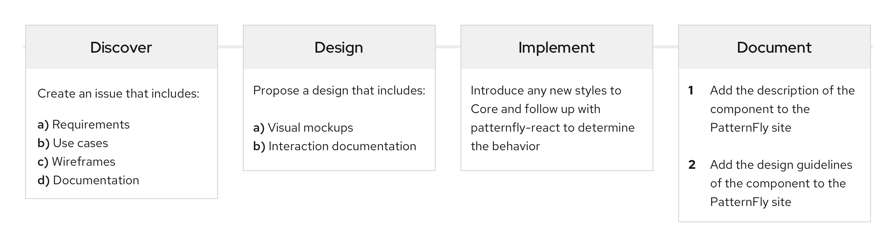

The PatternFly open source community depends on contributions to help our design system grow and evolve. We encourage everyone, regardless of background, to make suggestions for enhancements, contribute new design patterns and ideas, help identify bugs in code, and more. With your help, we can stay on top of the latest and greatest implementation solutions. Continue reading to learn how you can start contributing today.

## Process
The following is an overview of the contribution process. As a contributor, you are not expected to complete all of these stages. We appreciate your contribution at whichever step you decide to begin with.

__1. Discover__
  - Create an issue that includes:
    - Requirements
    - Use cases
    - Wireframes
    - Documentation
  - The PF team will review and prioritize your issue, taking into account scope and technical constraints
    - If accepted, your feature request will be placed on the PatternFly roadmap and moved to design

__2. Design__
  - Propose a design that includes
    - Visual mockups
    - Interaction documentation
  - The PF team will review and prioritize the design and move it to implementation

__3. Implement__
  - Introduce any new styles to Core and follow up with PatternFly-React to define the behavior
  - The PF team will review the implementation ensuring it satisfies the requirements

__4. Document__
  - Add the description of the component to the PF site
  - Add the design guidelines of the component to the PF site
  - The PF team will review the PR and make it available for consumption

## Get help
If you run into trouble and need support, the PatternFly team is here to help. Simply go to the [PatternFly forum](https://forum.patternfly.org/c/support) and add a new topic to get in touch with us. We'll always do our best to answer your questions and connect you with the right people quickly.
