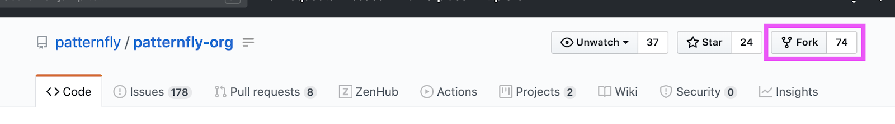
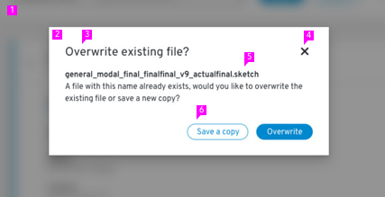
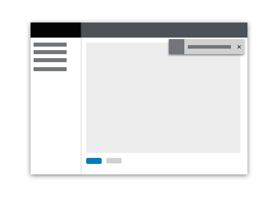
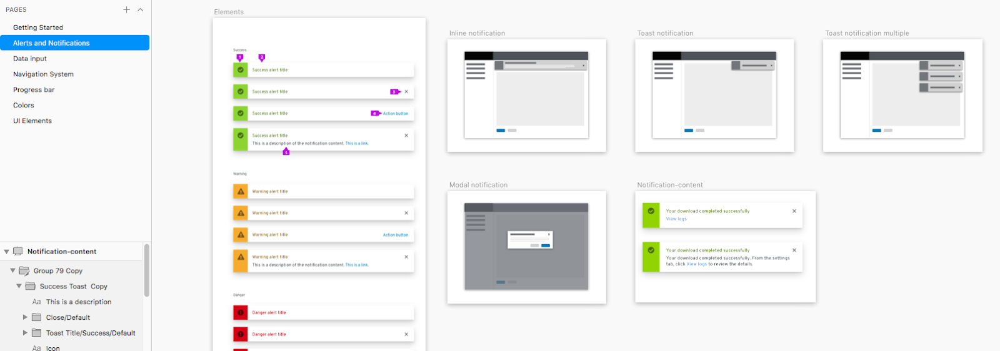
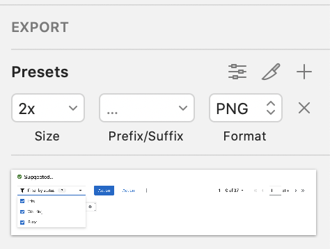
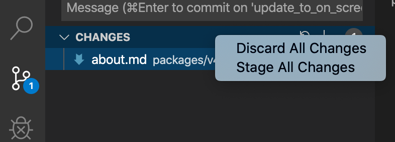
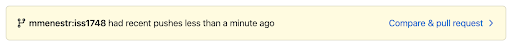
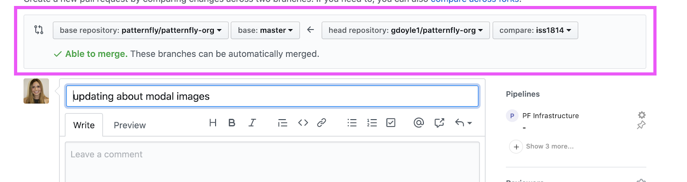
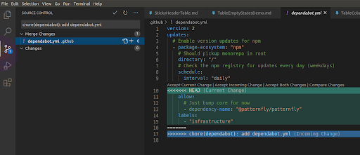

---
id: Design guidelines
section: contribute
--- 

These instructions cover the process for contributing design guidelines to patternfly.org.  

## Goals of PatternFly design guidelines

Design guidelines should give designers general usage guidelines for designing with PatternFly, as well as:

- Identify relevant components and describe how they can be used together to solve a particular use case.
- Define best design practices and explain how these can be used with components and patterns.
- Address common issues in the design and provide advice for determining the proper solution.

When you’re ready to contribute, follow these steps:

## Step 1: Research your topic  
Survey approaches and typical use cases related to your topic. Gather examples and review how projects currently address your problem or situation. You should also research industry best practices related to your topic. 

## Step 2: Set up your code editor and GitHub account
Before you can contribute content, you’ll need to set up your code editor and GitHub account so that you can share your Markdown files with the PatternFly team. You can use any code editor you like, but we recommend using Microsoft Visual Studio Code. 

1. Download [Microsoft Visual Studio Code](https://code.visualstudio.com/).
2. Open Microsoft Visual Studio Code and install [code . command](https://code.visualstudio.com/docs/setup/mac) using these steps: 
    
    a. On your keyboard, press `command + ↑ + p` to bring up the command palette.    
    
    b. Type `>shell command`. 
    
    c. Select `install “code” command in PATH`. This allows you to bring up Visual Studio Code from the command line. 

3. [Create a GitHub account](https://github.com/) if you don’t already have one. 
4. Once you created your account and logged in, go to the [patternfly-org GitHub repo](https://www.github.com/patternfly/patternfly-org).  
5. In the top right-corner under your GitHub icon, click **Fork**. 

    

6. Add a folder on your computer to store the repo content. For example, you can create a _GitHub_repos_ folder in Documents to store the patternfly-org repo content. 

## Step 3: Get patternfly-org on your local
You’ll only need to set up your local contribution environment once. Open your computer’s terminal and follow these steps: 

1. Type `pwd` and press **Enter**. This tells you where you’re located within your computer, like which directory you’re in and what files are listed there. 
2. Change directories based on where you want to install the repo. For example, if you want to install to `/Users/zallen/repos`, type `mkdir -p repos`, press **Enter**, type `cd repos`, and press **Enter**. 
3. Type  `git clone`, followed by your patternfly-org GitHub URL. Example: `git clone https://github.com/yourGitHubname/patternfly-org.git` 
4. Type  `cd patternfly-org` and press **Enter**. 
5. Type `git remote add upstream https://github.com/patternfly/patternfly-org.git` and press **Enter**.

## Step 4: Begin a new pull request (PR) or edit an existing one

If you’re creating a new PR: 

1. Use your terminal to enter the correct directory (directions in Step 3 above).
2. In your terminal, enter commands to grab the most updated version of the master branch:   

    a. Type `git fetch upstream` and press **Enter**. 
    
    b. Create a new branch by typing `git checkout -b [name of your PR] upstream/master` and press **Enter**. For example, if your PR name is iss2020, you would type `git checkout -b iss2020 upstream/master`.  

3. Edit files by typing `code .` and then pressing **Enter**. This will open Visual Studio Code (if this doesn’t work, you can manually open the Visual Studio Code app).

If you’re editing an existing PR:

1. Type git fetch upstream and press **Enter**.
2. Type `git checkout [name of your existing PR]` and press **Enter**. For example, if your existing PR name is iss2020, you would type `git checkout iss2020`. 
3. If GitHub shows merge conflicts, type `git pull upstream master` and press **Enter**.
4. Edit files by typing  `code .` and pressing **Enter**. This will open your Visual Studio Code (if this doesn’t work, you can manually open the VIsual Studio Code app). 

## Step 5: Create or edit a file

If you're creating a new file, name it **[design].md** in Visual Studio Code, replacing “design” with the name of your guideline exactly as you want it to appear in the website’s navigation.  

To edit or add an existing file, locate the existing page in Visual Studio Code instead of creating a new .md file or folder. 

Design guidelines are stored with other website content in the patternfly-org GitHub repo. Files in this repo adhere to the following file structure:  

- **content**  

    - contribute 
    - **design-guidelines** 

        - **content** 
        - **styles** 
        - **usage-and-behavior** 
        
            - &lt;**topic-name**&gt;

                - **img**  

                    - &lt;**image-1.png**&gt; 
                    - &lt;**image-2.png**&gt;

                - **design.md** 
        
    - documentation 
    - get-started 

_Note: Items not ending in a file extension are folder names._

Design guideline documents are located in **content** &gt; **design-guidelines**, shown in bold above. There are three subfolders: 

1. **Content**: Guidelines for writing microcopy
2. **Styles**: Visual design resources and styles
3. **Usage and behavior**: Interaction design patterns 

All folder and Markdown file names should be in lowercase with dashes in place of spaces. Image file names should be descriptive. Include the name of the pattern and, if possible, the defining feature of the image. Avoid giving images generic names, such as "image13copy.png.” 

## Step 6: Draft your document

Now that your file is created and in the right location, draft your document in Markdown. 

If you want feedback _before_ creating the Markdown draft, you can create a draft using Google Docs or a similar word processor and share it with [mmenestr@redhat.com](mailto:mmenestr@redhat.com) to receive comments.

## Step 7: Create image assets

Locate examples for reference and then construct image mockups to illustrate how those examples could be built using standard PatternFly components.

If new components or demos are required to address the topic, you can request them by filing an issue in the [patternfly](https://github.com/patternfly/patternfly) repo. 

To ensure that imagery is consistent and maintainable, create all your image assets in Sketch: 

1. Download the latest version of the [Design Doc Assets file](https://sketch.cloud/s/ggDwz) from the Sketch Cloud. This file contains all of the assets needed to create and maintain images used within design documentation.
2. Open the file in Sketch and create a new page for keeping all your topic images. Name that page with the title of your documentation page—it will be used for displaying the topic in the navigation. If you’re modifying an existing topic, you can edit the existing page.
3. Insert a new artboard for every unique image that you will create.
4. Create your images. There are two types of images used within design guideline documents: 

    - **High-fidelity mockups** are used to show component details or in any situation where understanding design specifics is important. When describing a design, add numbered callouts to point to specific elements. If you’re only pointing to one element, use an arrow to point to the element instead.  

         

        When creating high-fidelity mockups, you should first look for existing examples in the [PatternFly template file](https://www.sketch.com/s/729c2eee-e8b6-4fcd-8a79-f6faa8c30f89). You can create new examples as needed by using the components found in that file. Next, export those images so that they can be added to your corresponding document page in the [Design Doc Assets file](https://sketch.cloud/s/ggDwz). You can make callouts or other customizations there as needed. 

    - **Schematic mockups** convey placement of elements in a page. These are useful when the internal content is not important or relevant. Because they lack text and graphics, schematic mockups also scale well when placed in a document. The example below demonstrates how the positioning, rather than the content, of a toast alert is the focus. 

      

When finished, your organization should look like this:

 

## Step 8: Export and add image assets 

To ensure high-quality images in the final documentation, export sketch images as PNG x2.  

 

Exporting as PNG x2 ensures better image quality, but it also doubles physical size (WxL). To maintain good image quality while restricting image width to the original artboard width, add images to Markdown using the following HTML tag: 

``  

The image should display in the visual designer of the Markdown tool you’re using. If the example does not display, there might be a problem with your code. Check that the element is correct and did not turn into normal quotations while copy/pasting. 

## Step 9: Stage and commit changes 

Once you’re finished making changes, stage them in Visual Studio Code:  

1. When you've completed all changes, click on the numbered bubble in the toolbar’s code icon.  

  

2. In the **Changes** tab, right-click and select **Stage all changes**. 

 

3. Return to your Terminal application to commit the changes: 

    a. Type `git status` and press **Enter**. This should list the same files that were listed in your “changes” tab in VS. If there aren’t any errors, continue to the next step. 
    
    b. Type  `git commit -m ‘title of your PR’` and press **Enter**. You can edit this title later in GitHub if necessary, but it must be placed between single quote marks ( ‘ ) for now. Be sure to type these single quote marks—copy/pasting them from this page won’t register correctly. 
    
    c. Type `git push origin --set-upstream [name of your PR]` and press **Enter**. 

## Step 10: Create a pull request 

On GitHub, create a pull request to submit your changes: 

1. Go to the patternfly-org repo pulls and click **Compare & pull request**.  

 

2. On the resulting page, make sure that the arrow points towards the base repository and away from the head repository. 

 

3. Change your PR name and/or add a comment to your PR if you need to.
4. Attach all of your image files to this PR so that they can be updated in the original document, merged back into the main branch, and uploaded back to Sketch Cloud for future access.
5. Tag [mmenestr](https://github.com/mmenestr) to initiate a final review. 
6. Submit the PR.  

If your PR has merge conflicts in Github:

1. Return to your terminal and `type git fetch upstream` and press **Enter**. 
2. Type `git rebase upstream/master` and ress **Enter**. 
3. Solve the merge conflicts.
4. Type `git add -A` and press **Enter**.
5. Type `git rebase --continue` and press **Enter**.
6. Type `git push --force origin <name of your PR>` and press **Enter**. 

 

7. Upon merging the pull request, new content will become live on the website in the next release. 