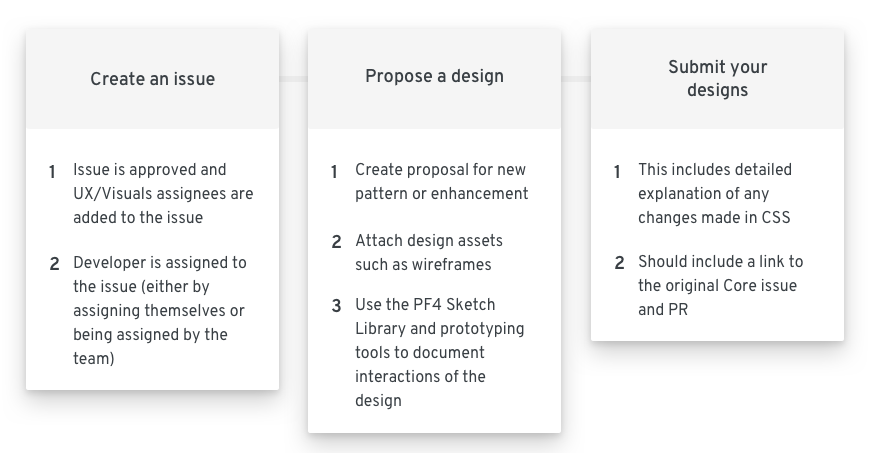

## Ways to contribute
Whether you have an existing design or requirements for a new feature, the first step is to open a New Feature Request issue. Your request will be reviewed and placed on the PatternFly roadmap. After this, the PatternFly design team will work with you to complete your design proposal and facilitate reviews.

As a designer, here are some of the contributions you can make:

### New feature
Work with PatternFly to design a new feature for your product and contribute it back to the system simultaneously.

__Example__
*I want to design and contribute a new design pattern that allows a user to favorite or like an item in a data list.*

### Enhancement
Improve or update an existing PatternFly component or design pattern.

__Example__
*I want to add a compact/expand toggle to the list view.*

You may also open an issue to propose a new design guideline page or update an existing guideline, and work with the PatternFly team and stakeholders to author and publish your new content.

### Design guideline
Design guidelines appear on the website and help designers to apply PatternFly components in their designs.  They are use case and solutions driven.

__Example__
*I want to add guidelines for how to apply labels and tags to organize objects.*

## Lifecycle

Before you begin the contribution process, follow [these guidelines](/get-started/design) to get your environment setup.

Follow these steps and this [template format](https://documentcloud.adobe.com/link/track?uri=urn%3Aaaid%3Ascds%3AUS%3A28fd970d-8b77-4008-b598-b2f629bda589) to submit your designs:

__1. Create an issue__
  - Navigate to the [PatternFly page](https://github.com/patternfly) on Github and go to the [feature board](https://github.com/orgs/patternfly/projects/3)
  - Open an issue for a new feature or comment on an existing issue for an enhancement

__2. Propose a design__
  - Create a proposal for the new pattern or enhancements (be sure to re-use existing components in the design when applicable)
  - Attach any design assets such as wireframes or mockups to help clarify the design intent and behavior
  - Document all interactions within the desing clearly (you can leverage the Sketch library in addition to prototyping tools like InVision, Marvel, etc.)

__3. Submit your designs__
  - The PatternFly team will help you throughout this process. If accepted, you will be assigned a buddy to assist you throughout the rest of the process

