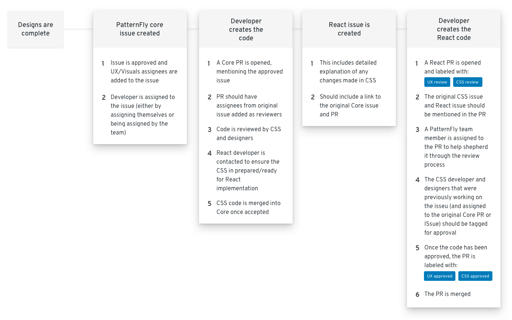

## Ways to contribute
1. Pick an open issue in the [pf-next repo](https://github.com/patternfly/patternfly-next/issues) and make a comment that you would like to contribute
2. Pick up open issue in [pf-react](https://github.com/patternfly/patternfly-react/issues) backlog
3. File a bug:
  - View the documentation for the component
  - Search open issues in CSS & React to see if exists already
  - If the bug is present in only the React implementation, create a bug on that repo
  - If the bug can be seen on both the React and CSS side, it should be created on the CSS repo.
  - Mention which project the bug was noticed in and if there is a deadline that the fix is needed for

[Core contribution guidelines](https://github.com/patternfly/patternfly-next#guidelines-for-css-development) & [React contribution guidelines](https://github.com/patternfly/patternfly-react/blob/master/CONTRIBUTING.md#contribution-process)

## Lifecycle

