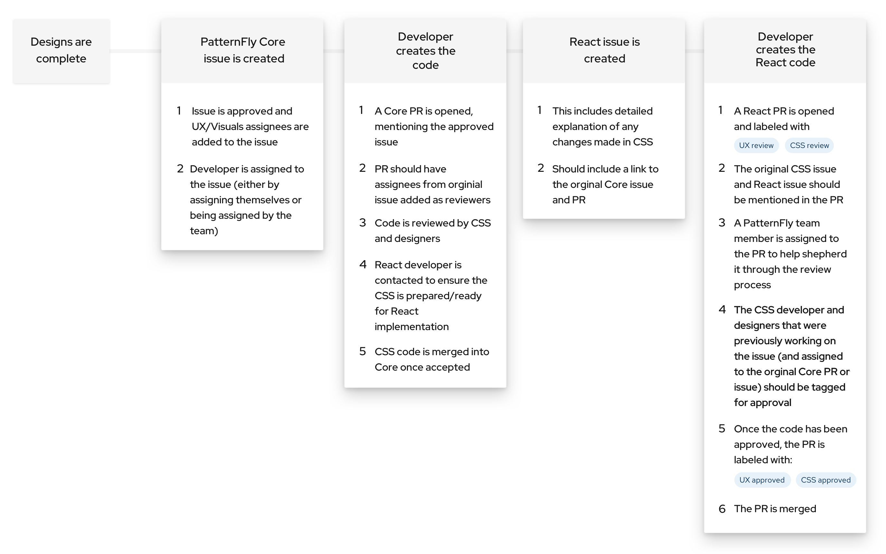

## Ways to contribute

As a developer, here are some of the contributions you can make:

### Pick up an existing HTML/CSS issue
Pick an open issue in the [patternfly repo](https://github.com/patternfly/patternfly/issues) and make a comment that you would like to contribute

### Pick up an existing React issue
Pick an open issue in the [patternfly-react repo](https://github.com/patternfly/patternfly-react/issues) and make a comment that you would like to contribute

### File a bug
  - View the documentation for the component
  - Search open issues in the [patternfly](https://github.com/patternfly/patternfly/issues) and [patternfly-react](https://github.com/patternfly/patternfly-react/issues) repos to see if a related issue exists already
  - If the bug is present in only the React implementation, create a bug in the [patternfly-react repo](https://github.com/patternfly/patternfly-react/issues)
  - If the bug can be seen on both the React and HTML/CSS side, it should be created on the [patternfly repo](https://github.com/patternfly/patternfly/issues)
  - Mention which project the bug was noticed in and if there is a deadline that the fix is needed for

## Detailed contribution instructions
- [Core contribution guidelines](https://github.com/patternfly/patternfly#guidelines-for-css-development)
- [React contribution guidelines](https://github.com/patternfly/patternfly-react/blob/main/CONTRIBUTING.md#contribution-process)

## Lifecycle

