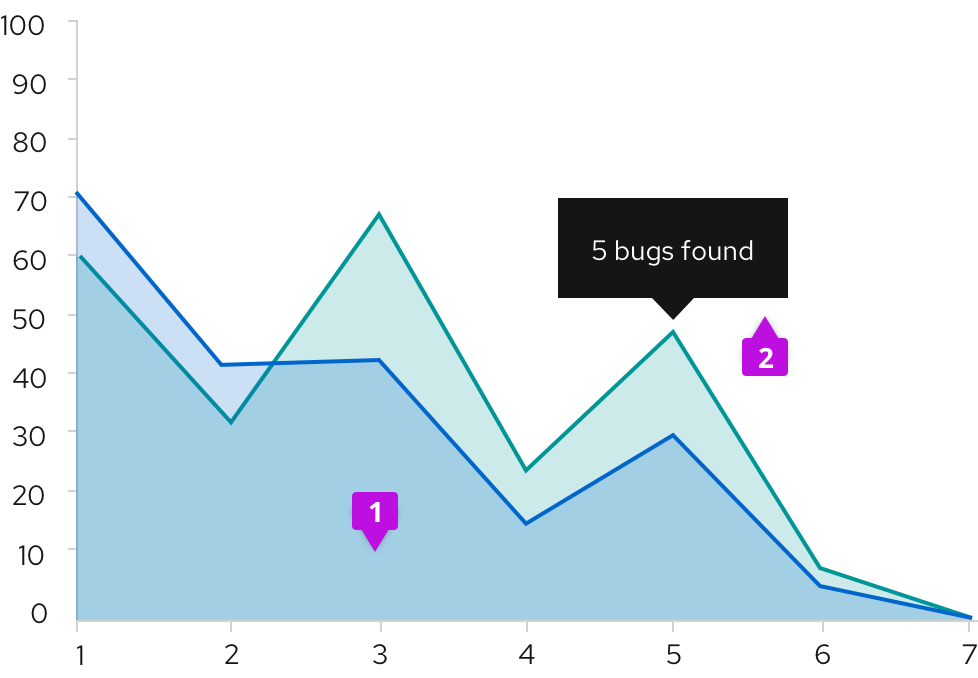

An **Area chart** is used to provide metrics for a single data point. While similar to a line chart in both form and function, it offers an area fill for visual emphasis. The area fill below the line also functions to indicate cumulative data.

## Usage
The most common use case for area charts is to show trending over a continuous scale (usually time). Use this instead of a line chart when you need to provide more visual emphasis than a simple line chart would offer. It is possible to stack area charts to compare more than one continuous data sets. Stacking area charts will put more emphasis on the difference between the data sets visualized. See [Line charts](/charts/line-chart) for more information about them.

### Example
 

1. **Data area fill:** The area fill is presented below the data line. Data area fills use colors that conform with the [Colors for charts](/guidelines/colors-for-charts).
2. **Chart tooltip:** Use the chart tooltip to drill into the data related to any data point provided on your area chart.