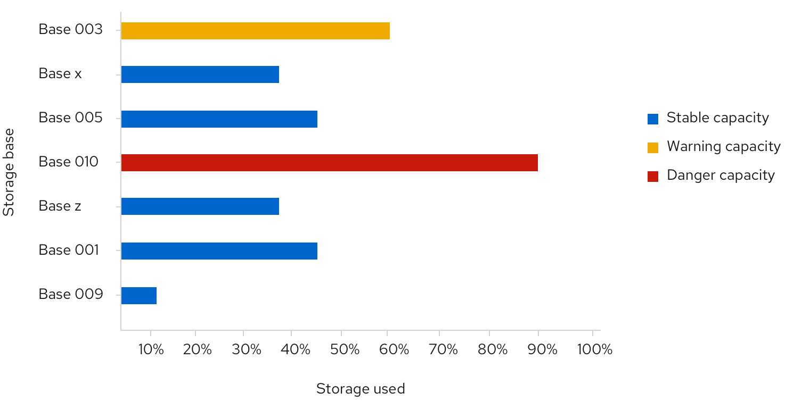
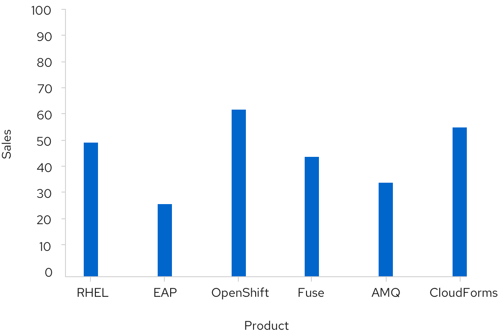

A **Bar chart** is used to easily display two variables, one on the horizontal x-axis and one on the vertical y-axis. They are helpful to visualize and compare categorical data.

## Usage
Since bar charts differentiate by length, we recommend that in most cases they be used rather than donut or pie charts, which differentiate by angle and area. As a rule of thumb, bar charts are a great way to show and compare categorical data. If you want to show continuous data over time, you may consider using a [Line chart](/charts/line-chart) instead. If you wish to show the percentage utilization ratio between used and available, you should check out the [Donut utilization chart](/charts/donut-utilization-chart).

## Horizontal vs. vertical bar charts

The orientation of bar charts is dependent on the data and space at hand. Any bar chart should be able to be displayed in either direction if applicable.

#### Example

 

1. **Bar:** All bars should be the same width. The height of the bar represents its value. The spacing between bars should be equal as well, mimicking the axis value spacing. For recommendations on fill colors, see [Colors for charts](/guidelines/colors-for-charts).
