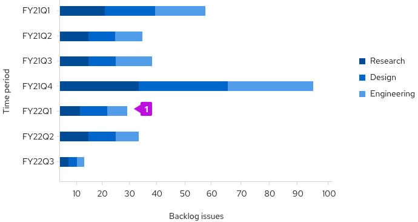
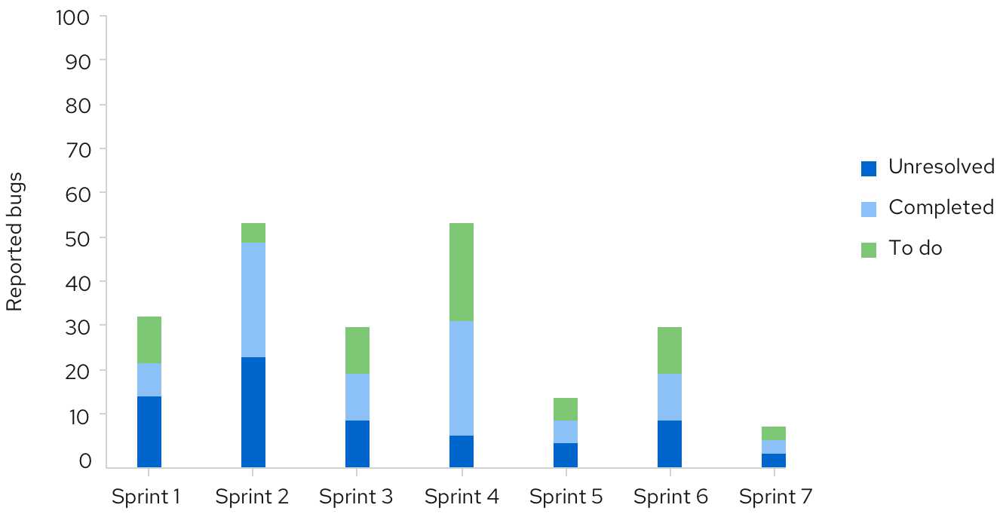

A **Stacked bar chart** describes totals while allowing a degree of internal breakdown of the data. They can be illustrated vertically and horizontally depending on available space and the data being described.

## Usage 
An advantage of stacked bar charts is the order of the stack can be swapped without changing the overall total. These can be illustrated vertically and horizontally depending on available space and the data being described.

#### Example

 

1. **Stacked bar:** The first series name is represented by the topmost stacked bar, and the last series name is represented by the bottommost stacked bar. For recommendations on series colors, see [Colors for charts](/guidelines/colors-for-charts).
