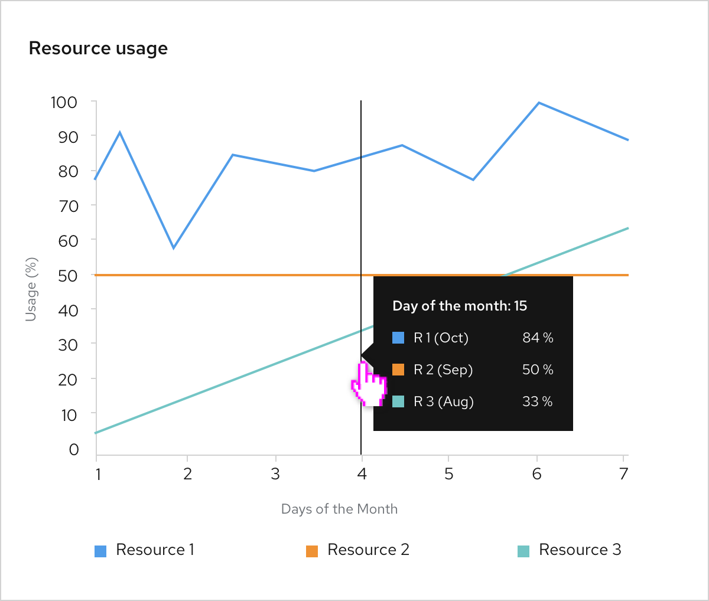

A **Tooltip chart** is a chart with tooltips that appear when users hover over items in the chart.

## Usage
For charts that have more than one data set graphed, a complex chart tooltip can be used to give more detail to a specific point in the multiple data series. This would work well for [line](/charts/line-chart), [area](/charts/area-chart), or [stacked](/charts/stack-chart) charts where data sets could intersect over a period of time.

## Example
The tooltip shows up on hover, and contains all the corresponding data points that match a point along the x-axis. The content of the tooltip could also include any additional information that might be important to show the user.

