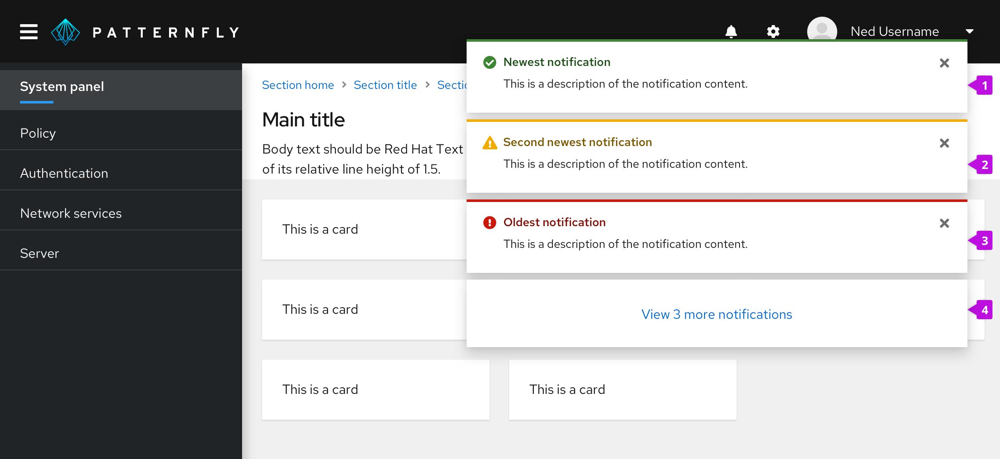

An **alert group** stacks and positions two or more alerts in a layer over the main content of a page. Alert groups should always rank alerts by age, stacking new alerts on top of old ones as they surface. 

Use an alert group when you need to position multiple alerts on the same page, mainly [toast alerts](/components/alert/design-guidelines#elements). Toast alerts continue to stack until a user dismisses them or they reach an automatic timeout (8 seconds is recommended).

## Elements

1. **Newest notification:** Always appears at the top of the alert group.
2. **Second newest notification:** Moves down when a newer notification surfaces.
3. **Oldest notification:** Continues to move down the stack as newer notifications surface, until a user closes it.

## Placement
Use 8px of padding between each alert in an alert group. Alert group alignment on a page will depend on your use case.

**For desktop views**, right-align alert groups over your page content. Each alert should stack on top of one another with 8px of padding in between.

**For mobile views**, center alert groups over your page content.

See our [alert guidelines](/components/alert/design-guidelines/#using-toast-alerts) for more information about using toast alerts.
