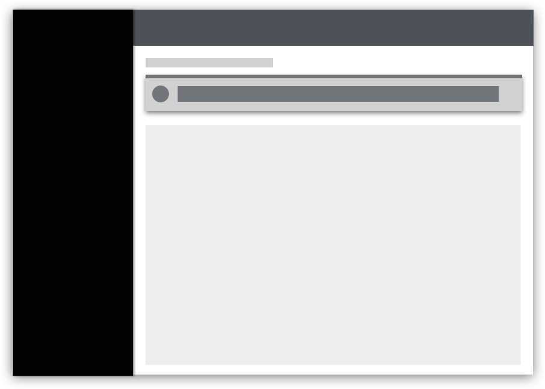
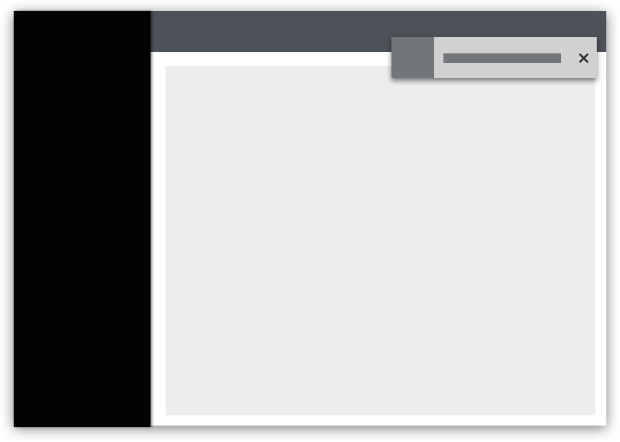
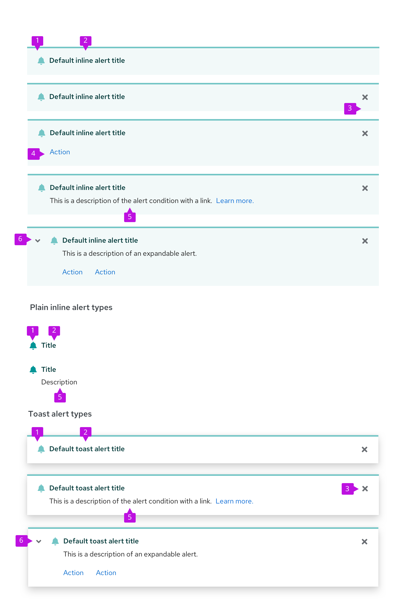
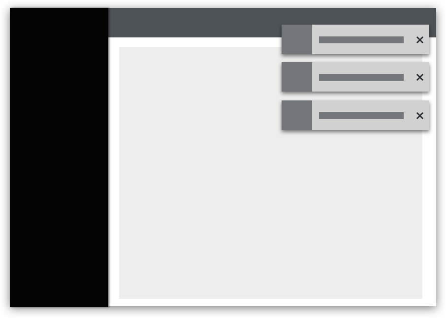

An **alert** is a notification that provides brief information to the user without blocking their workflow.

There are 2 main types of alerts:  

- **Inline alerts**: Inline alerts communicate information about a specific user action on a page. An inline alert appears within the content area and disappears when the user closes it or navigates away from the page.

- **Toast alerts**: Toast alerts communicate information about an update, confirmation, or other activity. A toast alert overlays content in the upper-right corner of the page and disappears when it times out or when the user dismisses it.

## Elements
Toast alerts are always dismissible, and inline alerts can be both dismissable and non-dismissible. Other elements are consistent between both alert types.

1. **Status area**: The status area indicates the severity of the alert with a specific icon and color.   
2. **Alert title**: The alert title concisely communicates the alert’s main message. Its text color is coded to match the alert type.  
3. **Close button**: The close button is used to dismiss the alert. It’s required for toast alerts and optional for inline alerts.  
4. **Actions (optional)**: The actions area enables the user to take a specific action in relation to the alert. 1 or more actions can be placed inside of an alert.  
5. **Description (optional)**: The description field communicates additional information to the user. It can also include a navigation link as an alternative to an action.
6. **Expandable alert (optional)**: The expansion reveals additional information.

## Communicating severity
The status icon, background, and alert title are coded to communicate the severity of an alert.

|Type     |Icon    |Usage      |
|---------|--------|--------------|
|Default  |fa-bell | Use for generic messages with no associated severity
|Information     |fa-info-circle|Use for general informational messages|
|Warning  |fa-exclamation-triangle |Use to indicate that a non-critical error has occurred|
|Critical |fa-exclamation-circle | Use to indicate that a critical or blocking error has occurred
|Success  |fa-check-circle | Use to indicate that a task or process has completed successfully

For more information about what colors to use for status and severity, visit the [Colors page](/guidelines/colors/#status-and-state-colors).

## Using inline alerts
Use inline alerts to return feedback as the result of a user action within a page without blocking the user’s workflow. Common uses for inline alerts include form validation and warning messages.

If an alert message applies globally to the content on a page, place the alert in the page header area just below the title.

If the alert applies only to specific content, place it inline with the page content to call attention to the error.

The user can dismiss information alerts by clicking the alert’s close button. Error-related alerts (warning and critical severity) should disappear only when the user addresses the issue that caused the alert. However, if the issue cannot be corrected on the current page and the user must take action to address a situation before proceeding, use a [modal](/components/modal) instead of an inline alert.

In addition to static message content and links, you have the option of including interactive elements in the body of an inline alert to ask the user for further input or feedback.

Inline alerts are commonly used in the following situations:
- Informing the user that the information they entered into a form field isn’t valid
- Informing the user of something that needs their attention
- Informing the user that they need to set something up
- Informing the user that a feature is temporarily unavailable

## Using toast alerts
Use toast alerts to communicate an update, confirmation, or other activity to the user without blocking their workflow. For example, you can use a toast alert to inform the user that their message was sent. You can include links in a toast alert for a user to take action on the event that surfaced the alert, but the links should only be a shortcut for the user. A toast alert should never be used as the only means for taking actions on an alert event.

Toast alerts stack in the upper-right corner of a page. To properly position and stack a set of alerts, use an [alert group](/components/alert-group) component. When alerts stack, the most recent alert appears at the top, and others move down as more alerts come in. When alerts are deleted, the remaining alerts move up.

Toast alerts should always have a close button so that the user can dismiss them. If you include an automatic timeout for your toast alert, 8 seconds is recommended. Toast alerts should not disappear while the user is hovering over them.

Toast alerts are commonly used in the following situations:
- Confirming that a message sent
- Confirming that an update was made
- Informing the user that their action was completed successfully
- Informing the user that their action was completed with errors

## Customizing alerts

If your use case falls outside of PatternFly's standard alert variations, use [icons](/guidelines/icons) and [colors](/guidelines/colors) to create custom alerts that meet your needs.

View custom alerts in action in our [custom alert examples](https://www.patternfly.org/v4/components/alert#custom-icons).

## Content

- In inline alerts and toast alerts, avoid using “success” and “successfully.” They’re extraneous.

| **Do** | **Don’t** |
|:------:|:---------:|
| Account created| Your account was successfully created.|

  

- Be concise. In one-line toast alerts, use fragments instead of sentences if possible.

| **Do** | **Don’t** |
|:------:|:---------:|
| Message sent| Your message has been sent.|

 

  

- In toast alerts containing links, describe how the user can navigate through the UI to perform the action. Learn more about how descriptive text supports accessibility in the next section. 

| **Do** | **Don’t** |
|:------:|:---------:|
| From the **Settings** tab, click **View logs.**| **View logs**| 

  

 

## Accessibility considerations
Toast alerts present special challenges for accessibility. Screen readers announce the arrival and message content of an incoming toast alert, but user focus will not be placed there. This makes it difficult for these users to directly act on the alert itself.

In any toast alert containing links for further user action, include text that describes how the user can navigate through the UI to perform the action.

For example, this toast alert is not accessible because it does not include text that explains to the user where to go within the UI to perform the action: 

This toast alert is accessible to sighted and non-sighted users because it includes text that explains to the user where to go within the UI to perform the action: 

