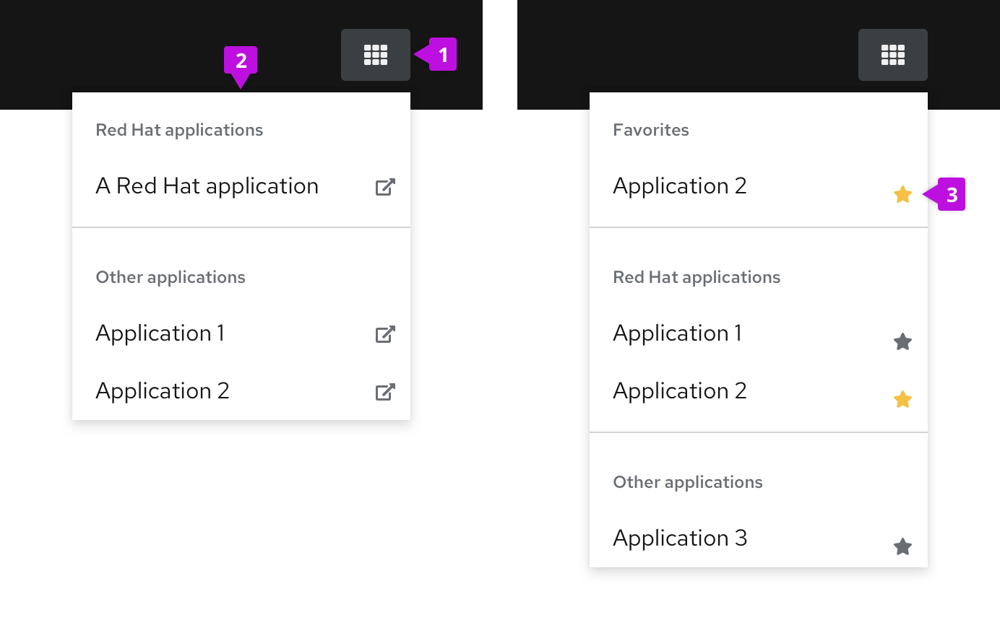

An **application launcher** is an optional utility menu item that allows a user to launch a separate web application in a new browser window.

## Elements
An application launcher has two main elements.

1. **Icon:** used to open and close the menu.
2. **Menu:** contains a list of links.

## Usage

Application launchers are usually found within the masthead of a UI. They are commonly used when you want to allow a user to launch multiple applications from a common location. Use the external link icon to indicate when a link opens a new window. You can also use icons in the list. For longer lists, you can optionally add the ability to search the list and favorite items.

## Examples
**Application launcher with external links**

**Application launcer with favorites and search**

