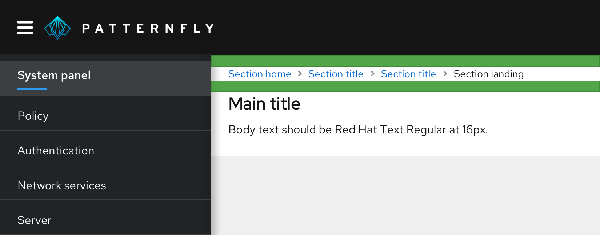

**Breadcrumbs** act as a resource to help users navigate more efficiently and provide context to help users understand where they are in the application hierarchy. 

## Usage

Use breadcrumbs in addition to your global navigation to display a user's location in the application.

### Guidelines
* Use breadcrumbs when the primary global navigation items are not always exposed.
* Never use breadcrumbs as a replacement for global navigation.
* Never use breadcrumbs to map a user’s personal journey through a website as it may not reflect where the page actually lives. 

### Placement
Breadcrumbs should be placed underneath the masthead, at the top of the page. There should be 16px of padding both between the breadcrumb and the masthead, and between the breadcrumbs and anything that comes below.

