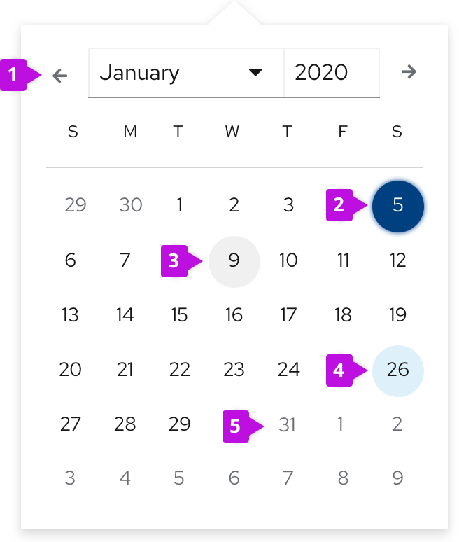

A **calendar month** component allows users to select and navigate between days, months and/or years. This component is usually used with the date picker component, to display date options and selections. For more information about usage, view [date picker guidelines](/components/date-picker/design-guidelines).

## Elements

1. **Selection arrows**: allow users to navigate between months.
2. **Selected date**
3. **Current date (today’s date)**: Indicates the day users access the calendar. Always highlighted.
4. **Hover state**
5. **Disabled state**
