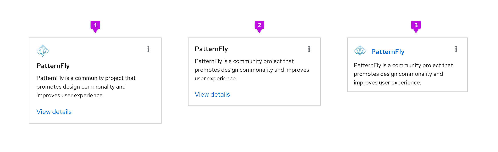
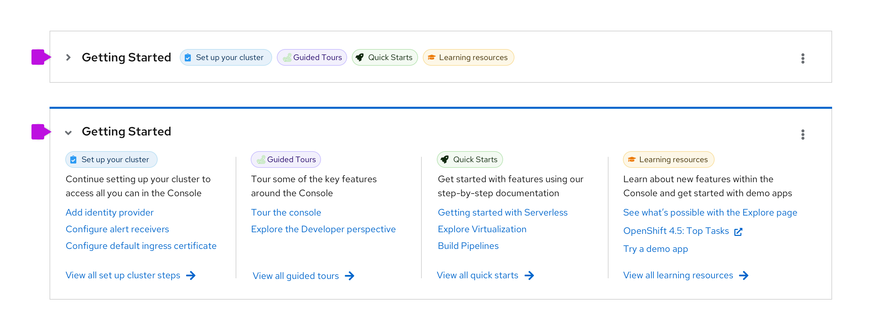
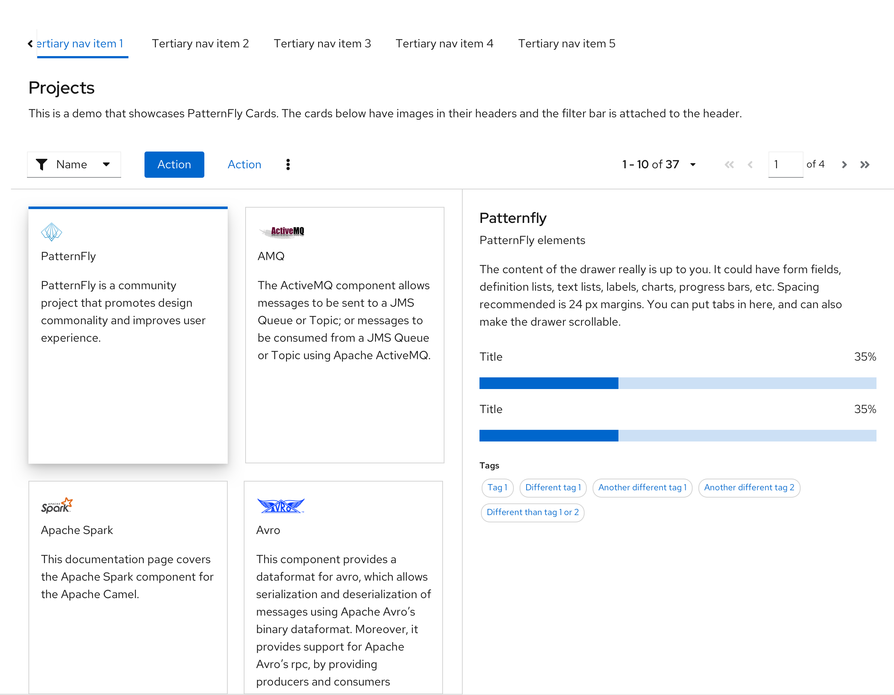

A **card** is a square or rectangular container that can contain any kind of content. Cards symbolize units of information, and each one acts as an entry point for users to access more details. For example, in dashboards and catalog views, cards function as a preview of a detailed page. Cards may also be used in data displays like card views, or for positioning content on a page.  

## Elements

A card usually consists of four parts:

  

1. **Header:** Defines the contents of the card. Card headers can optionally contain images as well as the title of the card and an actions menu represented by the right-aligned kabob.

2. **Title(optional):** Communicates the title of the card if it's not included in the header.

3. **Body:** Provides details about the item. The card body can include any combination of static text and/or active content.

4. **Footer(optional):** Contains links, actions, or static text at the bottom of a card.

Cards are flexible and customizable to your use case. Here are some different ways to use a card to represent the same content. Choose a layout that considers the usage context and the space you have to work with.

1. The first version places an image in the header with a separate title. The View details action is located in the footer.

2. In the second verion, the title is moved to the header area to give a more compact footprint.

3. A third version removes the footer, adds the image back, and makes the title a link to drill into the details, which makes the footprint of the card smaller, yet.

### Content spacing

PatternFly supports three types of cards:

1. **Compact (recommended):** Use 16px spacing with an 8px spacer between the header and body, and a 16px spacer between the body and footer.
2. **Standard:** Standard cards use 24px spacing with a 16px spacer between the header and body and 24px between the body and footer.
3. **Large:** Large cards use 32px spacing with a 24px spacer between the header and the body and 32px between the body and footer. Large cards are generally used for presenting marketing content or anyplace where a lower content density is desired.

## Variations

### Border treatments

PatternFly offers two types of border treatments for cards:

1. **Default card:** By default, cards will have a thin (1px) drop shadow to differentiate them from the background of a page and give them a slightly raised appearance.
2. **Flat card:** Flat cards have a 1 pixel gray border. Flat cards are recommended for use against a white background as the solid border will better differentiate the card from the page background.

### Expandable cards

The Title element can be made expandable in situations where you want to hide the card content and reduce its footprint. In the collapsed state, only the card title is shown, and the user can click the expansion toggle to view the remainder of the card content.

### Selectable cards
It is often useful to make cards selectable. PatternFly supports two types of selectable cards.

1. **Multi-select card:** A multi-select card has a checkbox in the upper righthand corner. Users may select cards for performing global actions against by selecting the checkbox.

2. **Selectable card:** A selectable card has a raised appearance and a blue border treatment when selected.

## Usage
Use cards:
- To visually group content or distinguish information from the rest of a page’s content. Examples include dashboards and catalog views.
- To organize content in layouts with multiple columns or grids.  
- To compare separate groups of information.  
- To make media easier to scan, such as images or videos.  

**Never** use a card to show a dense amount of repetitive, related content. Use a [data list](/components/data-list) or [table](/components/table) view instead.

Cards primarily appear in [catalog views](#Cards-in-catalog-views), [primary-detail views](#Cards-in-primary-detail-views), and [dashboards](#Cards-in-dashboards).

### Cards in catalog views

A common use case for cards is when you want to present a catalog of items that the user can choose from. In this case, presenting a grid of cards can be a good solution. An example of cards used in a catalog view is shown below.

Note that this view uses a multi-select card so that bulk actions can be performed from the toolbar on a group of cards at once. For more information on cards used in a catalog or card view, see the [card view design guidelines](/demos/card-view/design-guidelines).

### Cards in primary-detail views

Use selectable cards when you want to present an overview of a set of objects and then examine the details. Here, a details of different projects can be displayed in a side-by-side primary-detail view.

### Cards in dashboards

Cards are often used in dashboards to visualize information. You should generally organize your dashboard such that each card displays a specific piece of information.

