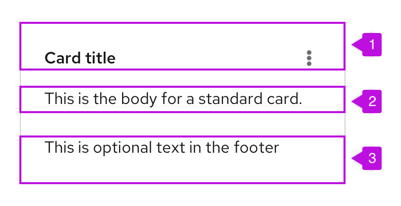

A **card** is a square or rectangular container that can contain any kind of content. Cards symbolize units of information, and each one acts as an entry point for users to access more details. For example, in dashboards and catalog views, cards function as a preview of a detailed page. Cards may also be used in data displays like card views, or for positioning content on a page.  

## Elements

A card usually consists of 3 parts: 

  

1. **Header**: Title of the information group
2. **Body**: Brief details about the group
3. **Footer**: Links to access more information about the group 

Cards are flexible, and you can customize them in a variety of ways. A card can contain:
- A header with an image, actions, and a body.
- Only a header and a body. 
- A header with an image, a body, and footer. 

PatternFly supports two types of cards: 
1. **Compact (recommended):** Compact cards use 16px spacing with an 8px spacer between the header and body and 16px between the body and footer.
2. **Standard:** Standard cards use 24px spacing with a 16px spacer between the header and body and 24px between the body and footer.

 

## Card usage
Use a card:
- To visually group content or distinguish information from the rest of a page’s content. Examples include dashboards and catalog views. 
- To organize content in layouts with multiple columns or grids.  
- To compare separate groups of information.  
- To make media such as images and videos easier to scan.  

 
 
 
Do NOT use a card to show a dense amount of repetitive, related content. Use a list or table view instead.

## Card view usage
A **card view** is a grid of cards that displays a small to moderate amount of content. 

 

Use a card view to:
- Display items in a data set that are best identified by a graphic or other visual representation.
- Make information easier to visualize and compare. 
- Summarize a large number of objects at once within the same page. 

Do NOT use a card view to make a large amount of text-based content easier to scan. Use a table or list view instead.

### Background colors for card views 
Use a white or a gray background for your card views.

Use a white background if your content view can change. Examples: 
- A card that opens an expandable panel on the right 
- A card view that toggles into a table or list view 

 

**Note**: If you use a white background, apply a gray border to your card instead of a drop shadow. 

Use a gray background if the sole purpose of your content view is to display cards. 

 

### Card views on mobile 
Cards will size down appropriately based on the built-in CSS responsiveness behaviors. Most of the time, they’ll follow the grid layout, expanding and compressing at certain breakpoints. At the smallest mobile size, they take up almost the entire width of the screen. 

 

### Card view actions
You can customize card actions in a few ways. Here are some recommendations to consider depending on your use case:

#### Inline actions 
If an action can be performed on one card only, place the action in the card’s body or footer. You don’t need to include a checkbox because the actions are card-specific. 

- If you have a few cards with single actions, use the secondary button style. 
- If you have multiple cards with single actions, use a link button or link text.

  

Inline action cards are commonly used as navigation or drill-down indicators. In this case, present the user action on the card to differentiate this type of navigational card from a standard card. This way, users can easily distinguish the card types if your application includes both.   

 

#### Multiple inline actions
If multiple actions can be performed on a single card, place those actions in a kebab. Position the kebab in the top-right corner of the header.

 

#### Global actions 
If an action can be performed globally on multiple cards, or if it leads to multiple pieces of content at the same time, place the action in a toolbar above the card view. In the top-right corner of your card, add a checkbox so that users can select one or more items.

 

1. Upon hover, the card’s shadow expands.
2. Global actions are placed in the toolbar.
3. The card’s checkbox allows a user to perform an action on multiple cards. When a user selects a card, the checkbox turns blue to indicate selection.

### Images 
Only include meaningful images on your cards (don’t add them for decoration). Images should help users identify specific content types. Place smaller images above the card’s header, and place larger images within the card’s body. 

 

### Bottom pagination 
If your card view has multiple pages, add a footer with pagination. 

 
