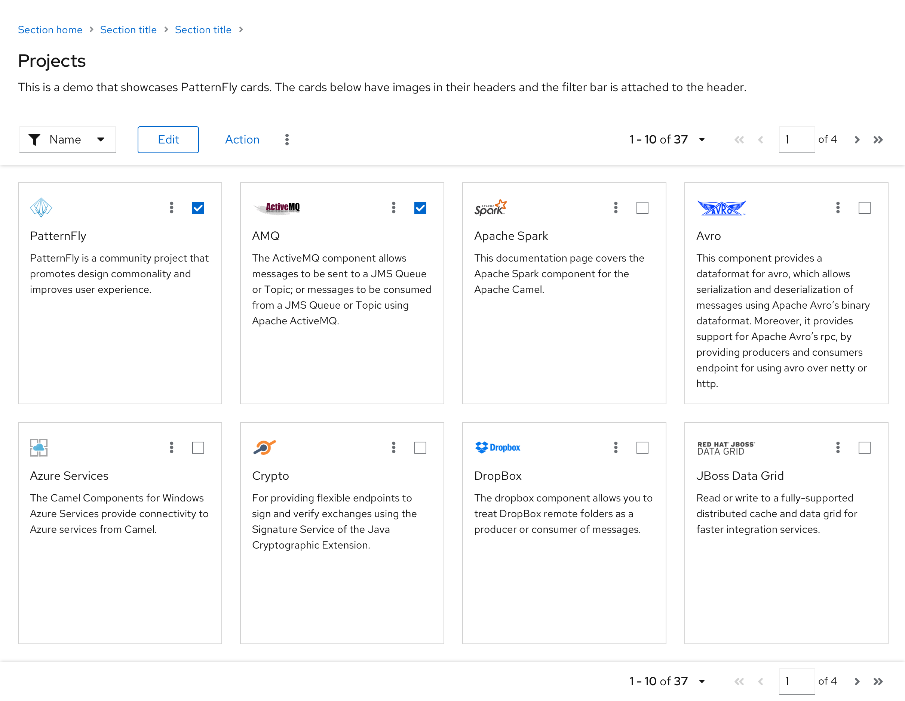

A **card** is a square or rectangular container that can contain any kind of content. Cards symbolize units of information, and each one acts as an entry point for users to access more details. For example, in dashboards and catalog views, cards function as a preview of a detailed page. Cards may also be used in data displays like card views, or for positioning content on a page.  

## Elements

A card usually consists of 3 parts:

  

1. **Header**: Title of the information group
2. **Body**: Brief details about the group
3. **Footer**: Links to access more information about the group

Cards are flexible, and you can customize them in a variety of ways. A card can contain:
- A header with an image, actions, and a body.
- Only a header and a body.
- A header with an image, a body, and a footer.

### Content spacing

PatternFly supports three types of cards:
1. **Compact (recommended):** Compact cards use 16px spacing with an 8px spacer between the header and body and 16px between the body and footer.
2. **Standard:** Use 24px spacing with a 16px spacer between the header and body, and a 24px spacer between the body and footer.
3. **Large:** Use 32px spacing with a 24px spacer between the header and the body, and a 32px spacer between the body and footer. Large cards enable a lower content density, making them optimal for marketing content or content that becomes more digestible with more spacing.

### Border treatments

PatternFly offers two types of border treatments for cards:

1. **Default card:** By default, cards will have a thin (1px) drop shadow to differentiate them from the background of a page and give them a slightly raised appearance.
2. **Flat card:** Flat cards have a 1 pixel gray border. Flat cards are recommended for use against a white background as the solid border will better differentiate the card from the page background.

### Expandable cards

The Title element can be made expandable in situations where you want to hide the card content and reduce its footprint. In the collapsed state, only the card title is shown, and the user can click the expansion toggle to view the remainder of the card content.

### Selectable cards
It is often useful to make cards selectable. PatternFly supports two types of selectable cards.

1. **Multi-select card:** A multi-select card has a checkbox in the upper righthand corner. Users may select cards for performing global actions against by selecting the checkbox.

2. **Selectable card:** A selectable card has a raised appearance and a blue border treatment when selected.

## Card usage
Use a card:
- To visually group content or distinguish information from the rest of a page’s content. Examples include dashboards and catalog views.
- To organize content in layouts with multiple columns or grids.  
- To compare separate groups of information.  
- To make media such as images and videos easier to scan.  

Do NOT use a card to show a dense amount of repetitive, related content. Use a list or table view instead.

### Cards in catalog views

A common use case for cards is when you want to present a catalog of items that the user can choose from. In this case, presenting a grid of cards can be a good solution. An example of cards used in a catalog view is shown below.

Note that this view uses a multi-select card so that bulk actions can be performed from the toolbar on a group of cards at once. For more information on cards used in a catalog or card view, see the [Card view design guidelines](/demos/card/design-guidelines).

### Cards in primary-detail views

Selectable cards are usefull when you want to examine the details of an object represented by a card. Here, a details of different projects can be displayed in the details panel of a side-by-side primary-detail view.

### Cards in dashboards

Cards are often used in dashboards to visualize information. You should generally organize your dashboard such that each card displays a specific piece of information.

