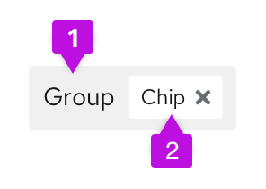

A **chip group** represents an attribute that has been assigned one or more values. An OR relationship is implied between values in the group. Chip groups are useful to express complex filters to a data set, for example.

## Elements

Chip groups contain two elements.

1. **Chip group:** indicates the main attribute in which selections were made.
2. **Chip:** indicates the selections made within the attribute.

## Usage

Chip groups are typically used in filter and selection use cases to indicate to the user what selections they have made. They separate selections by attribute, for added clarity. Chip groups also give users the ability to either delete an entire chip group at once using the group X, or delete individual chips at a time. 

