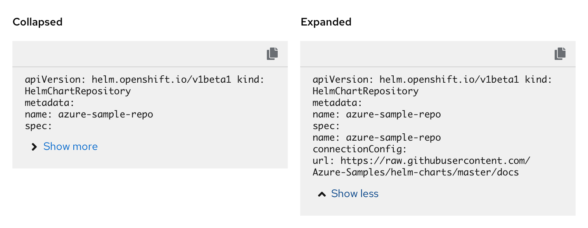

The **code block** is a component that contains two or more lines of ready-only code. The code in a code block can be copied to the clipboard.

## Elements
Code block has four main components.

1. **Code snippet:**  the content that will be copied to the user’s clipboard.
2. **Clipboard button:** completes the copy action when clicked. The copy button is always present but additional actions can be added on an as needed basis.
3. **Tooltip:** informs users that clicking the button will copy the content to their clipboard, or that the content has successfully been copied.
4. **Show more/less (optional):** expands and collapses the code snippet.

**Show more/less**

There is the option to include a show more/less section in the code block. The show more/less section can be used to collapse larger code snippets. An expandable code block allows for long lines of code to be stored in an expansion panel. Expanding the code block allows the user to view the full string that they can copy.

**Multiple actions**

Code blocks can include multiple actions. By default the copy action is always present and other actions are optional and customizable.

The secondary action can include the option to show a checkmark after the user has clicked the secondary action.

## Usage

The code block can be used any time two or more lines of code need to be copied and maintain its original formatting. The default action button that’s included in the code block is the copy to clipboard action button. Depending on the use case, the code block can include a second action button. Additional actions are customizable and optional. The code block also has the option to include a show more/less section if the code block is longer.
