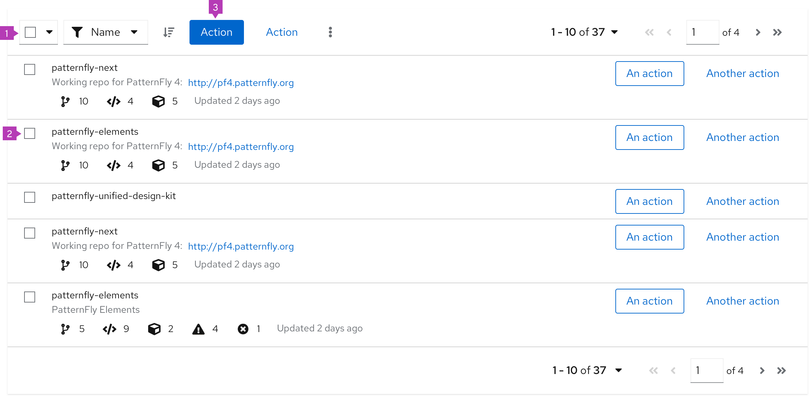
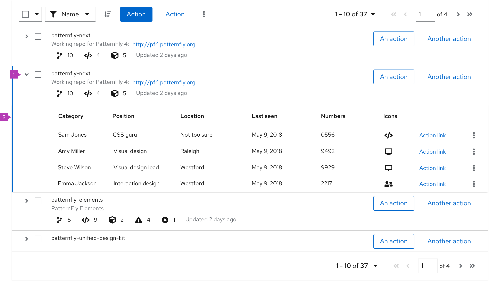
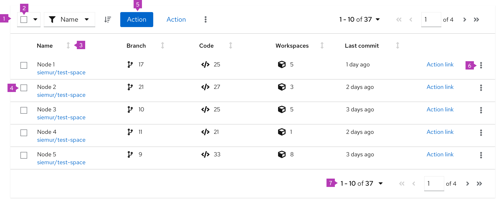
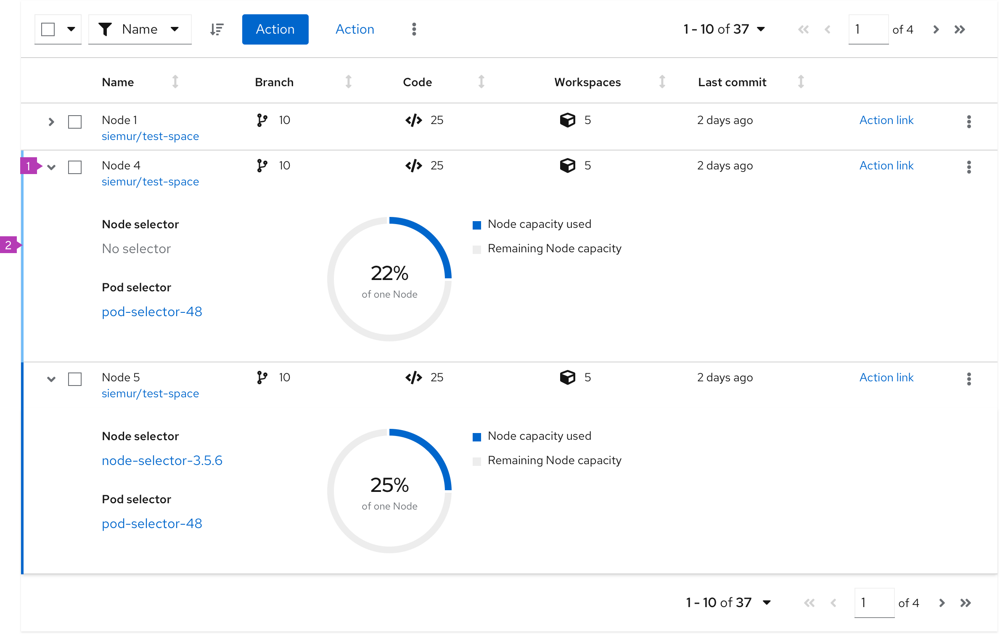
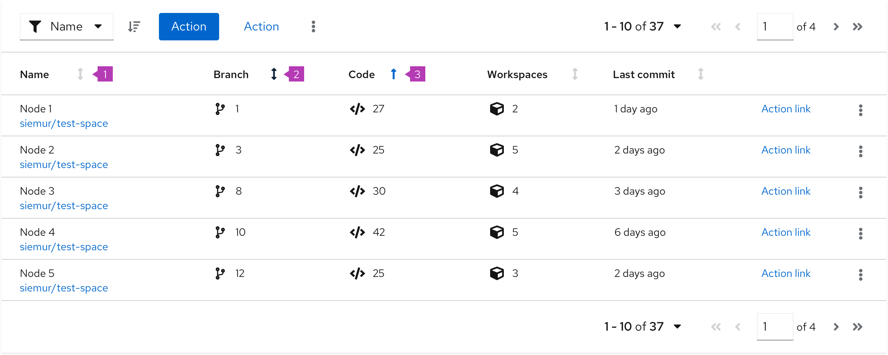

A **data list** is used to display large data sets when you need a flexible layout or need to include interactive content like charts.

PatternFly offers two components for displaying large data sets: [data list](/documentation/react/components/datalist/) and [table](/documentation/react/components/table/). While they satisfy similar use cases, choosing the correct component to use in your design will be dependent on the type of data you need to display.

Use [data lists](#data-lists) when:
* A flexible layout is more important than arranging information in a grid.
* You want to include active content like a chart.
* Content displayed may vary between rows.

Use [tables](#tables) when:
* Users will want to consume data as a grid (in other words, structured rows and columns).
* You want column headers.

## Data lists

### How to use
Think of each row in a data list as a container for some formatted content. In PatternFly, data list rows can accept any [layout](/documentation/react/layouts/bullseye) supported by the design system as long as all rows apply the same layout. Here are some common layouts that may be useful in a data list:

* **[Grid](/documentation/react/layouts/grid):** When you want to display content in a responsive grid.
* **[Level](/documentation/react/layouts/level):** When you want to justify content evenly over the width of the row. It also vertically aligns items in the center of the row.
* **[Split](/documentation/react/layouts/split):** When you want to distribute content evenly with a main content area in the center.
* **[Flex](/documentation/react/layouts/flex):** When you want a custom layout and more control over the alignment and spacing provided in the other layouts.

### Compact and default data list
PatterFly supports two main types of data lists:

1. **[Compact data list](#compact-and-default-data-list)** - when you want to show as much data per page as possible.
2. **[Default data list](#compact-and-default-data-list)** - when you don’t have to minimize paging.

See [when to use compact vs. default spacing](#when-to-use-compact-vs-default-spacing) for more information about the styling and usage.

 

### Data list elements
The elements mentioned below are similar for a data list with compact or default spacing. The example shows a data list with a compact spacing. See [when to use compact vs. default spacing](#when-to-use-compact-vs-default-spacing) for more information about the styling and usage. 

 

1. **[Toolbar](/design-guidelines/usage-and-behavior/toolbar):** The toolbar sits above the list and contains controls for manipulating list data. Common actions include filtering, sorting, and pagination.
2. **[Bulk selection](/design-guidelines/usage-and-behavior/bulk-selection):** When present, selects all items in a table. If pagination is being used, this will only select items on the current page. See [bulk selection](/design-guidelines/usage-and-behavior/bulk-selection) for more information.
3. **Row:** Row height may be variable and sizes to the content. Rows in a data list may take any supported layout.
4. **Select checkbox:** Selects this row.
5. **Inline actions:** These actions apply only to the current row/item.
6. **Global actions:** Actions that apply to all selected items.
7. **Pagination footer:** When present, provides navigation to additional pages.

### When to use data list vs. table
Use a data list when:
* The information you want to display is not easily structured into a tabular format.
* You want a more flexible layout within rows.
* You plan to embed rich content like a chart or an image into a row.

Don't use a data list: 
* For displaying content that is better presented in tabular format with well defined columns and headings. Instead, use a [table](#tables).

### Alternative solutions
Alternative to a data list include [tables](#tables) or [card views](/design-guidelines/usage-and-behavior/card-view). Card views and data lists have similar properties, but information in a card view is chunked into a grid of individual cards. In choosing between a data list and a card view, consider the type of data that will be displayed and the format that best suits that data. If you cannot easily fit all of the data that needs to be displayed into a card, a data list might be a better solution.

### Data list capabilities
Every data list can be extended with these functionalities:

* **[Actionable data list](#actionable-data-list)**
* **[Expandable data list](#expandable-data-list)**

### Actionable data list
The actionable data list provides checkboxes that enable users to select one or more rows and act on that selection using options in the [toolbar](/design-guidelines/usage-and-behavior/toolbar).

 

1. **[Bulk selection](/design-guidelines/usage-and-behavior/bulk-selection):** When present, selects all items in a table. If pagination is being used, this will only select items on the current page. See [bulk selection](/design-guidelines/usage-and-behavior/bulk-selection) for more information. 
2. **Checkbox:** Enables a user to select a row.
3. **Global actions:** Actions that can be applied to all selected items.

#### When to use and when not
Use an actionable data list when:
* You need to enable a user to select and act on multiple items in the list.

Don't use an actionable data list when:
* Actions are restricted to a single row or object. In this case, place actions inline within the row.

### Expandable data list
The expandable list adds an expansion panel to every row to reveal more details about the item.

 

1. **Expansion caret:** Toggles the expansion open and closed.
2. **Expansion panel:** A container that is revealed when the expansion is open. It can accept any supported layout to present additional content to the user.

#### When to use
Use an expandable data list when:
* You have more information than will comfortably fit inside a row.
* You want to provide a way for advanced users to access information that is not applicable to all users.

## Tables 

### How to use
Consider the structure of the data you want to display and organize that information into columns. Columns will typically have column headers. Every row within a table must have a consistent format. If the table row includes actions, they should always be placed in the rightmost column(s).

### Compact and default table
PatterFly supports two main types of tables:

1. **[Compact table](#compact-and-default-table)** - when you want to show as much data per page as possible.
2. **[Default table](#compact-and-default-table)** - when you don’t have to minimize paging.

See [when to use compact vs. default spacing](#when-to-use-compact-vs-default-spacing) for more information about the styling and usage.

 

### Table elements
The elements mentioned below are similar for a table with compact or default spacing. The example shows a table with a compact spacing. See [when to use compact vs. default spacing](#when-to-use-compact-vs-default-spacing) for more information about the styling and usage. 

 

1. **[Toolbar](/design-guidelines/usage-and-behavior/toolbar):** Sits above the table and contains controls for manipulating table data. Common actions include filtering, sorting, and pagination.
2. **[Bulk selection](/design-guidelines/usage-and-behavior/bulk-selection):** When present, selects all items in a table. If pagination is being used, this will only select items on the current page. See [bulk selection](/design-guidelines/usage-and-behavior/bulk-selection) for more information.
3. **Column headers:** Should align with the content they contain. If the user is able to sort on a column, the first click on the header will sort the content of the table on the content in that column. Subsequent clicks will toggle the direction of the sort. Table data can only be sorted on one column at a time. See [sorting by columns](#sorting-by-columns) for more information on the sort component.
4. **Select checkbox:** Selects this row
5. **Global actions:** Actions that apply to all selected items
6. **Inline actions:** Actions that apply only to the current row/item
7. **Pagination footer:** When present, provides navigation to additional pages

### When to use table vs. list

**Use a table when**:
* The information you want to display fits into a structured, tabular format (in other words, has distinct rows and columns).

**Don't use a table**: 
* For less structured or variably structured data that cannot be easily organized into columns. In these situations, use a [data list](#data-lists).

### Table capabilities
Every table can be extended with these functionalities: 

* **[Expandable table](#expandable-table)**
* **[Compound expandable table](#compound-expandable-table)**
* **[Actionable table](#actionable-table)**
* **[Sortable table](#sorting-by-columns)**

### Expandable table

 

1. **Expansion:** Expands the row
2. **Expansion panel:** Contains details associated with a row. See [expanded panel coloring](#expanded-panel-coloring) for more information.

#### When to use
Use expandable table rows when: 
* You have more information than will comfortably fit inside a row. 
* You want to provide a way for advanced users to access information that is not applicable to all users.

#### Expanded panel coloring
Use a dark blue line for expanded rows:
* In a non-selectable table.
* In a selectable table for a selected row. The selected row would use a dark blue line, while the other expanded un-selected rows would use a light blue line.

Use a light blue line for expanded rows: 
* In a selectable table for unselected expanded rows. The unselected expanded rows would use a light blue line, while the selected expanded rows would use a dark blue line.

### Compound-expandable table

 

1. **Expandable cell:** A cell that can be clicked to reveal more detail about an item. If the expansion for an item is already open, clicking on a different cell will close the current item and open a new one.
2. **Expansion panel:** Contains details associated with an expandable item.

#### When to use
Use a compound expandable table when:
* You want multiple expansion panels that relate to specific table columns. 
* It would not make sense to combine all of this information into a single, simple expansion.

### Actionable table
The actionable table provides checkboxes that enable users to select one or more rows and act on that selection using options in the [toolbar](/design-guidelines/usage-and-behavior/toolbar).

 

1. **[Bulk selection](/design-guidelines/usage-and-behavior/bulk-selection):** When present, selects all items in a table. If pagination is being used, this will only select items on the current page. See [bulk selection](/design-guidelines/usage-and-behavior/bulk-selection) for more information. 
2. **Checkbox:** Enables a user to select a row.
3. **Global actions:** Actions that can be applied to all selected items.

#### When to use and when not
Use an actionable table when:
* You need to enable a user to select and act on multiple items in the table.

Don't use an actionable table when:
* Actions are restricted to a single row or object. In this case, place actions inline within the row.

### Sorting by columns
Sorting by columns is possible for any table variation. Enabling the component within a table eases the ability to scan and read through the content. This option is favored over adding sorting functionality to the [toolbar](/design-guidelines/usage-and-behavior/toolbar).

 

1. **Sortable column:** When a column is sortable, the sort icon will appear to the right of the column header in a [light grey](/design-guidelines/styles/colors#typography-and-iconography-colors) color. Sorting will not become active until the user selects the column header. This triggers the arrow to point upwards and the content to be sorted in ascending order.
3. **Hovered sort:** When a column is sortable, the sort icon will appear to the right of the column header. Upon hover, the  icon will change to a [darker grey](/design-guidelines/styles/colors#typography-and-iconography-colors) indicating that the icon is actionable.
2. **Sorted column:** When a column is being sorted by, the column header will turn [blue](/design-guidelines/styles/colors#typography-and-iconography-colors) and the sort icon will represent the direction of the sort. Subsequent clicks on the sortable column header will toggle the direction of the sort.

#### When to use
The default sort order for a table should support the primary use case for the application. All columns in a table do not require sort functionality. That is, you can disable the header sort function on some columns and enable it on others.

#### Example
If a table contains these two attributes: (System Name | Last Sync) you may want to show the most recently synced system at the top of the table (in other words, it is the default sort column), because a primary use case for this table is verifying that you have successfully connected or troubleshot the system’s connection to Cloud Services.

If a table contains these three attributes: (System Name | Last Sync | Severity) you may want to show the system with the highest Severity because that is the system the user should tend to first.

## When to use compact vs. default spacing
Whether to use a table/data list with compact or default spacing is up to you and your use case. However, here is some guidance for when to use which option. You can see examples of each option for comparison. 

### Compact spacing 
A table or data list may sometimes need to be compact to make more rows visible at a time. The more rows you can see, the less you need to use [pagination](/design-guidelines/usage-and-behavior/pagination). Compact spacing is recommended for data with a simple structure. See an example below. 

Use compact spacing when:
* You need to show as much data as possible on one page.
* You need to show data in a small space. For example in modal or wizard.
* You need to minimize paging.
* Readability is a secondary concern.

 

Example: 
* You can see more data on one page. 
* You have a good overview about the structure of data.
* The structure of data is simple, informative and have less visual elements. 

### Default spacing 
A table or data list may sometimes need more space for rich graphical data. See an example below.

Use default spacing when:
* You don’t have to display a lot of data on one page.
* You use many visual indicators that are placed in columns, such as icons or charts.
* You don't have to minimize paging.
* Readability is a primary concern. 

 

Example:
* You can see less data on one page. 
* You will need a pagination to see more rows.
* Data structure includes many visual elements. 

## Tables on mobile
The PatternFly table is designed to be fully responsive. When columns no longer fit within the width of the viewport, columns are stacked so that data in each row is displayed as sets of attribute-value pairs.

 

## Using lists and tables in a page
Lists and tables should be placed in the body of a page. The width should be set by the containing element.

 

In this example, a table is positioned in the body of a page in a card.
