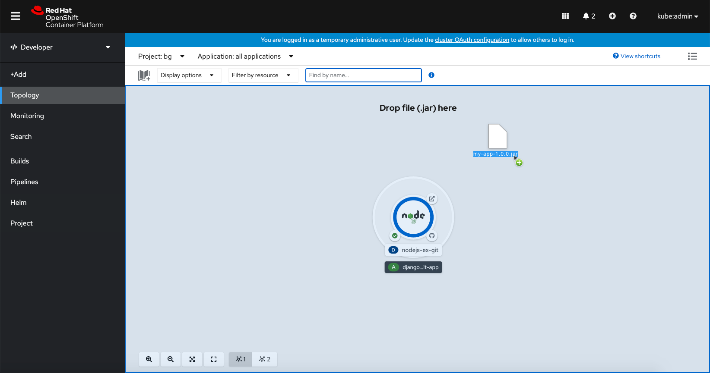

A **drag and drop** interaction can be used when you are dragging and dropping a file or item from one place to another. For example, when you are dragging and dropping a file from your desktop to an application or when you are dragging and dropping an item vertically or horizontally into another column or row.

## Elements
The visual treatment of drag and drop interactions should follow the same pattern as the [PatternFly file upload](https://www.patternfly.org/v4/components/file-upload) component.

1. **Drop area:** Where the file or item can be dropped.
2. **File:** The file you want to drag and drop into the drop area.

## Usage
A drag and drop interaction can happen at a variety of scales, in a large content area or a smaller input field. The drag and drop experience should be the same for the user regardless of its scale.

### Dragging and dropping onto larger areas
If you want to drag and drop a file to a larger drop area, you can apply the drag and drop interaction to that drop area.

It is recommended that you add a ‘Drop file(s) here’ message to let the user know where exactly they can drop their file. It is helpful to include the file extension in the message.

We recommend using a 20px font for the message font size.

### Dragging and dropping onto form fields
You can use the built in drag and drop feature of the [file upload](https://www.patternfly.org/v4/components/file-upload) component to add drag and drop capabilities to any form field.

### Dragging and dropping rows and columns
If you want to drag and drop columns or rows into a certain order you can use the fa-grip-horizontal icon to indicate the ability to move a vertically-oriented item or the fa-grip-vertical icon to indicate the ability to move a horizontally-oriented item.

|       |Icon |Name |Style |React |Contextual usage |
|---------------|------|-----|-----------|------------|
|fa-grip-horizontal |fa-grip-horizontal |fas |GripHorizontalIcon | Indicates the ability to move a vertically-oriented component via drag and drop
|fa-grip-vertical |fa-grip-vertical |fas|GripVerticalIcon |Indicates the ability to move a horizontally-oriented component via drag and drop
