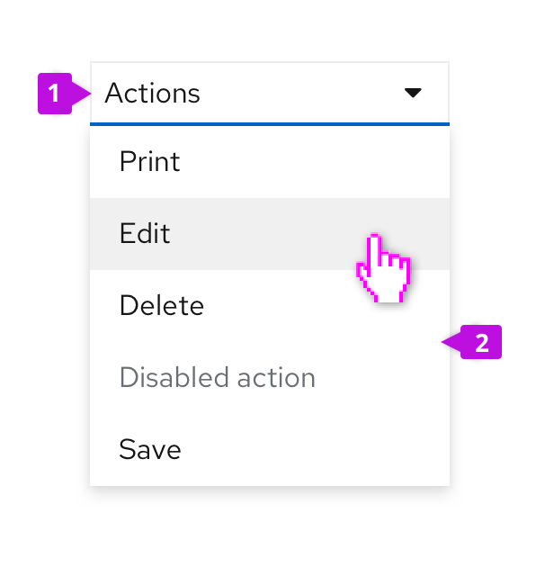
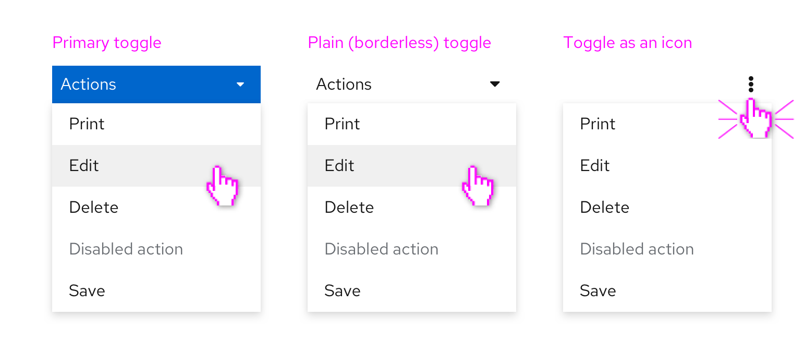
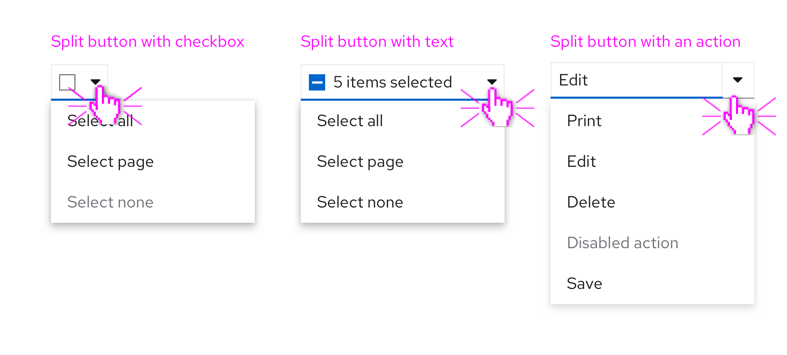

A **dropdown** presents a menu of actions or links in a constrained space that will trigger a process or navigate to a new location. See [select component guidelines](/components/select/) for more information about making one or more selections from a list of items in a value list.

## Elements and variations
### Basic dropdown
A basic dropdown consists of a toggle control to open and close a menu of actions or links.

1. **Toggle:** The toggle is used to open and close the menu. It takes on all of the behaviors of a button. The toggle label is used to name the menu and should be descriptive of the actions that it contains. If no more descriptive name makes sense, use “Actions” as a default name.

2. **Menu:** The menu contains a list of actions or links. Menus should optimally contain seven (7) or less items for easy scanning by the user. For longer menus, items may be grouped. See the [menu component guidelines](/components/menu/design-guidelines) for more information about supported options, including use of icons, grouping, and descriptions. The Dropdown component includes many common built-in menu variants. It’s also possible to attach a custom menu by using the [basic panel variant](/components/dropdown/react#basic-panel).

### Dropdown variations
In addition to the basic dropdown shown above, you may apply the following variants to the dropdown toggle element.

#### Primary toggle
The primary toggle should be used in the same way as you would use a primary button. If you want to draw the user’s attention to a dropdown menu as the primary place to take action on a page, consider using a dropdown with primary styling.

#### Plain toggle
Plain styling removes the border treatment from a dropdown toggle. This is useful in places where the default border treatment might make your layout feel visually cluttered or crowded.

#### Icon toggle
When there is not enough space for a labeled button, an icon can be used instead. Icon toggles are best used when you can use a common icon that has a well understood meaning or when you are working with limited space. A common default is to use the vertical ellipses (kebab) icon to generally indicate that it is connected with a menu as shown above.

### Split button
A split button can be used when you want to combine an action button or other control with a dropdown menu. Here are some examples of split buttons.

A split button with a checkbox can be used in bulk selection use cases for a list, table, or card grid. Here, the checkbox provides immediate access to bulk selection, and the user can also open the dropdown menu to expose other actions. Text can also be added within the toggle to reflect current state.

A split button with actions is useful when you want to expose a default action with a single click, but also allow access to other actions via the dropdown menu. This can be thought of as providing a shortcut to the most recent or frequently used item in the menu. A split button with actions can contain a labeled action as shown above or an icon in place of the label for use when there is limited space.
