Use an **empty state** component when there is no data or other information to show on the screen. Empty states can be used to communicate completion or other status at the end of a sequential task, and may include a call to action to guide the user on what to do next.  They may also be used to educate users and guide them with positive and proactive next steps in any situation where there is no data or information to display.  View example use cases in the [use case examples](#use-case-examples) section.

## Usage 
PatternFly offers four empty state variations; an extra small empty state, a small empty state, a large empty state, and an extra large empty state. 
* The **extra small empty state** should be used inside cards, or when there are space constraints, as seen in the second [no access](#user-not-entitled-or-does-not-have-access) use case example. 
* The **small empty state** should be used inside tables, wizards, modals, or cards, where the empty state is "inside a container," as seen in the [no data to show](#no-data-to-show) use case example. 
* The **large empty state** should be used in a full-page empty state, as seen in the [addition or creation](#addition-or-creation) use case example. 
* The **extra large empty state** variation should only be used in special instances, specifically for [first-use or get started](#first-use-or-get-started) states, as well as for full-page [congratulatory](#success) states, seen in those use case examples.

## Elements
Below is an example of a large empty state inside a full-page, outlining all the elements inside an empty state. The other empty state variations are made up of the same elements, and only differ in their spacing and text sizes.

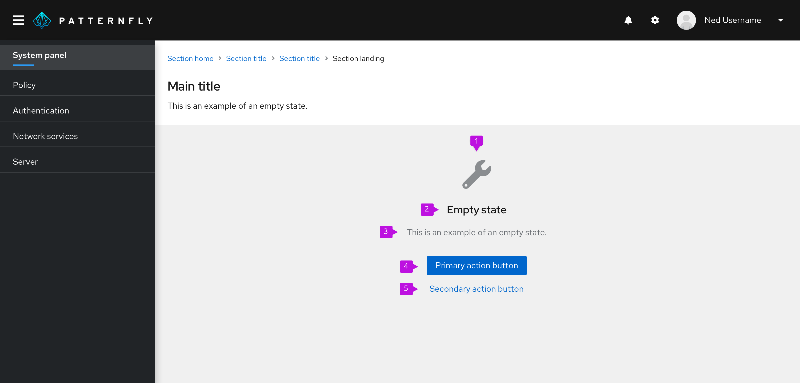 

1. **[Icon/image](#icons):** Display associated object icons here.
2. **[Title](#title-and-body):** Provide a concise explanation.
3. **[Body](#title-and-body):** Provide additional information that helps a user understand why the space is empty, what they can do to move forward, and the value or benefit that is gained by taking the next step.
4. **[Primary button](#primary-and-secondary-buttons):** Primary call-to-action.
5. **[Secondary buttons (optional)](#primary-and-secondary-buttons):**  Alternative options for the user. There can be more than one secondary action.

## Design guidelines

### Icons
To maintain consistency, icons have been mapped to specific empty state scenarios. 

Here is when you should use each icon:

|       |Type |Color |Icon |Usage |
|---------------|------|-----|-----------|------------|
|  |First use or get started |Grey (#8A8D90) |fa-rocket | Use in a get started  page or in situations where it is the user’s initial interaction with your platform/application. You may decide to replace this icon with something else if you already have an application specific graphic or illustration to use here
|  |Search |Grey (#8A8D90)|fa-search |Use when there is no data to show
|  |Configuration |Grey (#8A8D90) |fa-wrench |Use when configuration is required or there is a configuration issue
|  |No access |Grey (#8A8D90) |fa-lock | Use when the user is not entitled or the user role does not have access
|  |Error  |Red (#C9190B) |fa-exclamation-circle |Use when there is an inability to get data, there is backend failure, or an error has occurred
|  |Success |Green (#486b00) |fa-check-circle |Use to indicate that a task or process has been completed successfully
|  |Addition or creation |Grey (#8A8D90) |fa-plus-circle |Use when something needs to be added or created

You should always try to use an icon in your empty state, unless there is an empty state where an icon does not match any of the situations mentioned above, or if an icon does not fit into a given layout. For example, you may want to omit the icon when using an extra small empty state inside of a card, due to space limitations.

**Color**

By default, icons should be grey, except when it is a status icon or you have a special use case icon. In other words, don’t use color arbitrarily.    

### Title and body

**Tone and voice**

Pay close attention to voice and tone in your empty state. Your voice is the personality that’s reflected in your writing, while your tone is the approach you take that’s appropriate for the context of your content. Tone encompasses the audience emotions that need to be accounted for and the resulting approach you must take. To help you stay consistent, refer to the [PatternFly voice guidelines ](/ux-writing/brand-voice-and-tone) as needed. In this case, you should use concise and straightforward voice. It should be conversational, while still professional.

It is OK to use “you” and “your” but never assign blame to the user.

 

There is also no need to be overly mannerly, so avoid using please, unless the user is being inconvenienced. 

 

**Level of detail**

In your empty state, state what isn't there, and then give the user a next step.  Empty states should not be used to describe in detail how to use the page—the design should be intuitive enough without extensive written explanation. Include at least one sentence, even if it seems like a straightforward explanation, and at least two when there may be more explanation needed.

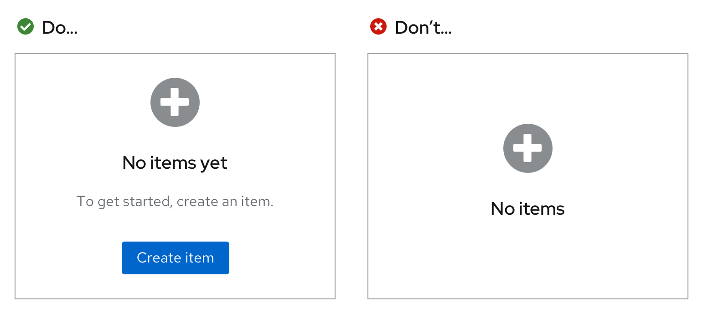 

**Sentence case**

Empty states should follow sentence case rules. Only the first word in any phrase or sentence should be capitalized (whether it is in the body or in a button or link), unless a proper noun is included in the phrase/sentence.
Every sentence in a body should end with a period. Headers should not end in a period though.

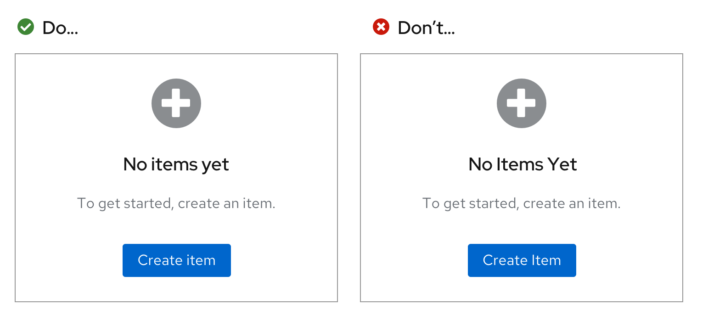 

### Primary and secondary buttons
Buttons in empty states are used to highlight next steps a user can take when they reach your page. There are multiple ways to set up calls-to-action. You can have a call-to-action presented as a primary button, or within the body. If you have a singular call-to-action on your page, it is preferable for it to be presented in primary button format as it places bigger emphasis on the call-to-action. However, there may be a specific reason why you may need it embedded in the body.

1. **Call-to-action as a primary button**

     

2. **Call-to-action in body**

    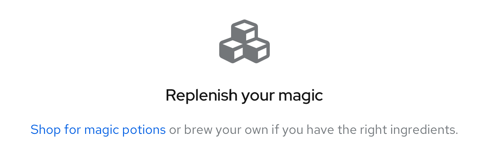 

 
If you have more than one actionable link, there are two options depending on how your primary call-to-action is presented:

1. **Link button underneath the primary button:** if your primary call-to-action was in a primary button format

    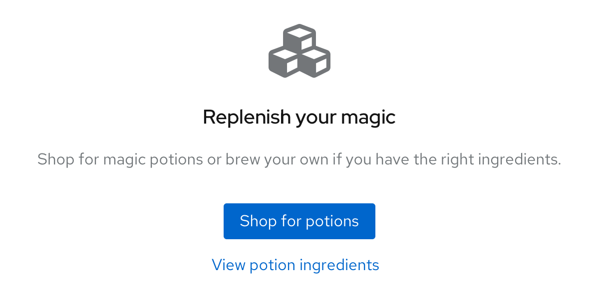 

2. **Link button underneath the body:** if your first call-to-action was in the body

    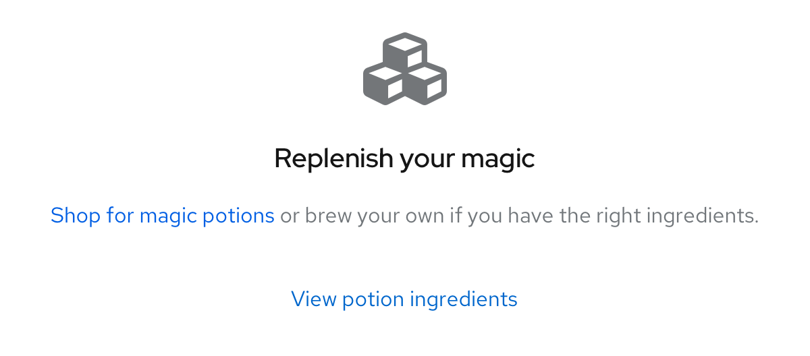 

There are only two situations where a stand-alone link button (with nothing linked in the body) can be used:

1. **Filtering or search situation:** when a user has filtered for something in a table, and is prompted to "clear all filters" or "include" other items in their search

    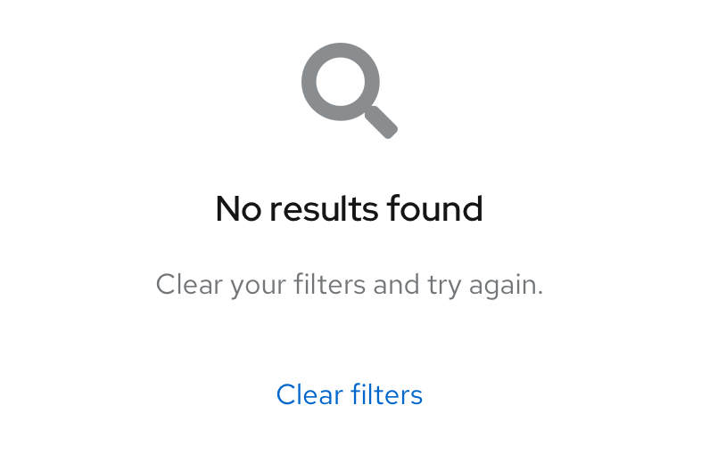 

2. **Multiple primary calls-to-action:** when there are multiple primary actions the user can take and they are all equally important

### Alignment

**Full-page empty state**

When an empty state appears on a full-page,  it  should be 64px away from the top, and horizontally centered with a minimum padding of 24px on all remaining sides.

 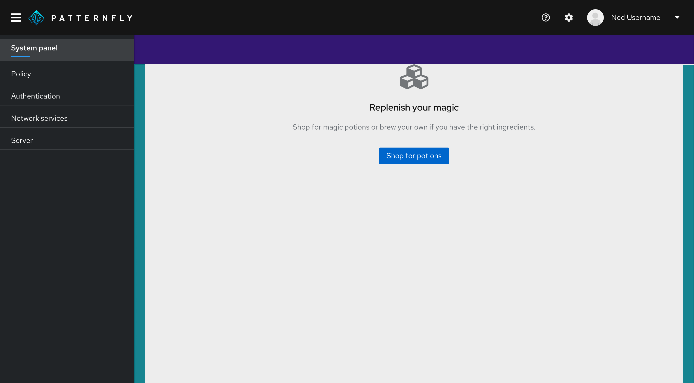 

Mobile in-page empty states should be 48px away from the top and have a minimum of 16px padding on the remaining sides.

 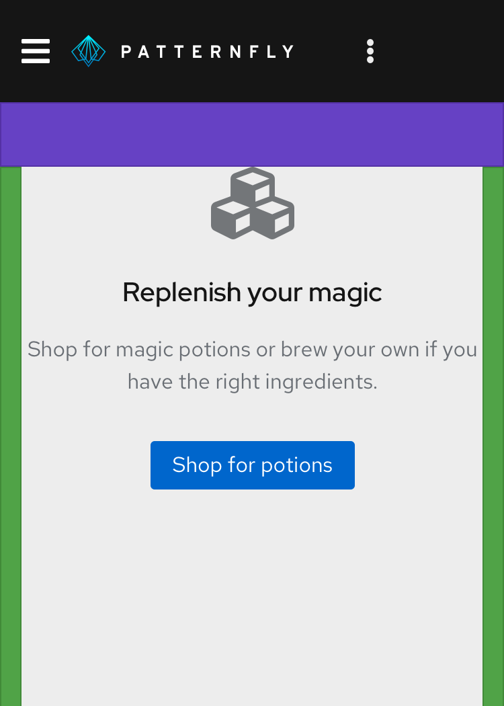 

**In-table, card, or wizard empty states**

Empty states within a table, card, or wizard should always be horizontally and vertically centered on their background, with an outside padding of 24px on all sides.

 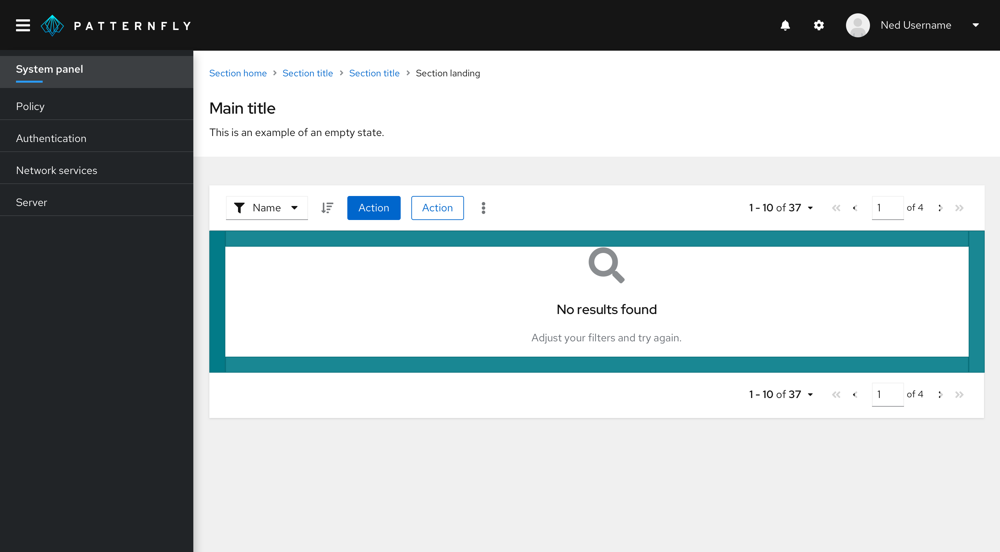 

### Toolbars or filters in empty states

No toolbars or filters should be shown when a user is in a full-page empty state as the user will have no items to perform any actions on.

  

## Use case examples
There are several common use cases for empty states:
* [First-use or get started](#first-use-or-get-started)
* [No data to show](#no-data-to-show)
* [Required configuration](#required-configuration)
* [User not entitled or does not have access](#user-not-entitled-or-does-not-have-access)
* [Back-end failure](#back-end-failure)
* [Success](#success)
* [Addition or creation](#addition-or-creation)

### First-use or get started

In a first-use situation, there is nothing to display because the user has not created or added anything yet. Use this opportunity to educate users about how to get started and introduce any associated value or benefit to taking action. This empty state should be displayed in the extra large empty state variation.

 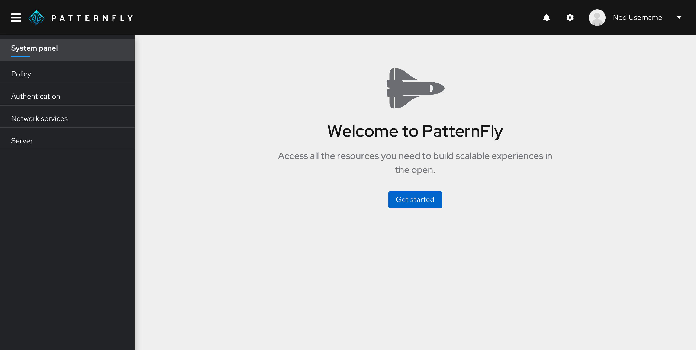 

### No data to show

Help users understand why there is no data to display and explain what they can do to move forward. For example, there may be no data to show because the user has a series of filters applied and the system cannot locate a match. It’s also possible that there is no data because all issues are resolved or all tasks are complete.

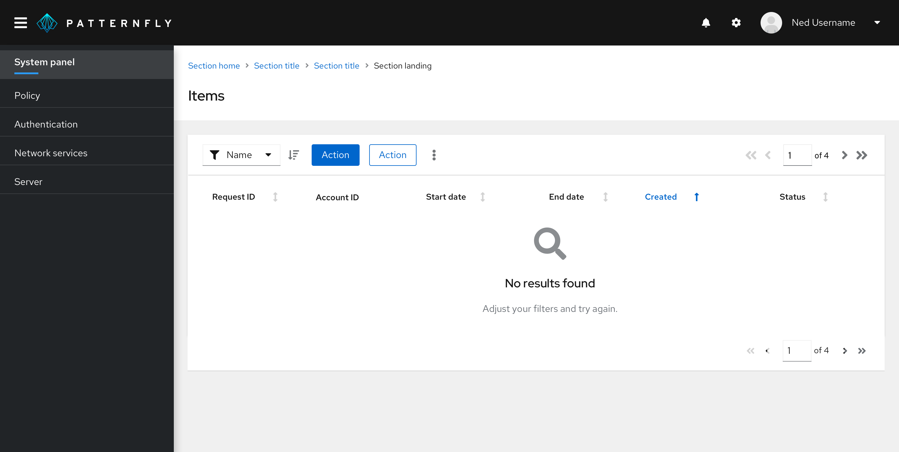 

### Required configuration

In this situation, a user may need to take steps to configure, connect, or enable something in order to view associated information or take advantage of features.

 

### User not entitled or does not have access

Help users understand why they are not able to view content and provide next steps. This can be particularly useful when users do not have the permissions to view a page’s content, or to view specific content in a dashboard.

 

### Back-end failure

Provide the user with information about the error that is easy to understand, and provide clear next steps they can take to resolve the issue.

 

### Success

Let the user know they've successfully completed a process. For example, you might provide a success state at the end of a tutorial or the completion of a wizard.
 
When the success state appears in a table or wizard, it should use the standard empty state variation.

 

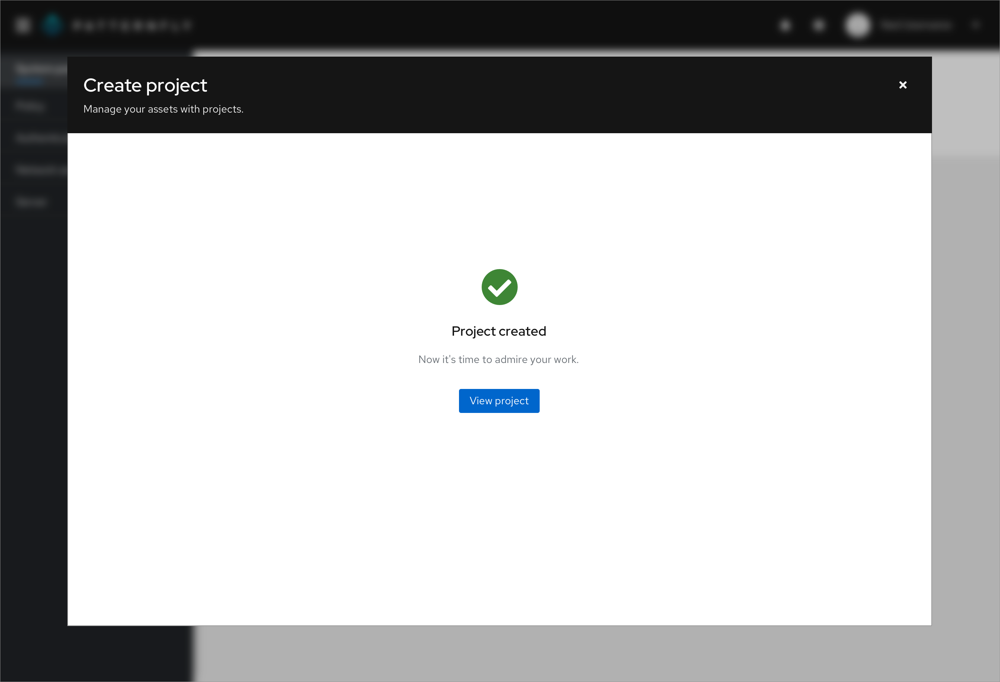 

If the success state appears in a full-page, you can choose to use the extra large empty state variation to fill up the page.

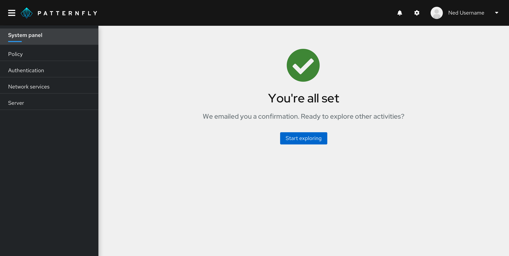 

### Addition or creation 
In some situations, users may need to add or create something to view associated information. Let them know what they need to add and guide them with calls-to-action to lead them the right way.

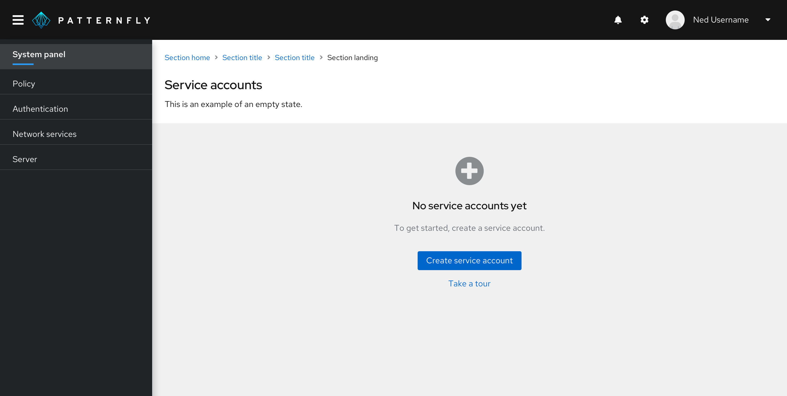 

<!-- ## Variations

Empty states are most commonly presented in data lists, data tables, card views, or as a full-page.

*In a data list*

*In a small card*

*In a large card*

*In a full screen*
-->
