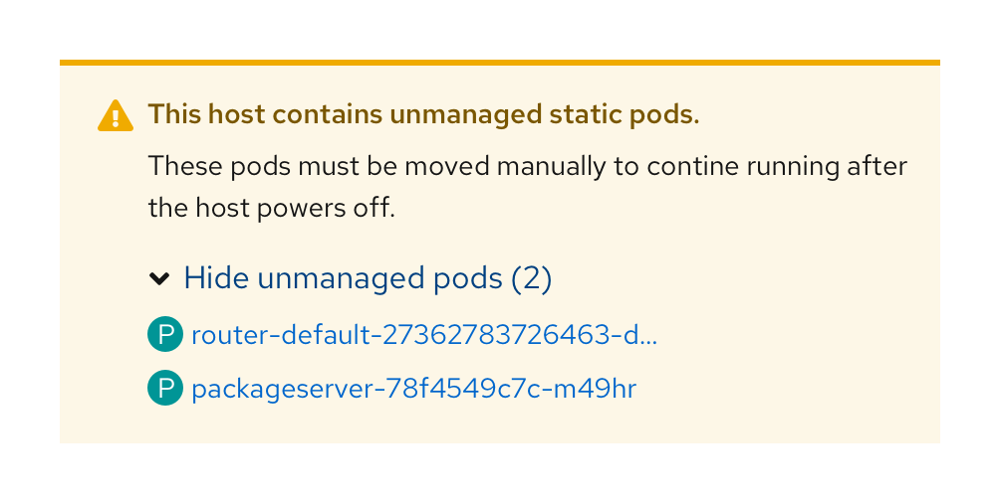

An **expandable section** component is used to support progressive disclosure in a form or page by hiding additional content when you don’t want it to be shown by default. An expandable section can contain any type of content such as plain text, form inputs, and charts.

## Elements
An expandable section has two main elements.

1. **Caret:** Indicates whether the section is expanded or collapsed.
2. **Toggle text:** Informs the user what will be shown when the component is expanded.

## Usage
Use an expandable section when you want to hide optional or advanced content by default. They are commonly used in forms to reveal plain text or additional form fields. They can also be used to reveal [charts](https://www.patternfly.org/v4/charts/about), [cards](https://www.patternfly.org/v4/components/card), [data lists](https://www.patternfly.org/v4/components/data-list), or [table views](https://www.patternfly.org/v4/components/table). Expandable sections may be used in [alerts](https://www.patternfly.org/v4/components/alert) to show additional information.

We recommend using the dynamic toggle text when designing with the expandable section. Dynamic toggle text will update based on the state of the expandable section. For example, it may read **Show more** when the toggle is collapsed, and **Show less** when the toggle is open.

## Examples
**Expandable section in a form**

**Expandable section in an inline alert**

**Expandable section in a side panel**

**Expandable section in a documentation page**

