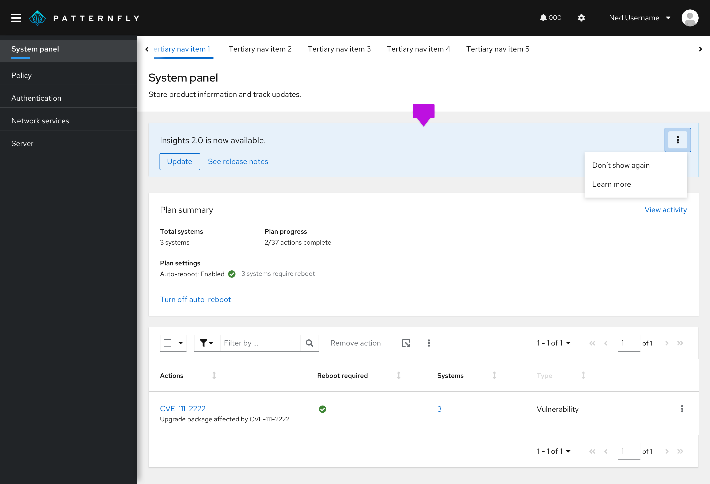

A **hint** is in-app messaging that provides a one-step reminder, explanation, or call to action for a page or modal.  

For information on other forms of on-screen help, see [Tooltip](/components/tooltip/design-guidelines) and [Popover](/components/popover/design-guidelines).

## Usage 

Use hints to share information about an interaction or prerequisite step that might not be immediately obvious to the user. 

 

## Content 
Use full sentences with punctuation.
Include relevant links to documentation when necessary.   
