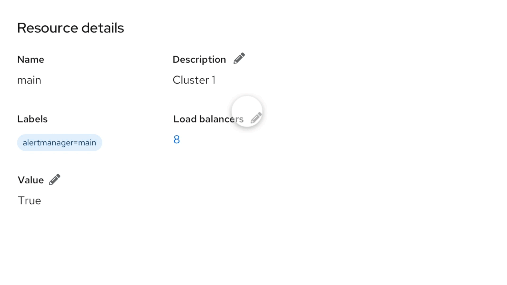
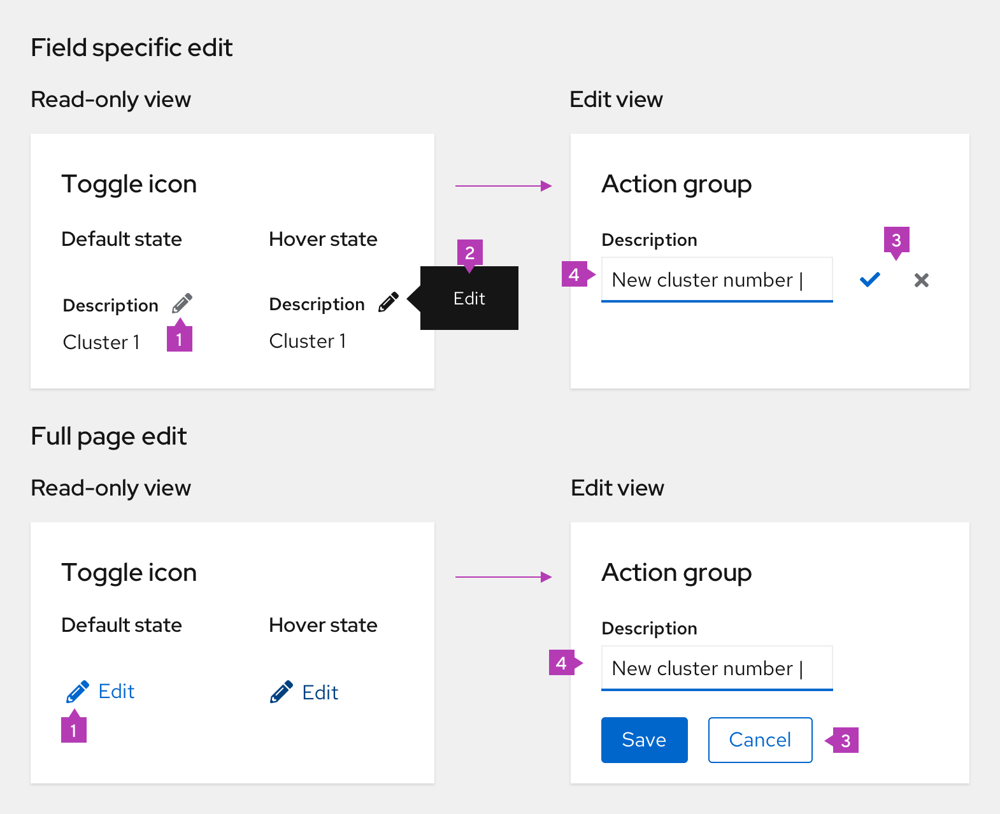
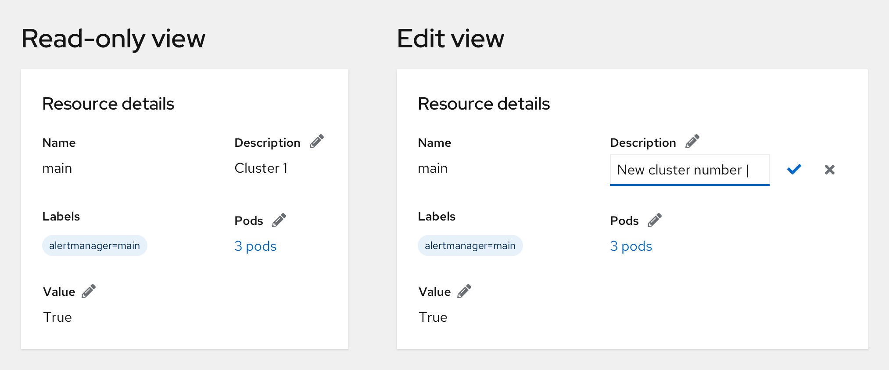
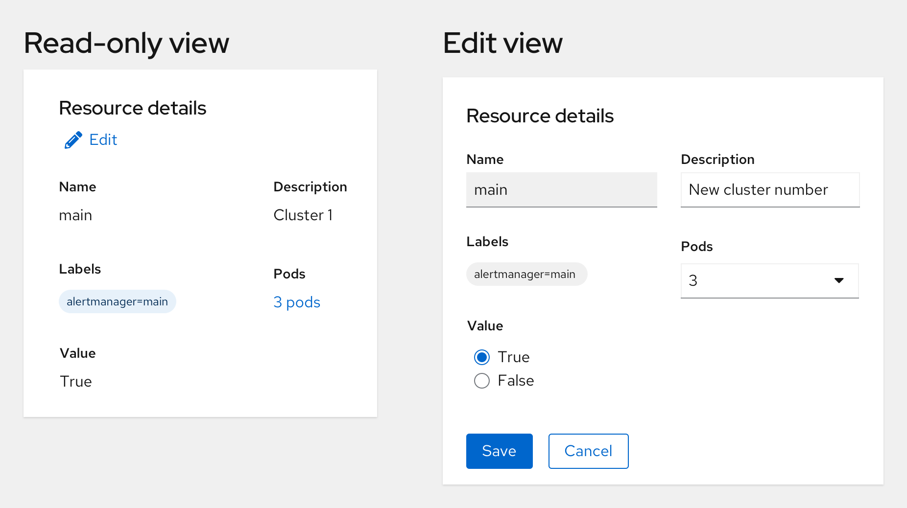
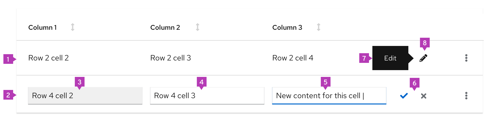
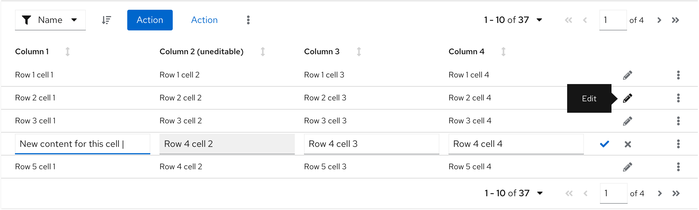

* The data needs to be updated frequently.
 
Don’t use inline edit when:
* The editing is the primary function of the view. For example, in an edit modal.

 
PatternFly supports two types of inline editing:
1. **[Page inline edit](#page-inline-edit):** enables the user to edit a [specific field](#field-specific-edit) in a details page or in a [full page](#full-page-edit).
2. **[Table inline edit](#table-inline-edit):** enables the user to [edit elements in a row](#row-editing).
 
## Page inline edit
There are two types of inline edit for forms:
* **[Field-specific edit](#field-specific-edit):** allows users to make changes to one field at a time
* **[Full page edit](#full-page-edit):** allows users to make multiple changes at a time, in a larger area with more fields
 
### Elements
 

 
1. **Toggle:** pencil toggle indicates the edit action
2. **[Tooltip](/components/tooltip):** provide a short description of the inline edit toggle
3. **Action group:** allows to save or cancel changes
4. **Form elements:** for example [text input](/components/text-input) or [text area](/components/text-area). See [forms](/components/form) for more information about form elements.
 
### Field-specific edit
 
#### When to use
Use field-specific edit when you want to allow users to make small edits to specific fields in a page. 
 
#### How to use
The pencil toggle is placed inline with the header for fields that are editable. Clicking on this toggle allows the user to edit inline, or can trigger a modal for more complex edits. In edit mode:
* **The check icon** saves the changes and switches the item back to read-only mode.
* **The close icon** returns to the read-only mode without saving new data.
 

 
### Full page edit
 
#### When to use
Use the full-page edit when you want to allow users to edit a larger area with many editable elements all at once.
 
#### How to use
Any editing is triggered by an edit link for the whole section. All edits should be easily done in the context of the page. Clicking the pencil icon toggles the page or description list into edit mode.
* **Non Editable fields**, for example, Name, and Labels should use read-only styling.
* **Editable fields** should function like any form.
* Users can save or cancel changes using the ‘Save’ or ‘Cancel’ button. Both actions return a page or description list to the read-only mode.
 

 
## Table inline edit
There is one type of inline edit for tables:
* **[Row edit](#row-editing):** allows for making changes to one editable row in the table
 
### Elements
 

 
1. **Editable inactive row:** inactive row with read-only styling
2. **Editable active row:** ability to edit form components is enabled
3. **Disabled input field:** unclickable and unusable input field
4. **Editable input field:** changes for this input are allowed
5. **Active input:** selected input field with new content
6. **Action group:** allows user to save or cancel changes
7. **[Tooltip](/components/tooltip):** provides a short description of the inline edit toggle
8. **Toggle:** pencil toggle indicates the edit action
 
### Row editing
Row editing allows a user to edit items that are visible in the table by having a [pencil toggle](/components/inline-edit#inline-edit-toggle) pinned to the right side, with the [kebab](/components/dropdown#with-kebab). 
 
#### When to use
Use row editing when:
* You need to change the data in a table.
* The data is not dependent on each other. For example, changing the data in a row five will not affect row three.
 
#### How to use
Clicking the pencil icon toggles the particular table row into edit mode. In the edit mode:
* The kebab is replaced with a ‘Check’ for saving and a ‘Close’ icon for canceling. Both icons should be grey until changes have begun to be made.
* When changes have begun, the check icon turns blue to increase the visibility of the save action.
* **The check icon button** submits the changes and switches the row back to the read-only mode.
* **The close icon** returns to read-only mode without saving new data.
 

 
If there are elements that are difficult to edit in a table, you can make them editable in a [modal](/components/modal), for example.

 

