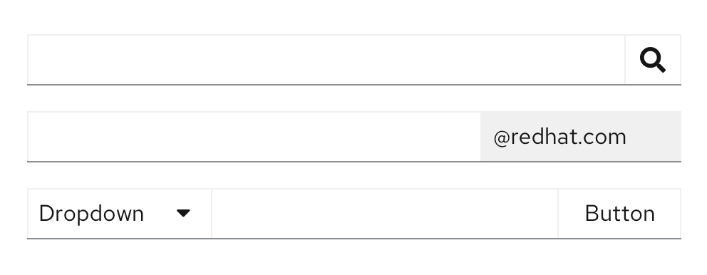

Use an **input group** when you want to group multiple input types, like a text input and a button, for example, into one control.

## Usage

Input groups can combine multiple elements. An example could be adding buttons to one or both sides of a text input, including in a search field and an email input field. View more examples in the input group react tab.

