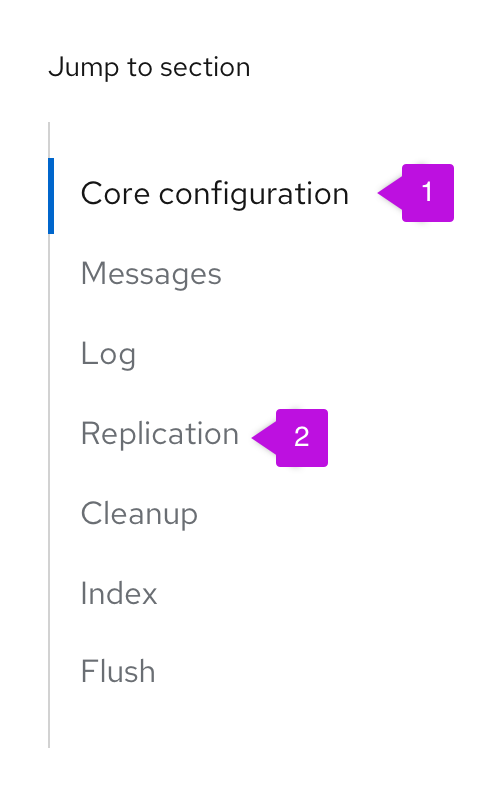
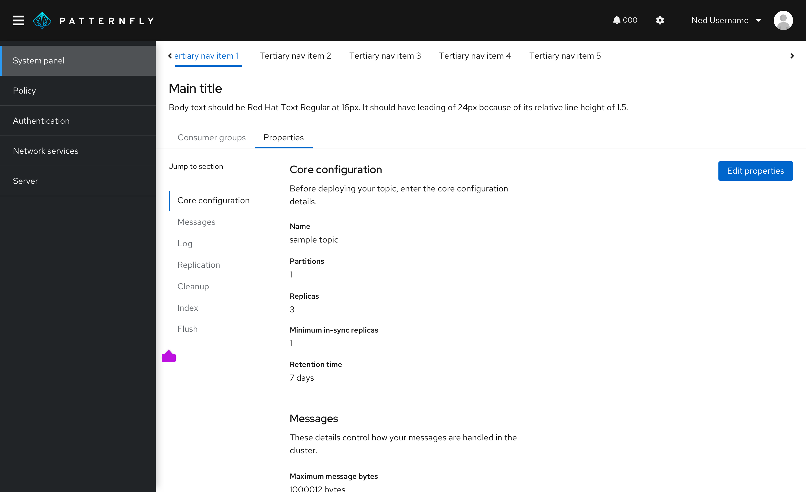
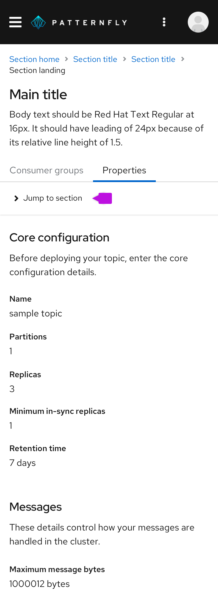
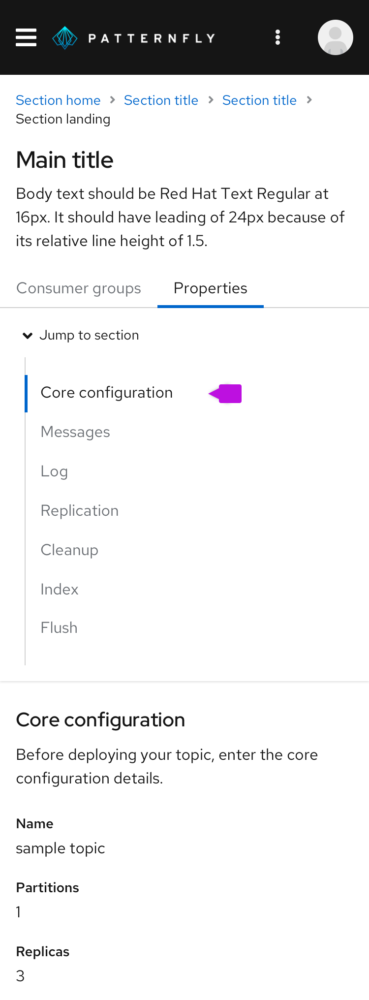

**Jump links** allow users to navigate to sections within a page.

## Usage
Jump links provide a way to navigate through sections on a page without scrolling. The highlighted active section changes as the user scrolls to the next section. 

## Elements

1. **Active section:** current section of the page the user is on.

2. **Inactive section:** other sections of the page that the user is not currently on.

## Variations
Jump links can be displayed either horizontally or vertically. Additionally, they can optionally include subsections.

### Horizontal jump links
As the user scrolls down the page, the active sections are highlighted from left to right. Jump links can be displayed left aligned or centered and with an optional label. 

### Vertical jump links 
As the user scrolls down the page, the active sections are highlighted from top to bottom. 

### Jump links with subsections
If the page has subsections, these are shown as an indented jump links under the parent section. Subsections can be individually selected. 

### Jump links on mobile
On smaller screen sizes, jump links collapse into an expandable component that is shown above the content. This component can be expanded to display the jump links. 

