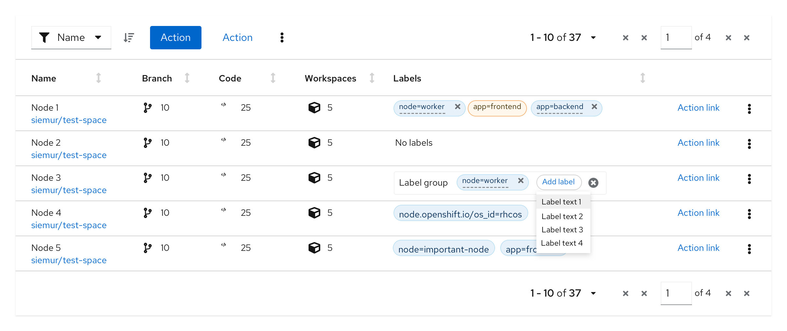

Use a **label group** when you have multiple [labels](https://www.patternfly.org/v4/components/label) to display at once. Label groups can be oriented either horizontally or vertically and can optionally be named and be dismissable. You may also make the label group editable to allow users to edit an existing label or add a new label.

## Elements
Label groups have a number of components to them.

1. **Label group (optional):** indicates the group category or name if one exists.
2. **Label:** indicates the labels applied.
3. **Overflow:** indicates if there are more labels to show.
4. **Group close (optional):** deletes the entire label group.

Label groups can use various combinations of these features to build custom label groups.

## Usage
Label groups should be used when there are multiple labels assigned to a component. They can be used almost anywhere in a UI, but are commonly used in table views and description lists.

### Label groups in a table

### Label groups in a table popover

### Label groups in a description list

## Variations

### Editable label group

#### Adding a new label to a group, without a group label
This variation can be used when there is a need to edit 1 or more labels within a label group, and the label group does not have a group label.

#### Adding a new label to a group, with a group label
This variation can be used when there is a need to add a new label within the label group, and the label group has a group label. 

When the user selects the ‘Add label’ button, a new label is added as the first label in the group.

Once the label is added, the user can overwrite the default value by double clicking the label.

#### Adding a new label to a label group from a list of preselected labels
This variation can be used when only a fixed set of labels can be added to a label group. 

User selects the ‘Add label’ button and selects a new label from an existing list of values.

The new label is added with the selected value and can not be changed. 

#### Adding a new custom label to a label group
This variation can be used when you want to allow users to customize the labels they add to a label group. 

User selects the ‘Add label’ button, which opens up a modal from which they can select the attributes for the new label. These include label text, color, icon, filled vs outlined, ability to dismiss, and editability. The options shown can be customized to fit your use cases.

The new label is created based on the attributes selected by the user.
