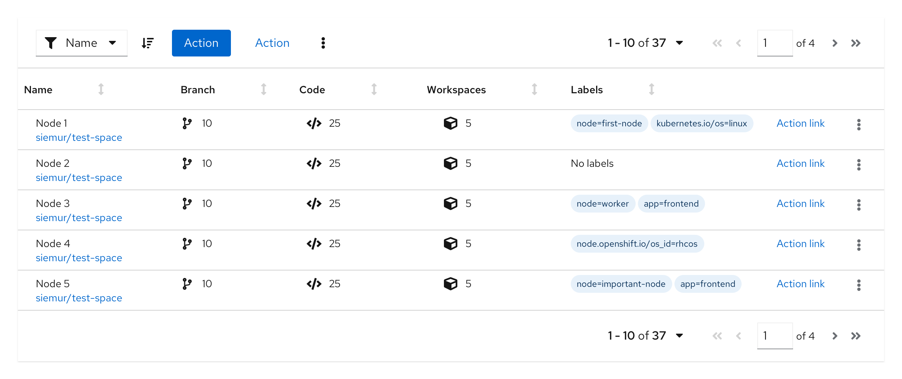

Use a **label group** when you have multiple [labels](https://www.patternfly.org/v4/components/label) to display at once. Label groups can be oriented either horizontally or vertically and can optionally be named and dismissable.

## Elements
Label groups have a number of components to them.

1. **Label group:** indicates the group category or name if one exists.
2. **Label:** indicates the labels applied.
3. **Overflow:** indicates if there are more labels to show.
4. **Group close:** deletes the entire label group.

Label groups can use various combinations of these features to build custom label groups.

## Usage
Label groups should be used when there are multiple labels assigned to a component. They can be used almost anywhere in a UI, but are commonly used in table views and description lists.

### Label groups in a table

### Label groups in a table popover

### Label groups in a description list

