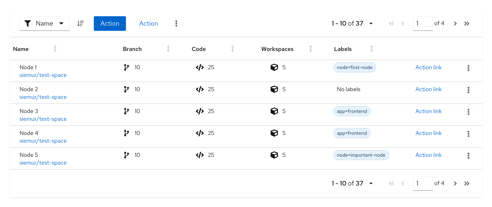

# Labels
Use a label when you want to highlight an element on a page to draw attention to it or make it more searchable. Labels can also be used to tag items of the same category.

Do not use a label if you want to show a count. Instead, use a [badge](https://www.patternfly.org/v4/components/badge/react).

## Usage
Labels are easily customized to fit different use cases. There are two main types of labels:
1. Unfilled

2. Filled

Use the filled option to add more visual prominence to a label.

The default colors for labels are gray, blue, green, orange, red, purple, and cyan. We offer a wide array of colors to allow for color coding labels within UIs. Label colors can be used to indicate status if desired, but do not have to. Regardless, we recommend you avoid using the red label unless it indicates danger or an error state.

While you may use other colors for your labels, we recommend using the ones provided as they have been carefully selected to be accessible with the PatternFly library. If you choose to use other colors, be mindful of picking accessible text color and icon color to go with the label background.

## Label features
You can further customize labels by making them dismissable, adding icons, or making them clickable links. You can use any combination of these features in a single label.

1. **Dismissible labels** can be dismissed by clicking on the “x”
2. **Add an icon** to the left of the text for added clarification
3. **Clickable labels** have a hover state to show interactiveness

**When to use dismissable labels**
For labels that are easily removed or dismissed, use a dismissable label. A common use case for dismissable labels is when users can edit labels.

**When to use labels with icons**
Optionally add an icon to your label in cases where additional visual information is helpful. You can also use them to distinguish labels of the same color if needed.

**When to use clickable labels**
You can also make labels clickable. A common use case for clickable labels is when a user may want to filter by a specific label. You can also use label links to redirect users to a new page.

## Labels in context
Labels can be used almost anywhere in a UI, but are commonly used in table views and catalogs.

