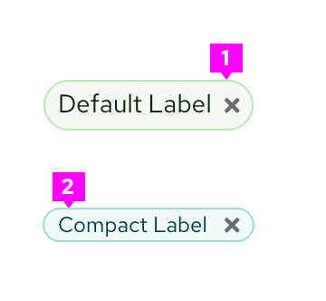
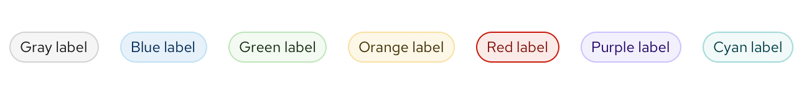

Use a **label** when you want to highlight an element on a page to draw attention to it or make it more searchable. Labels can also be used to tag items of the same category. If you want to show a count, use a [badge](https://www.patternfly.org/v4/components/badge) instead.

## Usage
There are 2 label types:

1. **Default labels:** Use by default when needing a label.
2. **Compact labels:** Use when confronted by space limitations and a smaller label is required (for example, in a table).

Both default and compact labels come in the following default colors: gray, blue, green, orange, red, purple, and cyan. We offer a wide array of colors to allow for color coding labels within UIs. Label colors can be used to indicate status if desired, but do not have to. Regardless, we recommend you avoid using the red label unless it indicates danger or an error state.

While you may use other colors for your labels, we recommend using the ones provided as they have been carefully selected to be accessible with the PatternFly library. If you choose to use other colors, be mindful of picking [accessible text color and icon color](https://www.patternfly.org/v4/accessibility/testing-your-accessibility) to go with the label background.

## Label features
You can further customize labels by making them filled or unfilled, dismissable, adding icons, or making them clickable links. You can use any combination of these features in a single label.

1. **Fill/Unfilled labels:** Offer customization for emphasis.
2. **Dismissible label:** Can be dismissed by clicking on the “x”.
3. **Label with icon:** Can be used to further clarify the label.
4. **Clickable labels:** Has a hover state to show interactiveness.
5. **Editable labels:** Has a dashed underline to communicate editability.

### When to use filled or unfilled labels

Use the filled option to add more visual prominence to a label. If your use case requires a mix of clickable and non-clickable labels, consider using one type for clickable and another for non-clickable. Whatever convention you choose, be sure to maintain consistency through your UI.

1. Unfilled

2. Filled

Use the filled option to add more visual prominence to a label.

### When to use dismissable labels

Use a dismissable label for labels that are easily removed. A common use case for dismissable labels is when users can edit labels.

### When to use labels with icons
Add an icon to your label in cases where additional visual information is helpful. You can also use them to distinguish labels of the same color if needed.

### When to use clickable labels
Use a clickable label for actionable labels. A common use case for clickable labels is when a user may want to filter by a specific label. You can also use label links to redirect users to a new page.

### When to use editable labels
Use editable labels when you want to allow users to organize and select resources manually. Adding editable labels enables the user to query for objects that have similar, dissimilar, or overlapping labels.

## Labels in context
Labels can be used almost anywhere in a UI, but are commonly used in table views and catalogs.

