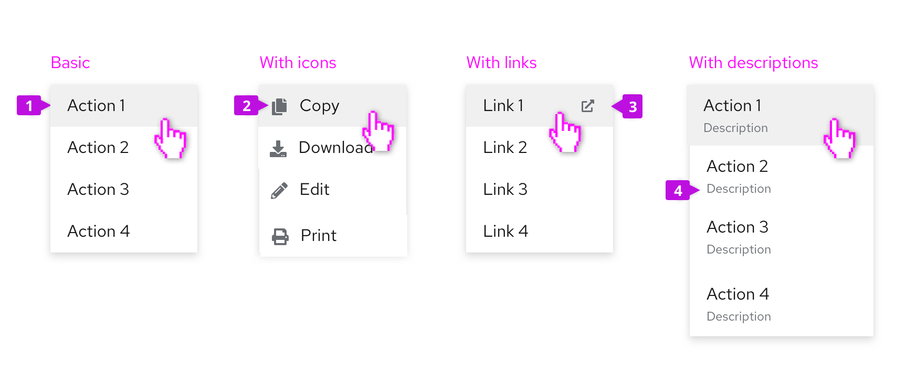
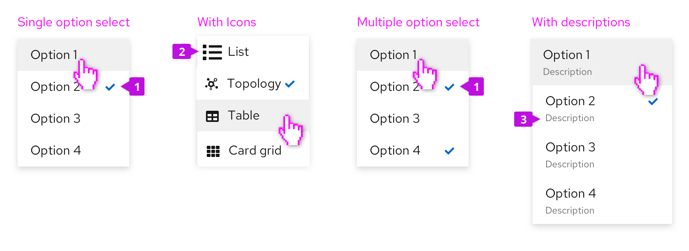

A **Menu** is a list of options or actions that users can choose from. It can be used in a variety of contexts whenever the user needs to choose between multiple values, options, or actions. A menu can be opened in a [dropdown](/components/dropdown), a [select list](/components/select), or it can be revealed upon right clicking on a region within a page.

## Elements and variations
### Action menu
An actions menu is used for presenting a list of actions or links.

1. **Menu item:** Menu items represent discrete actions that can be taken. Selecting a menu item inside a dropdown will trigger the action and dismiss the menu, while selecting a menu item inside a select list will select the item.

2. **Icon (optional):** You may place an icon before each menu item to aid in recognition. It has been shown that familiar icons speed the recognition of text labels, but only use icons if they will be easily recognized and are distinguishable. Never use icons simply as a decoration.

3. **Links:** Links may be used in place of or mixed with actions to navigate the user to a new page. If the link will open in a new window, the external link icon should be used to annotate the link and let the user know to expect this behavior.

4. **Descriptions (optional):** Descriptive text may be added below each menu item. This should only be used when the menu item label by itself may not be clear to all users. Keep descriptive text to two lines or less.

### Option select menus
Use an option select menu when you want to persist the selected items. This is typically the case for select menus or settings menus that allow users to select between multiple options. See the [Select](/components/select) and [Options menu](/components/options-menu) components for more details. You may present a single or multiple [groups of options](#grouped-menus) within the same menu.

1. **Selected item:** A checkmark to the right of a menu item indicates that it is currently selected.

2. **Icon (optional):** You may place an icon before each menu item to aid in recognition. It has been shown that familiar icons speed the recognition of text labels, but only use icons if they will be easily recognized and are distinguishable. Never use icons simply as a decoration.

3. **Descriptions (optional):** Descriptive text may be added below each menu item. This should only be used when the menu item label by itself may not be clear to all users. Keep descriptive text to two lines or less.

### Grouped menus
You may decide to group menu items to associate related items and/or to indicate a hierarchy of items. Items may be grouped using group headings, separators, or both.

1. **Group heading (optional):** Add a group heading when you want to name the group.

2. **Separator (optional):** Separators are horizontal dividers that help to group the menu items by clearly showing where one group ends and the next begins. You should consider whether a separator is needed to create visually distinct groups. In the first example above, a separator is used to create separation between the two groups of items. In the second example, the separator is not needed because the titled checkbox groups create two clearly grouped set of options on their own.

### Multi-level fly-out menus
Fly-out menus can be used when you want to expose sub-items from a parent node. PatternFly supports a single level fly-out, only.

If a menu item has sub-items, a “>” character will be shown to the right of the item label. When hovering over the item, the secondary menu will be exposed.

### Filtering menu items
If the list of possible items is very long, a filter may be added to make it easier for the user to find what they are looking for.

When filtering is being used, a search input will be added to the top of the menu and the list of items will be filtered as the user types.

### Favoriting and other actions
Favoriting or any other optional action can be associated with any menu item. In this case, making an item a favorite will duplicate it at the top of the menu. This may be useful when you have a long list of possible actions and want to “pin” a subset of items to the top of the menu.

Any action that can be represented as an icon button can be placed in one or more menu items. In this case the favorites action is used to mark an item as a favorite.

## Usage

| **When you want to...** |                     |
| ------------------- | ------------------- |
| Expose a list of actions | Use an actions menu with actions and/or links. Add icons in front of menu items only if they will help to make items more recognizable. Include descriptive text for menu items that may require further definition. |
| Create logical groupings of menu items | Use separators to group items. Include group headings if you don’t feel like the meaning of the groups will be obvious. |
| Expose a list of nested actions | Use a fly-out menu. Any optional attributes of basic menus, including icons, groups, and descriptions can also be applied to flyout menus.|
| Select from a list of options | Use an options select menu for selecting between values rather than actions. Icons, descriptions, and groupings can be used with option select menus to improve recognition or create logical option groups. |

## Content guidelines
In creating menu item labels, keep in mind the following guidelines:

* Keep menu items short. In most cases 1-3 words should suffice.

* Actions should start with a verb, for example: Save, Clear filters, and Remove from tasklist.

* Options should reflect the result a user should expect. For example, a list or sorting options might include the items: Alphabetical, Oldest first, Newest first, and Numeric.

* Descriptive text added to a menu item should be short. Two lines or less is recommended.
