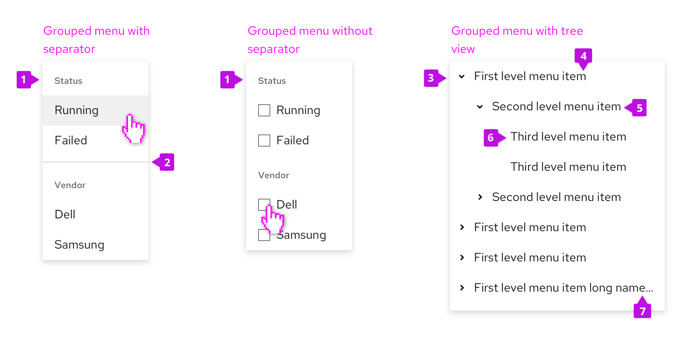
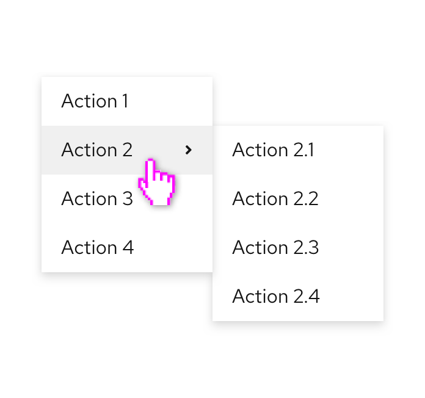
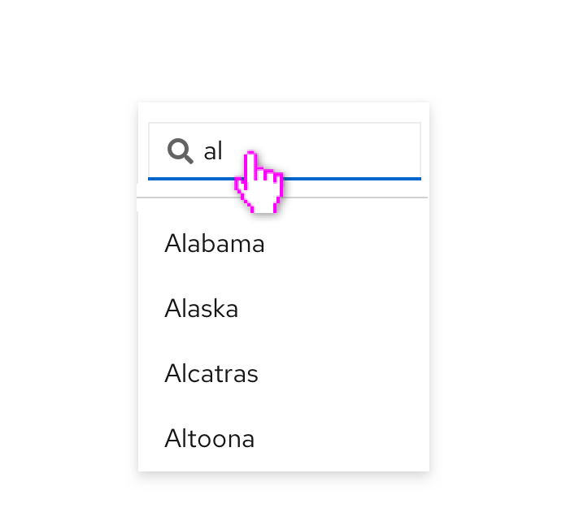

A **menu** is a list of options or actions that users can choose from. It can be used in a variety of contexts whenever the user needs to choose between multiple values, options, or actions. A menu can be opened in a [dropdown](/components/dropdown) or [select list](/components/select), or it can be revealed by right clicking on a specific region within a page.

## Elements and variations
### Action menu
An action menu presents a list of actions or links.

1. **Menu item:** Menu items represent discrete actions that can be taken. Selecting a menu item inside a dropdown will trigger the action and dismiss the menu, while selecting a menu item inside a select list will select the item.

2. **Icon (optional):** Familiar icons may be included before each menu item to accelerate text label recognition. Only use icons if they will be easily recognized and distinguished from one another. Never use them simply for decoration.

3. **Links:** Links navigate the user to a new page. They may be mixed with actions in a menu or used in their place. If the link will open in a new window, use the external link icon to annotate the link so that users can expect this behavior.

4. **Descriptions (optional):** Descriptive text may be added below each menu item, but only when the menu item label itself may not be clear to all users. Keep descriptive text to two lines or less.

### Option select menus
Use an option select menu when you want to persist selected items. This is typically the case for select menus or settings menus that allow users to select between multiple options. See the [select](/components/select) and [options menu](/components/options-menu) components for more details. You may present single or multiple [groups of options](#grouped-menus) within the same menu.

1. **Selected item:** Selected items are indicated by a checkmark to the right of their label.

2. **Icon (optional):** Familiar icons may be placed before each menu item to accelerate text label recognition. Only use icons if they will be easily recognized and distinguished from one another. Never use icons simply for decoration.

3. **Descriptions (optional):** Descriptive text may be added below each menu item, but only when the menu item label itself may not be clear to all users. Keep descriptive text to two lines or less.

### Grouped menus
You may decide to group menu items to associate related items or indicate a hierarchy within them. Items may be grouped using group headings, separators, or both.

1. **Group heading (optional):** Add a group heading when you want to name the group.

2. **Separator (optional):** Separators are horizontal dividers that help to group the menu items by clearly showing where one group ends and the next begins. You should consider whether a separator is needed to create visually distinct groups. In the first example above, a separator is used to create separation between the two groups of items. In the second example, the separator is not needed because the titled checkbox groups create two clearly grouped set of options on their own.

### Multi-level fly-out menus
Use fly-out menus when you want to expose sub-items from a parent node. PatternFly supports a single level fly-out, only.

If a menu item has sub-items, a “>” character will be shown to the right of the item label. When hovering over the item, the secondary menu will be exposed.

### Filtering menu items
If the list of possible items is very long, add a filter to make items more findable.

When filtering menu items, a search input will be added to the top of the menu and the list of items will be filtered as the user types.

### Favoriting and other actions
Favoriting or other optional actions can be associated with any menu item. In this case, making an item a favorite will duplicate it at the top of the menu. This may be useful when you have a long list of possible actions and want to “pin” a subset of items to the top of the menu.

Any action that can be represented as an icon button can be placed in one or more menu items. In this case, the favoriting action is used to mark an item as a favorite.

### Drilldown menu

Use a drilldown menu when data is structured into levels and includes a long list of options. When the parent with children is selected, the list is replaced with the children items. A header displays the name of the parent, with the option to go back one level. 

If data is more complex and has more than 2 levels, use a drilldown menu with breadcrumbs instead. Breadcrumbs offer better navigation between different levels. The number of visited levels is shown in a grey badge with a dropdown menu showing the menu items between the first and last level. The badge allows you to go back to a specific visited level. If you need to see the whole structure of your data, use a [tree view](/components/tree-view) instead. 

## Usage

| **When you want to...** |                     |
| ------------------- | ------------------- |
| Expose a list of actions | Use an actions menu with actions and/or links. Add icons in front of menu items only if they will help to make items more recognizable. Include descriptive text for menu items that may require further definition. |
| Create logical groupings of menu items | Use separators to group items. Include group headings if you don’t feel like the meaning of the groups will be obvious. |
| Expose a list of nested actions | Use a fly-out menu. Any optional attributes of basic menus, including icons, groups, and descriptions can also be applied to flyout menus.|
| Select from a list of options | Use an options select menu for selecting between values rather than actions. Icons, descriptions, and groupings can be used with option select menus to improve recognition or create logical option groups. |

## Content guidelines
When creating menu item labels, keep in mind the following guidelines:

* Keep menu items short. In most cases, 1-3 words should suffice.

* Actions should start with a verb, for example: *Save*, *Clear filters*, and *Remove from tasklist*.

* Options should reflect the result a user should expect. For example, a list or sorting options might include the items: *Alphabetical*, *Oldest first*, *Newest first*, and *Numeric*.

* Descriptive text added to a menu item should be short. Two lines or less is recommended.
