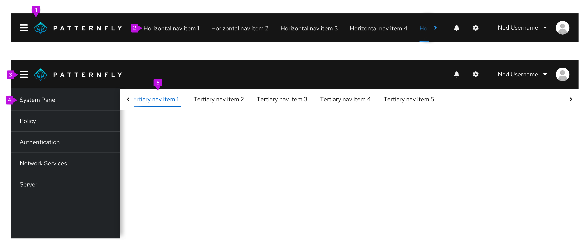
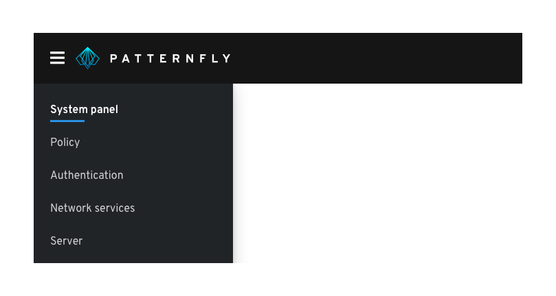
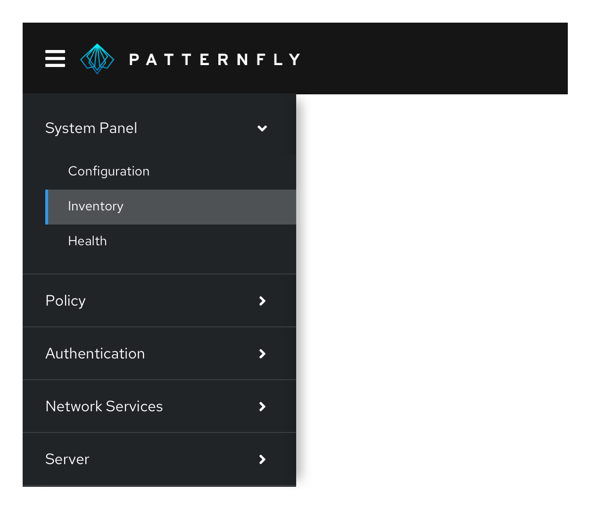
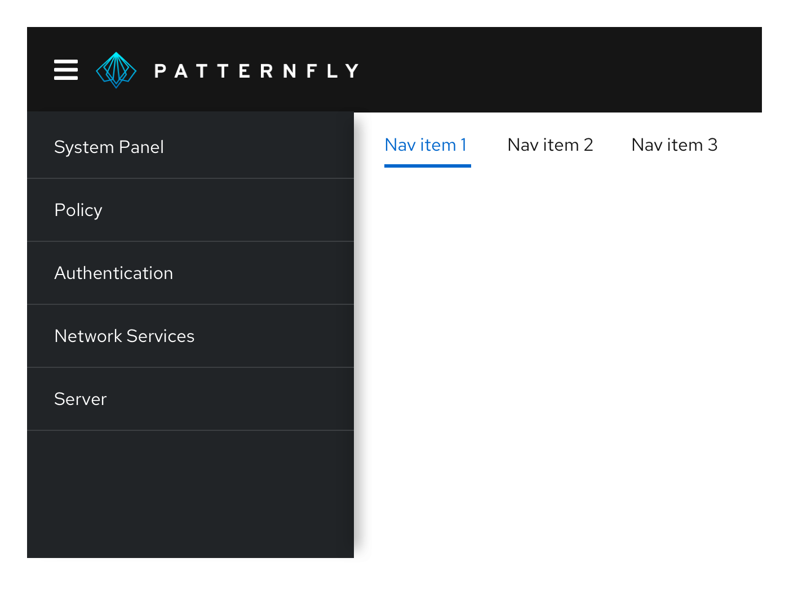

A **navigation** organizes an application’s structure and content, making it easy to find information and accomplish tasks. Navigation communicates relationships, context, and actions a user can take within an application.

## Elements

1. **Masthead**
2. [**Horizontal navigation**](#horizontal-navigation)
3. **Menu icon button:** Provides a way for users to toggle vertical navigation
4. [**Vertical navigation**](#vertical-navigation)
5. [**Tertiary navigation**](#tertiary-navigation)

## Usage

### Vertical navigation

Vertical navigation is hierarchical global navigation that displays navigation options from top to bottom on the left side of a screen. PatternFly vertical navigation can be collapsed to provide additional screen real estate by using a menu icon button at the top left.

#### When to use
* You have five or more primary navigation items
* You have secondary navigation items (even if you have less than five primary navigation items)
* You expect your application to be used on mobile devices

#### Variations

**Simple vertical navigation**

Use a simple, single-level vertical navigation when you only have one level of navigation to display.

**Grouped navigation**

When you have a small amount of secondary navigation items, you can group your items and display them persistently beneath the primary navigation items.

**Expandable vertical navigation**

When you have a large number of secondary navigation items, you can use an expandable navigation to collapse and expand options as needed.

### Horizontal navigation

Horizontal navigation is global navigation that displays navigation items from left to right in the application's masthead.

#### When to use
* You have less than five primary navigation items
* You have only one level of navigation and no secondary navigation items

### Tertiary navigation

While global navigation controls what users are seeing at the application-level, local navigation provides more granular navigation specific to a particular page or window in the application. For example, a user might use global navigation to get to a settings page, and then use local navigation to access privacy and general user settings.
