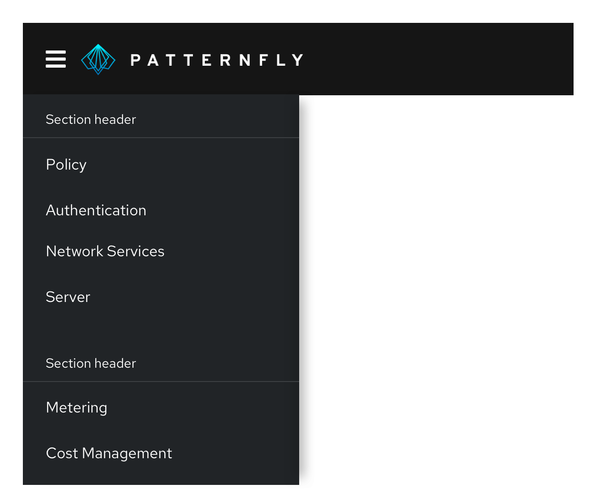

A **navigation** organizes an application’s structure and content, making it easy to find information and accomplish tasks. Navigation communicates relationships, context, and actions a user can take within an application.

## Elements

1. **Masthead**
2. [**Horizontal navigation**](#horizontal-navigation)
3. **Menu icon button:** Provides a way for users to toggle vertical navigation
4. [**Vertical navigation**](#vertical-navigation)
5. [**Secondary horizontal navigation**](#secondary-horizontal-navigation)

## Usage

### Vertical navigation

Vertical navigation is hierarchical global navigation that displays navigation options from top to bottom on the left side of a screen. PatternFly vertical navigation can be collapsed to provide additional screen real estate by using a menu icon button at the top left.

#### When to use
* You have five or more primary navigation items
* You have secondary navigation items (even if you have less than five primary navigation items)
* You expect your application to be used on mobile devices

#### Variations

**Simple vertical navigation**

Use a simple, single-level vertical navigation when you only have one level of navigation to display.

**Grouped navigation**

When you have a small amount of secondary navigation items, you can group your items and display them persistently beneath the primary navigation items.

**Expandable vertical navigation**

When you have a large number of secondary navigation items, you can use an expandable navigation to collapse and expand options as needed.

### Horizontal navigation

Horizontal navigation is global navigation that displays navigation items from left to right in the application's masthead.

#### When to use
* You have less than five primary navigation items
* You have only one level of navigation and no secondary navigation items

### Secondary horizontal navigation

Use secondary horizontal navigation when you want to provide more granular navigation specific to a particular page or window in your application. This differs from [tabs](/components/tabs), since tabs would allow you to switch perspective on the same page, while each secondary horizontal navigation item would be sending you to a distinct URL. For example, a user might use global navigation to get to a settings page, and then use local navigation to access privacy and general user settings.

Secondary horizontal navigation can be paired with vertical or horizontal navigation. It provides deeper nesting to the vertical navigation, which may help prevent the navigation from becoming too long. 

1. **Selected nav item:** The title of the page should reflect the selected horizontal navigation item. You can provide further nested information by using tabs.

We recommend either using horizontal navigation OR vertical navigation as your primary. The secondary horizontal navigation can be added to either and contains similar styling to the primary navigation either way.

Secondary horizontal navigation follows a similar responsive design as our other horizontal navigation types. 
Overflow items can be navigated to by using horizontal scroll or the arrows.

