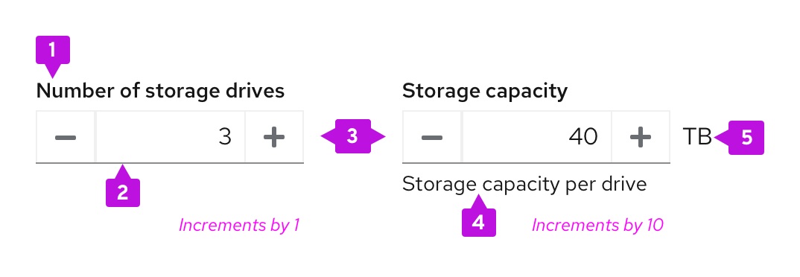
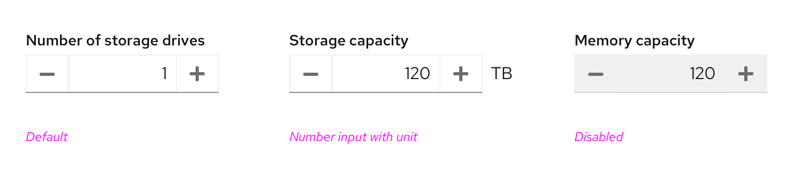

A **number input** provides a quick and effective way for users to enter and modify a numeric value. Similar to input groups, number inputs combine two input types into one control: A text input field with buttons on either side. When combined, these elements allow users to input numeric values in a responsive and scalable way.

## Elements

**Label:** Indicates what value the user should input in the numeric field.
**Input field:** Area for the user to type in their numeric input.
**Buttons:** Increase or decrease the value by set increments.
**Helper text:** Explains or provides additional context that helps the user provide the right information. This is an optional field.
**Unit:** Provides a unit symbol for the value in the input field, when applicable. This is an optional field.

## Usage
**Use a number input when:**
* Users need a quick and precise way to adjust values within defined parameters.
* Users need to make small incremental changes that require few clicks.
* You need to bypass device limitations, such as keyboardless interactions and form submissions on mobile.

**Don’t use a number input when:**
* The numeric value range is infinite.
* The numeric value can be either a fractional or whole number.
* The numeric value required is not part of a range, or is arbitrary. In this use case, use an input group instead.
* There is not enough space in the UI to account for the interaction between the input field and the buttons.

**When using number inputs, follow these best practices:**
Display a default numeric value in the input field that users can modify by typing directly into the input field or scale using the increase or decrease buttons.
Keep labels concise and specific to effectively communicate what value the user should enter into the input field.
Determine an increment size relative to your specific value range. Scale your increment size to accommodate for the types of values users will input in context.
Include unit symbols to the right of the text input and increase button, depending on your use case. Always use a unit’s standard abbreviation or symbol. For a list of recommended symbols, see our Units and symbols page.

## Variations
Number inputs can function in one of two ways:

1. **Default:** Buttons increase and decrease the numeric value within a given range.
2. **With thresholds:** Buttons are disabled when the user reaches a certain threshold within a given range.

## Default
A default number input allows users to input and modify a numeric value within a set range without disabling at certain thresholds. Use this variation when any value within your number input’s range is valid for your use case (for example, providing the number of storage drives associated with their computer or reporting their storage capacity).

## With thresholds
A number input with thresholds disables each button when a user’s numeric input passes a certain threshold. Use number inputs with thresholds to add maximum or minimum restrictions to user inputted values. 

When adding thresholds to a number input, be sure to inform users with text to minimize their risk for input errors. If a number input for the number of storage drives has a maximum input value of 20, communicate this limit in helper text: <i>Maximum capacity 20</i>.

## Accessibility
Consider the following guidance to ensure that your number input is 508 compliant:

* Use clear and descriptive labels for each button and fields. Specific language makes it easier for users with assistive technology to understand the required value.
* Include error validation messages to guide users who enter values incorrectly. For more information about writing effective error messages, see our UX writing style guide.

For more in-depth accessibility guidance, see the PatternFly accessibility guide.
