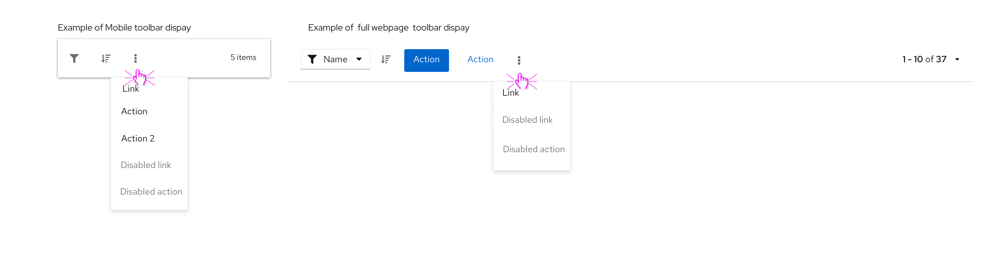
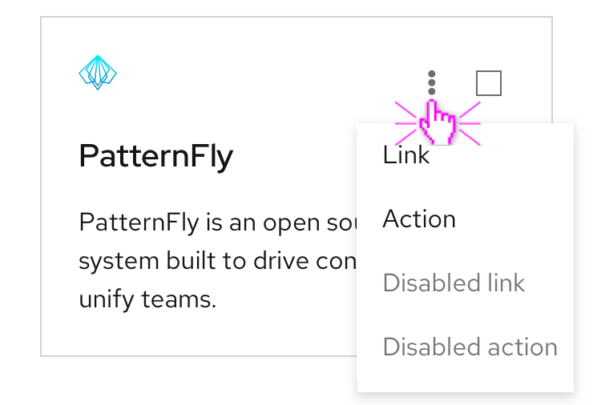

An **overflow menu** groups a set of actions in a responsive horizontal list to help declutter an interface. Actions can be set to persist or collapse into a kebab as the viewport shrinks. Overflow menus are useful in toolbars or other places where a group of actions is required.

## Usage 
Use an overflow menu when additional options are availble to the user but there is a space constraint.

**Examples**

* Use an overflow menu in a table toolbar to group a number of actions and create more visual space. Avoid having more than 3 actions fully displayed within a toolbar.

  

* Use an overflow menu within a table row when additional actions are available that don’t correspond with a column header.

  

* Use an overflow menu within a card component to present additional menu options.  

  

**When not to use**:
* Do not use an overflow menu when there are 2 or fewer actions available to the user
* Do not use in conjunction with label groups when there isn’t enough space to display each label. Instead, use an [overflow label](https://www.patternfly.org/v4/components/label-group/design-guidelines/).
* Do not use an overflow menu to hide additional content that you dont want to be seen by default, instead use an [expandable section](https://www.patternfly.org/v4/components/label-group/design-guidelines/).  

## Behavior 
Overflow menus are represented by a kebab button, as the user clicks on the kebab, a horizontal list will appear with additional options to click. 

## Content Guidelines
* Text should be short and direct so users can quickly scan and decide on an action.
* Text  should be written in sentence case.
* Overflow menus should be placed on the right side of the container 

