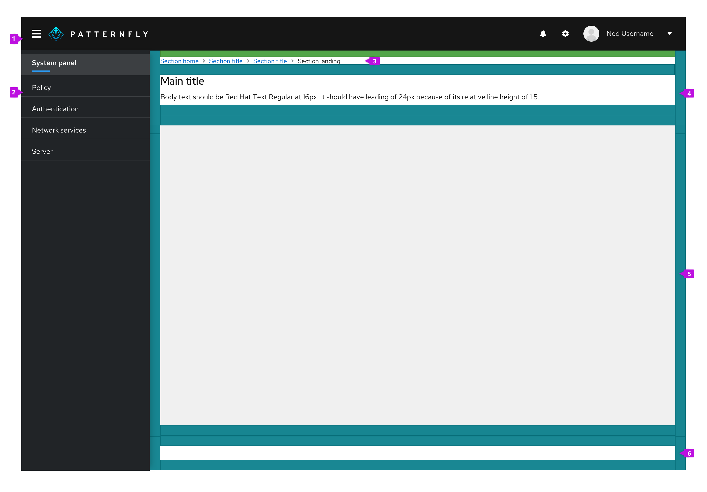
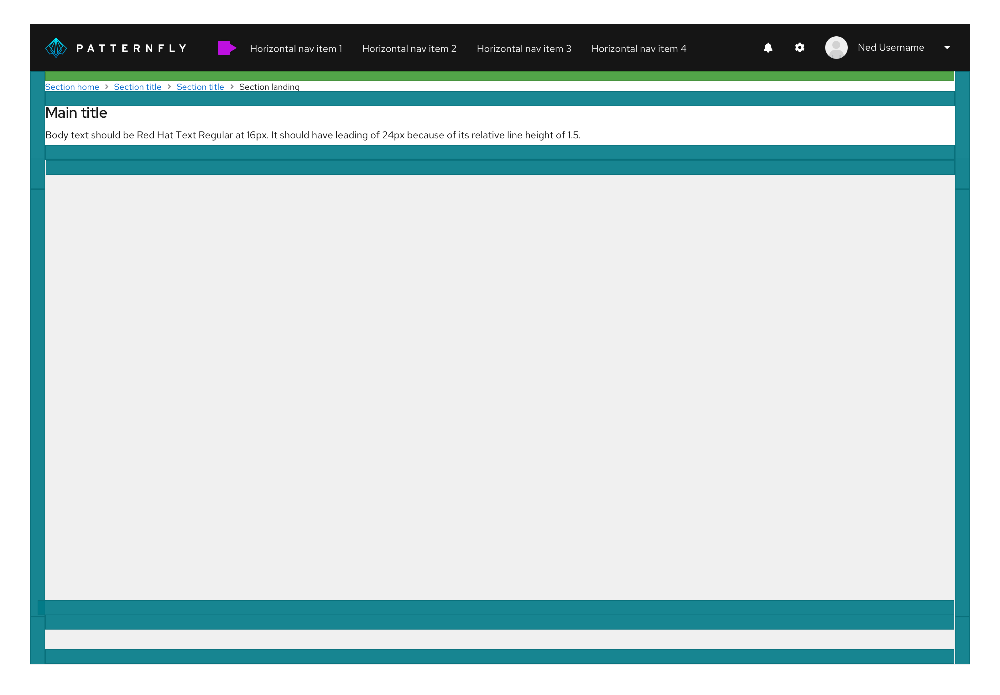
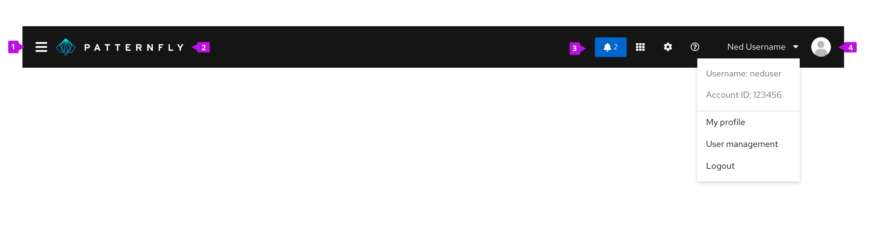

The **page** component is used to define the basic layout of a page with either vertical or horizontal navigation.

## Basic layouts
PatternFly includes a flexible layout system for defining pages. Page layouts are defined using page sections as explained below. While the layout system is flexible, you should adhere to the guidelines for common elements like the masthead and page header to maintain consistency across applications.

### Page sections
Page sections allow you to define areas on a page to group content. The header, body, and footer on a page are examples of page sections. Page sections have 24px padding on left and right edges or no padding to allow the contents to extend to the edge of a page. At screen sizes smaller than 1200px, the left/right padding is reduced to 16px to create a tighter layout. Page sections can also be made sticky such that they will remain visible at the top or bottom of the viewport when the page scrolls. This is useful for creating sticky headers, footers, or other elements.

The basic layout of a page differs depending on whether your application uses vertical or horizontal primary navigation as illustrated below.

### Page with vertical navigation

**1. Masthead:** The masthead provides a consistent header for every page in your application.

**2. Navigation:** This is your primary navigation. It should be consistent across pages. See the [Navigation design guidelines](/components/navigation/design-guidelines) for more information about navigation options and usage.

**3. Breadcrumb (optional):** When breadcrumbs are included, they should be the topmost element in the header section. When breadcrumbs are included on a page, the top padding is reduced from 24px to 16px. See the [Breadcrumb design guidelines](/components/breadcrumb/design-guidelines) for more information about breadcrumb usage.

**4. Page header:** All pages should have a header section. The height of the header will vary to fit the content. We recommend keeping information in the header area brief to consume as little space as possible. The page header should contain the page title to help orient the user and an optional description to describe the contents of the page. You may optionally apply the `pf-m-sticky-top` modifier to the header section to create a sticky page header and prevent its content from scrolling off the page.

**5. Body section:** Your main page content goes here. The body section can have a light gray `--pf-global--BackgroundColor--200` or white background depending on the content it will contain. The default padding all around the page body should be 24px in all directions.

**6. Footer section (optional):** You can optionally define a footer section for a page. You may optionally apply the `pf-m-sticky-bottom` modifier to the footer section to create a sticky page footer and prevent its content from scrolling off the page.

### Page with horizontal navigation

When using a horizontal primary navigation, the left-hand sidebar is removed and the navigation is placed inline with other masthead elements. All other page elements remain the same.

## Masthead
The masthead contains global properties such as logotype, navigation and settings in an organized fashion and it is accessible from all parts of the application. All pages should share a common masthead.

**1. Show/hide menu:**  The `fa-bars` icon at the left of the masthead provides a way for users to show or hide the vertical navigation. It is not included when horizontal navigation is being used. At large viewport (desktop) sizes, navigation is shown, by default, and the user can click this icon to hide it and expand the content area. Once hidden, the user can click the icon again to reveal it. At small viewport (tablet and phone) sizes, the vertical navigation will be hidden by default and the user must use this control to open the menu.

**2. Logotype:** The logotype area should clearly display the application name and the application logo if applicable. It is common to link the logotype to the application’s homepage. It is recommended to have the application name in .svg format for better performance. 

**3. Utility items:** Place any items in the utility area that you want to have accessible from all pages in the application. Utility items are right aligned and placed to the left of the user menu. The following are common items ordered from left to right. All items are optional depending on the needs of your application.

* **Notification badge:** Display a [notification badge](/components/notification-badge) to alert the user to incoming notifications. Clicking on the badge should open a [notification drawer](/components/notification-drawer), if used, or take the user to another view where they can review recent notifications. If used, the notification badge should always be the leftmost item in the utility area.

* **Application specific item(s):** Applications may include additional utility items in the masthead. These items should expose tasks or information that are meaningful to users at a global level.  

* **Application launcher:** When switching between applications is supported, an [application launcher](/components/application-launcher) component can be inserted in the masthead to provide that capability.

* **Settings:**  The settings menu contains ways to configure and customize an application. Interacting with settings either takes users to a settings area or reveals a dropdown menu with more options. The settings menu is represented by the `fa-cog` icon.

* **Help:** The help item reveals a dropdown menu. The menu items may include documentation links available to users, links to customer support resources, and/or instructions on how to get support. If the application has an [about modal](/components/about-modal), it should also be accessed here. The help menu is represented by the `pficon-pf-help` icon.

**4. User menu:** The user menu is always the right-most item in the masthead. It includes an [avatar](/components/avatar) and the username of the currently logged in user. The dropdown items may vary based on user settings and permissions available. Common items to include are: User name, Account ID or Account management. This section should always include a Log out option at the bottom of the dropdown list. If there is a need to allow users to change application display language, it should appear in this dropdown menu as well.
