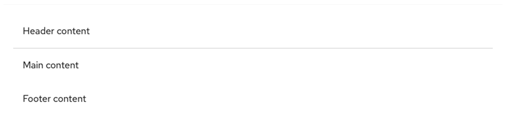
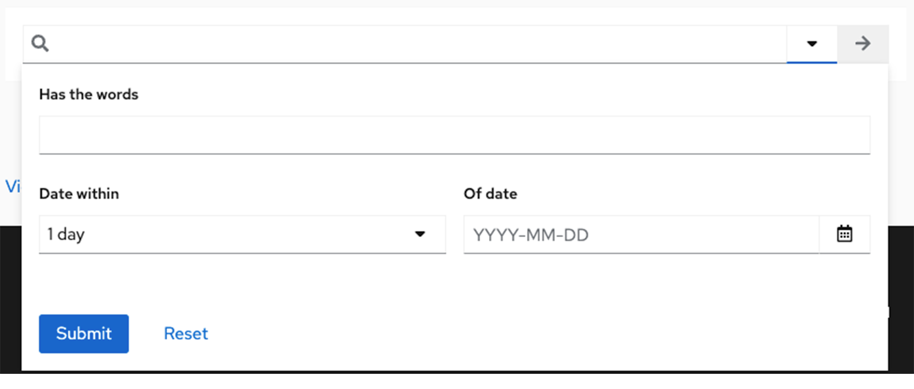

The **panel** component is a container that supports flexible content layouts. It can be used to house other components such as fields, forms, videos, buttons, and more. The panel should not be confused with the <a href="https://www.patternfly.org/v4/components/drawer/design-guidelines/">drawer</a> component, which allows you to surface information via a collapsable container.

## Usage
Panels are commonly used
- To provide more content structure through the UI.
- if you need a blank canvas to group content and components

## Examples

 
The panel is used as a content block with a header, body, and footer.
    

 
The panel is used a dropdown menu for <a href="https://www.patternfly.org/v4/components/search-input/react-demos/#composable-advanced-search">advanced search input</a>.