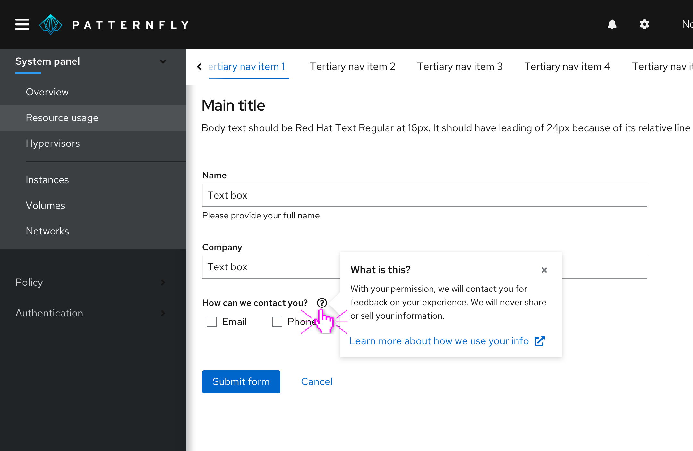
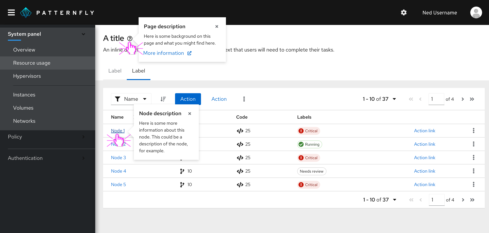

Use a **popover** to display content in a new window that overlays the current page. Unlike a modal, a popover does not block the current page. By default clicking anywhere outside of the popover will dismiss it.

## Usage

Popovers provide helpful contextual information at the moment users need it.

Use popovers to anticipate and answer questions for the user, help explain unfamiliar terms, or provide context around a task. You may also link to further information inside a popover.

Always use a question-circle icon when using the popover pattern to define a term or explain a concept. When in the UI, the default icon color is grey. Once the user hovers or clicks over the icon to open the popover, the icon turns black.

You may also use popovers with link text. For example, when there is no obvious UI element to add a popover to, you may pose a question, preceded with a question-circle icon to alert the user that they can find more information by clicking on it. 

Popover text should adopt link button styling and always be preceded by a question-circle icon, which should be blue, following the link button styling. Clicking on the link text should trigger a popover that provides an answer to the question posed in the hint text.

Popovers are triggered by a click and dismissed in one of the following ways:

* The user clicks the exit icon
* The user clicks an action button inside the popover
* The user clicks anywhere on the screen outside the popover

Never hide critical information in a popover. Critical information is any information the user *must have and will always need* in order to complete a task.

**Common use cases**
* On form field labels
* On titles, headers, other kinds of labels
* In a table column header

### When to use a tooltip versus a popover

Both tooltips and popovers allow users to get more information in context. However, they differ in two ways:
 
 1. Tooltips are used for identification purposes, while popovers are used for added description or information in context. 
 2. Tooltips appear on hover, while popovers appear on click

**Use tooltips for:**
* Short descriptions of an item or to identify an item, like an icon button
* Content that is no longer than 1 or 2 lines

**Use popovers for:**

* Longer descriptions
* Formatted text
* When you would like your in-context help to include pictures, actions, or links 

### Other forms of on-screen help

1. [Hints](/components/hint/design-guidelines)
2. [Tooltips](/components/tooltip/design-guidelines)
