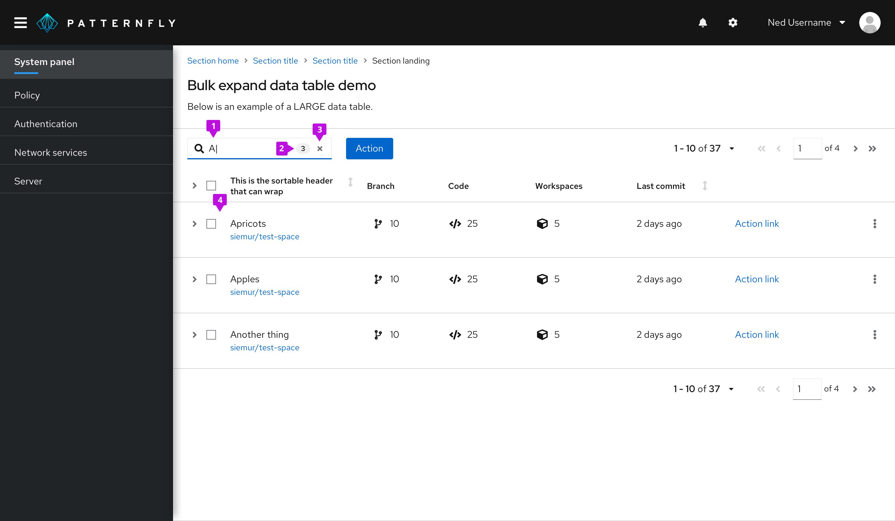
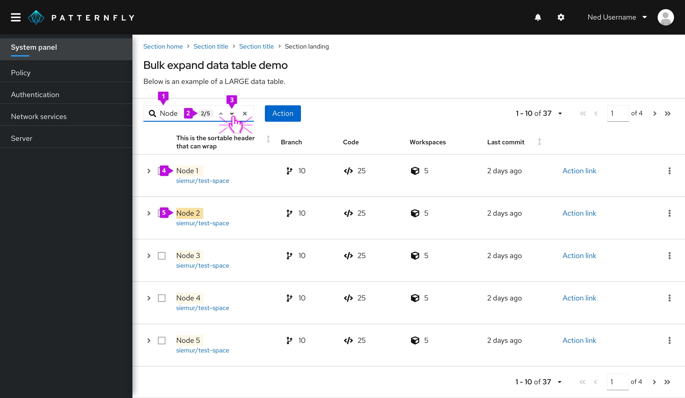

A **search input** is a type of input field that can be user to search, find, or filter. See [filter guidelines](/guidelines/filters) for more information on using search input as a filter.

## Usage
Use a search input when you want to either filter down or locate values from a dataset that match an inputted value.

### Search input as a basic filter

Search input can act as a basic filter for the user to type a string in and filter down a list of values. 

1. **Field input:** The user’s input immediately starts filtering down the list as the user types. There is no need for them to press enter. 
2. **Optional badge:** As matches are found, an optional badge may be added to the input field containing the count.
3. **Clear:** A clear button is easily accessible once the user begins typing to clear the field if necessary. 
4. **Filtered list:** The list is filtered to match the value entered in the input field, in this case, “A”.

### Search input as a find function
Another way to use search input is as a find function. This would mean that the value entered within the field would then be compared to each result, and only matches would be highlighted.

1. **Field input:** The user’s input immediately starts matching to values as they begin typing.
2. **Optional badge:** A badge, by itself, can be used to capture the total count of matches. In this case, since navigation is also being used, it displays the match number that the user is highlighting compared to the total number of matches.
3. **Optional navigation:** The navigation feature allows the user to navigate one-by-one through the matched results. It will correspond to the count that is within the badge.
4. **Match highlight:** All matches will be highlighted but we can not guarantee it will contain the gray color, depending on the use case.
5. **Current highlight:** The active match will contain a different colored highlight. We can not guarantee it will contain the blue highlight, depending on this use case. In this case, since the user is on 2/5, “Node” in “Node 2” is highlighted in blue.